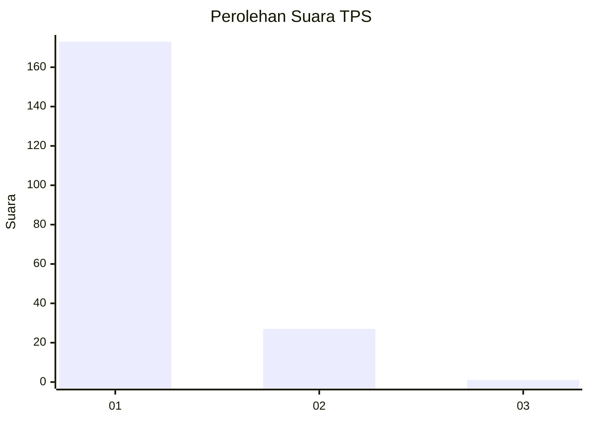
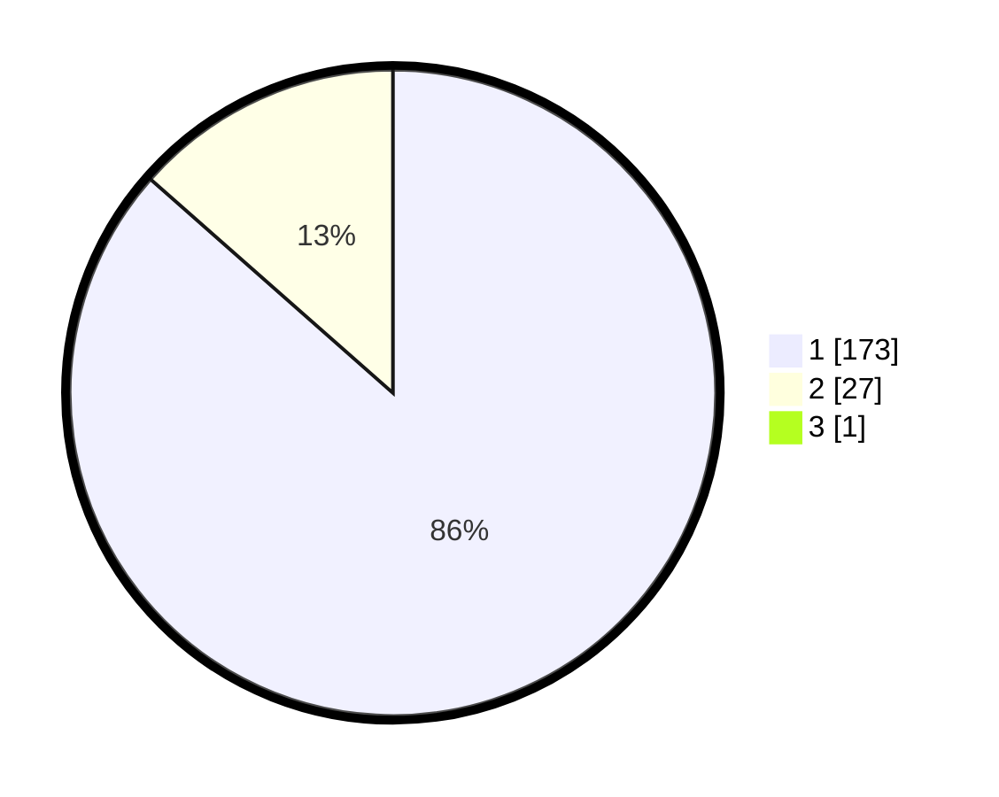

# Hasil

## Grafik

## Tabel

| No. | Nama Paslon    | Suara | Suara (raw) | Persentase |
|:--- |:-------------- | -----:| -----------:| ----------:|
| 1   | ANIES MUHAIMIN | 173   | [173][p-1]  | 86,07      |
| 2   | PRABOWO GIBRAN | 27    | [27][p-2]   | 13,43      |
| 3   | GANJAR MAHFUD  | 1     | [1][p-3]    | 0,50       |

[p-1]: https://github.com/gigit-pemilu/pemilu-2024-11-aceh/blob/main/pilpres/hitung-suara/sub/11-aceh/sub/11-bireuen/sub/09-juli/sub/2035-juli-meunasah-jok/sub/002-tps/sub/paslon-1.txt
[p-2]: https://github.com/gigit-pemilu/pemilu-2024-11-aceh/blob/main/pilpres/hitung-suara/sub/11-aceh/sub/11-bireuen/sub/09-juli/sub/2035-juli-meunasah-jok/sub/002-tps/sub/paslon-2.txt
[p-3]: https://github.com/gigit-pemilu/pemilu-2024-11-aceh/blob/main/pilpres/hitung-suara/sub/11-aceh/sub/11-bireuen/sub/09-juli/sub/2035-juli-meunasah-jok/sub/002-tps/sub/paslon-3.txt

## Foto C Plano

https://sirekap-obj-formc.kpu.go.id/23cc/pemilu/ppwp/11/11/09/20/35/1111092035002-20240215-011120--e87868d9-24ab-47a0-be7c-d6231f2370a7.jpg

https://sirekap-obj-formc.kpu.go.id/23cc/pemilu/ppwp/11/11/09/20/35/1111092035002-20240215-101034--bc49fae3-37e0-4bc2-8499-0c6e7945a489.jpg

https://sirekap-obj-formc.kpu.go.id/23cc/pemilu/ppwp/11/11/09/20/35/1111092035002-20240215-101058--74bcaae3-91d2-41e6-bae7-725306560f6d.jpg

## Metadata

| Key        | Value               |
| ---------- | ------------------- |
| Time Stamp | 2024-02-15 20:00:44 |

