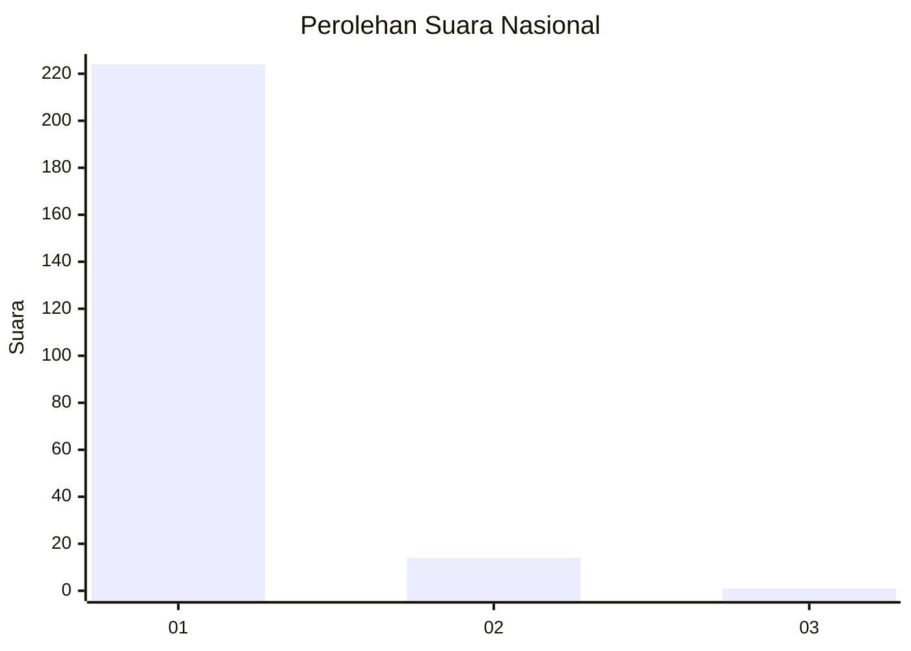
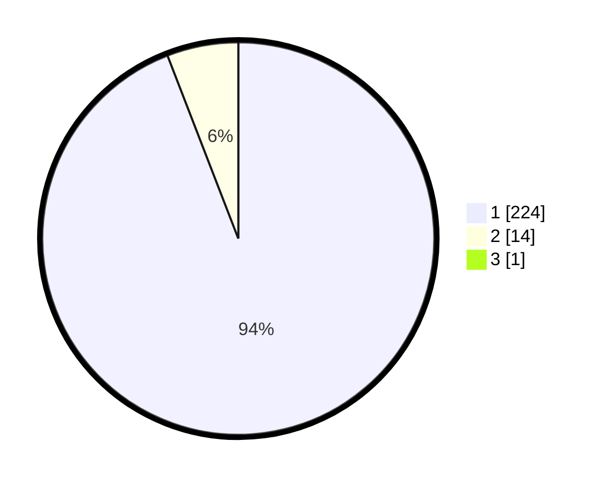

# Hasil

## Grafik

## Tabel

| No. | Nama Paslon    | Suara | Suara (raw) | Persentase |
|:--- |:-------------- | -----:| -----------:| ----------:|
| 1   | ANIES MUHAIMIN | 224   | [224][p-1]  | 93,72      |
| 2   | PRABOWO GIBRAN | 14    | [14][p-2]   | 5,86       |
| 3   | GANJAR MAHFUD  | 1     | [1][p-3]    | 0,42       |

[p-1]: https://github.com/gigit-pemilu/pemilu-2024/blob/main/pilpres/hitung-suara/sub/11-aceh/sub/11-bireuen/sub/10-jangka/sub/2007-paya-bieng/sub/002-tps/sub/paslon-1.txt
[p-2]: https://github.com/gigit-pemilu/pemilu-2024/blob/main/pilpres/hitung-suara/sub/11-aceh/sub/11-bireuen/sub/10-jangka/sub/2007-paya-bieng/sub/002-tps/sub/paslon-2.txt
[p-3]: https://github.com/gigit-pemilu/pemilu-2024/blob/main/pilpres/hitung-suara/sub/11-aceh/sub/11-bireuen/sub/10-jangka/sub/2007-paya-bieng/sub/002-tps/sub/paslon-3.txt

## Foto C Plano

https://sirekap-obj-formc.kpu.go.id/71e6/pemilu/ppwp/11/11/10/20/07/1111102007002-20240214-200723--d420fe9e-d306-4174-8463-086e4f2874ae.jpg

https://sirekap-obj-formc.kpu.go.id/71e6/pemilu/ppwp/11/11/10/20/07/1111102007002-20240214-202032--1388a268-82ad-41d0-9edf-ed1b49718673.jpg

https://sirekap-obj-formc.kpu.go.id/71e6/pemilu/ppwp/11/11/10/20/07/1111102007002-20240215-062836--148d0b0a-1bf4-4bcd-9ab7-0ed98be1652c.jpg

## Metadata

| Key        | Value               |
| ---------- | ------------------- |
| Time Stamp | 2024-02-15 15:00:29 |

