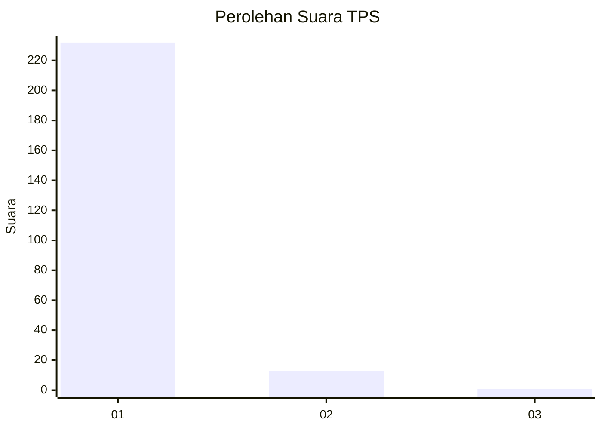
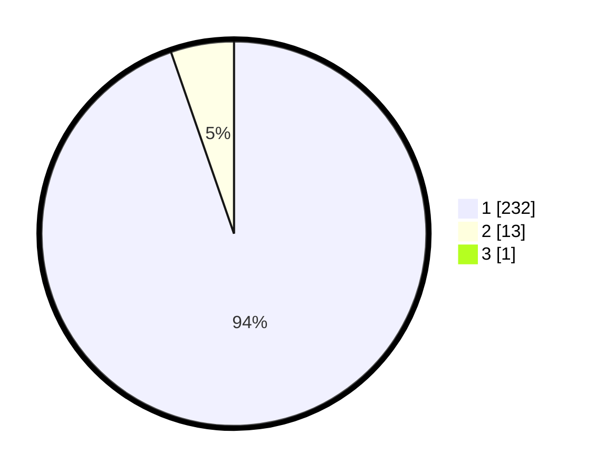

# Hasil

## Grafik

## Tabel

| No. | Nama Paslon    | Suara | Suara (raw) | Persentase |
|:--- |:-------------- | -----:| -----------:| ----------:|
| 1   | ANIES MUHAIMIN | 232   | [232][p-1]  | 94,31      |
| 2   | PRABOWO GIBRAN | 13    | [13][p-2]   | 5,28       |
| 3   | GANJAR MAHFUD  | 1     | [1][p-3]    | 0,41       |

[p-1]: https://github.com/gigit-pemilu/pemilu-2024-11-aceh/blob/main/pilpres/hitung-suara/sub/11-aceh/sub/11-bireuen/sub/10-jangka/sub/2008-meunasah-krueng/sub/001-tps/sub/paslon-1.txt
[p-2]: https://github.com/gigit-pemilu/pemilu-2024-11-aceh/blob/main/pilpres/hitung-suara/sub/11-aceh/sub/11-bireuen/sub/10-jangka/sub/2008-meunasah-krueng/sub/001-tps/sub/paslon-2.txt
[p-3]: https://github.com/gigit-pemilu/pemilu-2024-11-aceh/blob/main/pilpres/hitung-suara/sub/11-aceh/sub/11-bireuen/sub/10-jangka/sub/2008-meunasah-krueng/sub/001-tps/sub/paslon-3.txt

## Foto C Plano

https://sirekap-obj-formc.kpu.go.id/97f8/pemilu/ppwp/11/11/10/20/08/1111102008001-20240215-051859--ba95e048-5376-47e8-871e-265374947718.jpg

https://sirekap-obj-formc.kpu.go.id/97f8/pemilu/ppwp/11/11/10/20/08/1111102008001-20240214-225828--fc66e500-9964-4dab-a82b-02acc04b0f8f.jpg

https://sirekap-obj-formc.kpu.go.id/97f8/pemilu/ppwp/11/11/10/20/08/1111102008001-20240214-225951--6f449e19-53ca-4ecd-8a10-3bcdb07f2386.jpg

## Metadata

| Key        | Value               |
| ---------- | ------------------- |
| Time Stamp | 2024-02-15 16:00:26 |

