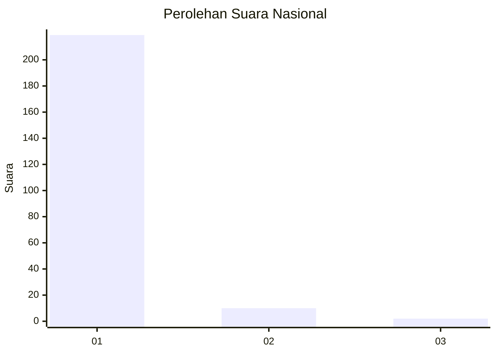
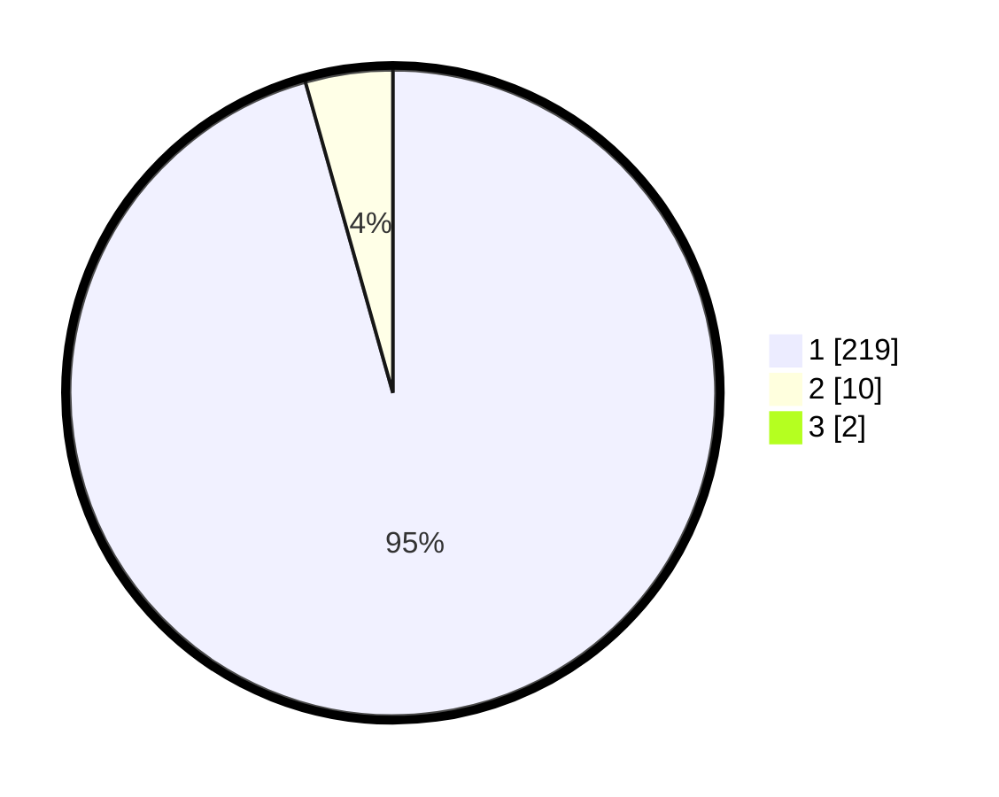

# Hasil

## Grafik

## Tabel

| No. | Nama Paslon    | Suara | Suara (raw) | Persentase |
|:--- |:-------------- | -----:| -----------:| ----------:|
| 1   | ANIES MUHAIMIN | 219   | [219][p-1]  | 94,81      |
| 2   | PRABOWO GIBRAN | 10    | [10][p-2]   | 4,33       |
| 3   | GANJAR MAHFUD  | 2     | [2][p-3]    | 0,87       |

[p-1]: https://github.com/gigit-pemilu/pemilu-2024/blob/main/pilpres/hitung-suara/sub/11-aceh/sub/11-bireuen/sub/11-simpang-mamplam/sub/2034-ulee-kareung/sub/002-tps/sub/paslon-1.txt
[p-2]: https://github.com/gigit-pemilu/pemilu-2024/blob/main/pilpres/hitung-suara/sub/11-aceh/sub/11-bireuen/sub/11-simpang-mamplam/sub/2034-ulee-kareung/sub/002-tps/sub/paslon-2.txt
[p-3]: https://github.com/gigit-pemilu/pemilu-2024/blob/main/pilpres/hitung-suara/sub/11-aceh/sub/11-bireuen/sub/11-simpang-mamplam/sub/2034-ulee-kareung/sub/002-tps/sub/paslon-3.txt

## Foto C Plano

https://sirekap-obj-formc.kpu.go.id/cc11/pemilu/ppwp/11/11/11/20/34/1111112034002-20240217-130228--8eed0f53-f32e-4e6a-97b4-cc67ec4b397e.jpg

https://sirekap-obj-formc.kpu.go.id/cc11/pemilu/ppwp/11/11/11/20/34/1111112034002-20240215-041857--506d0e16-b11c-408d-b51e-bb415b8d07ba.jpg

https://sirekap-obj-formc.kpu.go.id/cc11/pemilu/ppwp/11/11/11/20/34/1111112034002-20240215-041449--ac054373-8c46-4765-92f2-669c4cb91584.jpg

## Metadata

| Key        | Value               |
| ---------- | ------------------- |
| Time Stamp | 2024-02-17 13:37:34 |

