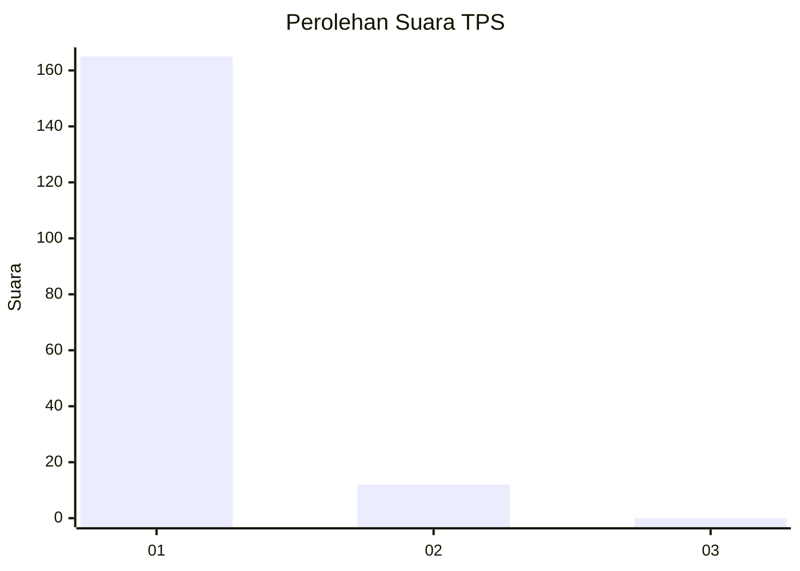
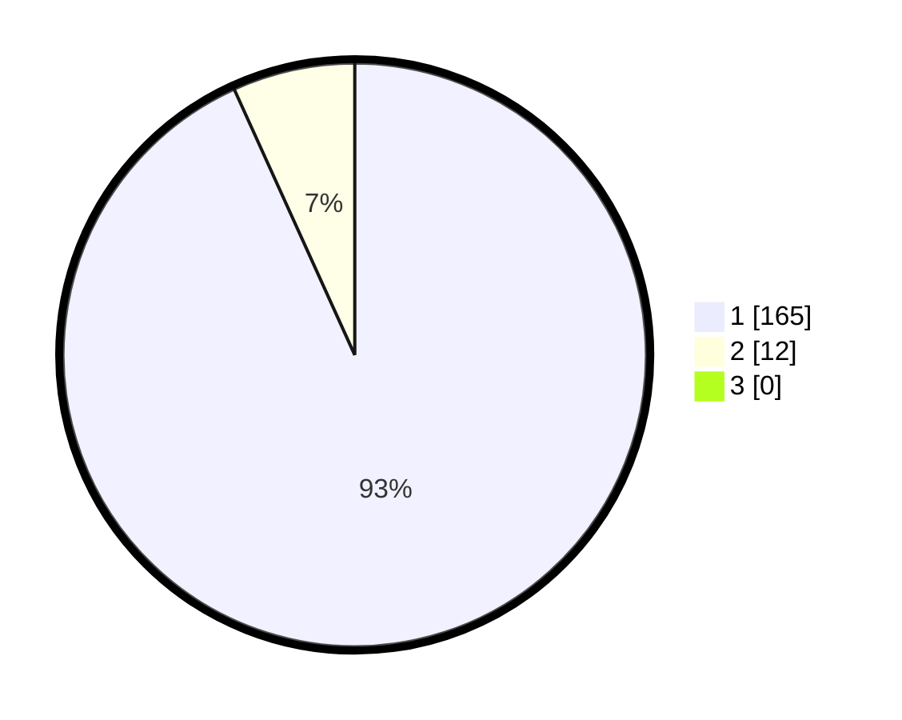

# Hasil

## Grafik

## Tabel

| No. | Nama Paslon    | Suara | Suara (raw) | Persentase |
|:--- |:-------------- | -----:| -----------:| ----------:|
| 1   | ANIES MUHAIMIN | 165   | [165][p-1]  | 93,22      |
| 2   | PRABOWO GIBRAN | 12    | [12][p-2]   | 6,78       |
| 3   | GANJAR MAHFUD  | 0     | [0][p-3]    | 0,00       |

[p-1]: https://github.com/gigit-pemilu/pemilu-2024-11-aceh/blob/main/pilpres/hitung-suara/sub/11-aceh/sub/11-bireuen/sub/11-simpang-mamplam/sub/2036-calok/sub/002-tps/sub/paslon-1.txt
[p-2]: https://github.com/gigit-pemilu/pemilu-2024-11-aceh/blob/main/pilpres/hitung-suara/sub/11-aceh/sub/11-bireuen/sub/11-simpang-mamplam/sub/2036-calok/sub/002-tps/sub/paslon-2.txt
[p-3]: https://github.com/gigit-pemilu/pemilu-2024-11-aceh/blob/main/pilpres/hitung-suara/sub/11-aceh/sub/11-bireuen/sub/11-simpang-mamplam/sub/2036-calok/sub/002-tps/sub/paslon-3.txt

## Foto C Plano

https://sirekap-obj-formc.kpu.go.id/7952/pemilu/ppwp/11/11/11/20/36/1111112036002-20240219-145350--2639418e-143a-4794-bf51-9fa361e9103d.jpg

https://sirekap-obj-formc.kpu.go.id/7952/pemilu/ppwp/11/11/11/20/36/1111112036002-20240219-145507--dddb8c0b-a280-4c59-aeb6-f295518f709c.jpg

https://sirekap-obj-formc.kpu.go.id/7952/pemilu/ppwp/11/11/11/20/36/1111112036002-20240219-145613--427f5761-7407-4607-be0a-0f29737430ff.jpg

## Metadata

| Key        | Value               |
| ---------- | ------------------- |
| Time Stamp | 2024-02-24 22:31:28 |

