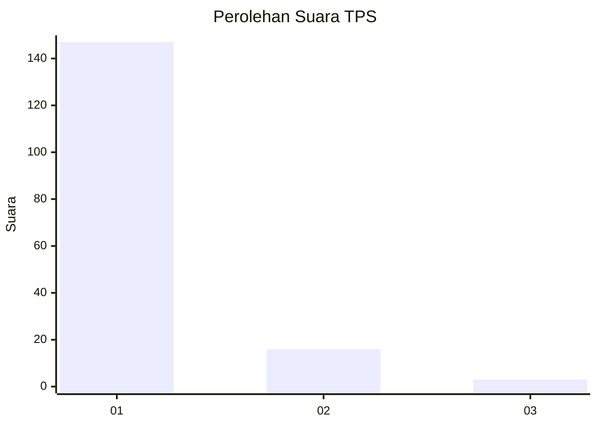
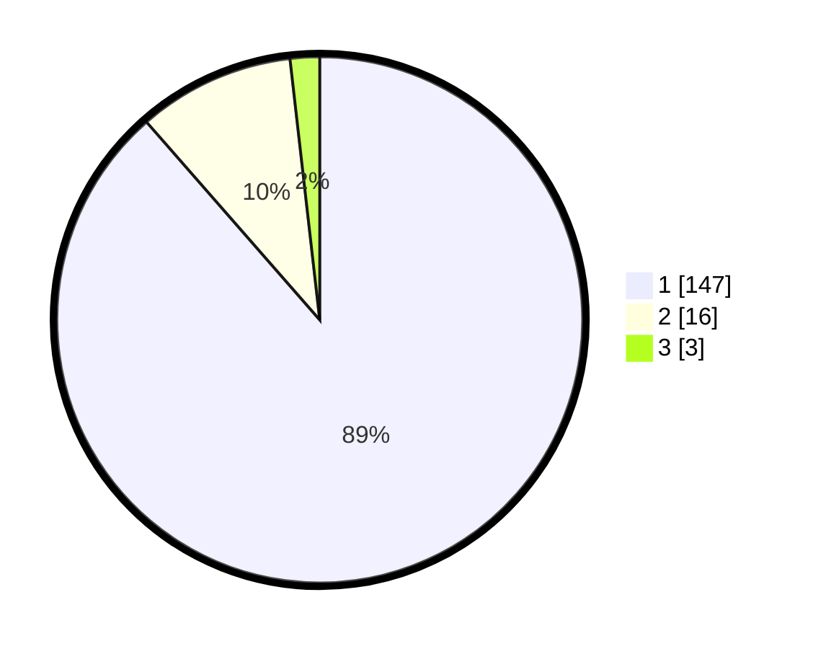

# Hasil

## Grafik

## Tabel

| No. | Nama Paslon    | Suara | Suara (raw) | Persentase |
|:--- |:-------------- | -----:| -----------:| ----------:|
| 1   | ANIES MUHAIMIN | 147   | [147][p-1]  | 88,55      |
| 2   | PRABOWO GIBRAN | 16    | [16][p-2]   | 9,64       |
| 3   | GANJAR MAHFUD  | 3     | [3][p-3]    | 1,81       |

[p-1]: https://github.com/gigit-pemilu/pemilu-2024-11-aceh/blob/main/pilpres/hitung-suara/sub/11-aceh/sub/11-bireuen/sub/11-simpang-mamplam/sub/2041-meunasah-barat/sub/001-tps/sub/paslon-1.txt
[p-2]: https://github.com/gigit-pemilu/pemilu-2024-11-aceh/blob/main/pilpres/hitung-suara/sub/11-aceh/sub/11-bireuen/sub/11-simpang-mamplam/sub/2041-meunasah-barat/sub/001-tps/sub/paslon-2.txt
[p-3]: https://github.com/gigit-pemilu/pemilu-2024-11-aceh/blob/main/pilpres/hitung-suara/sub/11-aceh/sub/11-bireuen/sub/11-simpang-mamplam/sub/2041-meunasah-barat/sub/001-tps/sub/paslon-3.txt

## Foto C Plano

https://sirekap-obj-formc.kpu.go.id/7fcd/pemilu/ppwp/11/11/11/20/41/1111112041001-20240219-163446--4b4cc7a3-9cd3-4b39-ad00-2e44901ef0d4.jpg

https://sirekap-obj-formc.kpu.go.id/7fcd/pemilu/ppwp/11/11/11/20/41/1111112041001-20240219-163609--1d5e4d7b-dd25-40c8-abfe-5840e103927d.jpg

https://sirekap-obj-formc.kpu.go.id/7fcd/pemilu/ppwp/11/11/11/20/41/1111112041001-20240216-092343--b4c7a6ba-a888-4593-852f-b1d4ae79e5f0.jpg

## Metadata

| Key        | Value               |
| ---------- | ------------------- |
| Time Stamp | 2024-02-24 22:31:28 |

