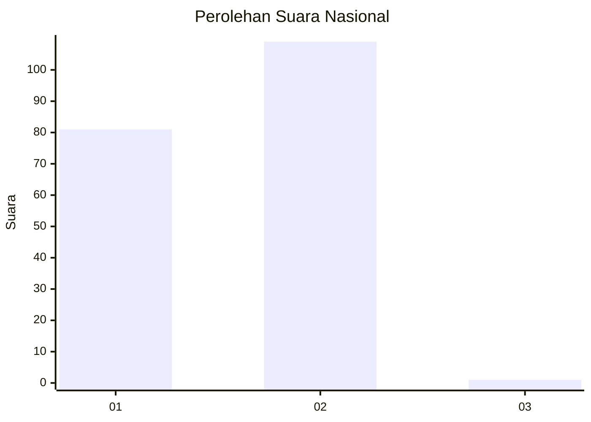
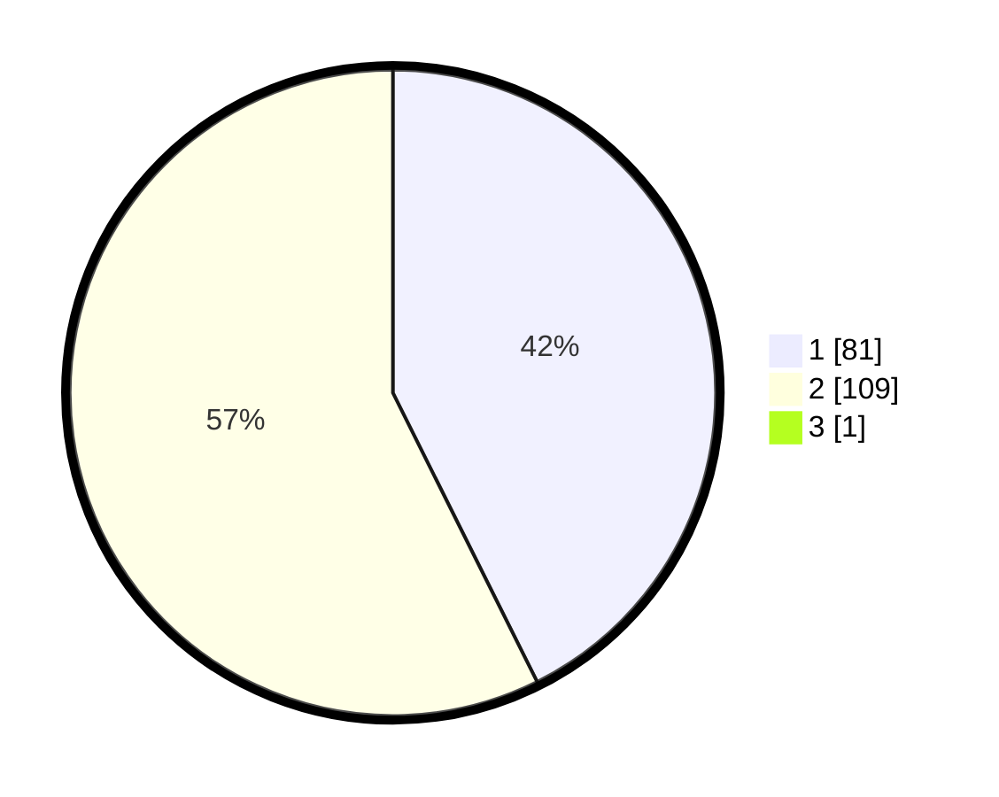

# Hasil

## Grafik

## Tabel

| No. | Nama Paslon    | Suara | Suara (raw) | Persentase |
|:--- |:-------------- | -----:| -----------:| ----------:|
| 1   | ANIES MUHAIMIN | 81    | [81][p-1]   | 42,41      |
| 2   | PRABOWO GIBRAN | 109   | [109][p-2]  | 57,07      |
| 3   | GANJAR MAHFUD  | 1     | [1][p-3]    | 0,52       |

[p-1]: https://github.com/gigit-pemilu/pemilu-2024/blob/main/pilpres/hitung-suara/sub/11-aceh/sub/11-bireuen/sub/13-kota-juang/sub/2001-bandar-bireuen/sub/001-tps/sub/paslon-1.txt
[p-2]: https://github.com/gigit-pemilu/pemilu-2024/blob/main/pilpres/hitung-suara/sub/11-aceh/sub/11-bireuen/sub/13-kota-juang/sub/2001-bandar-bireuen/sub/001-tps/sub/paslon-2.txt
[p-3]: https://github.com/gigit-pemilu/pemilu-2024/blob/main/pilpres/hitung-suara/sub/11-aceh/sub/11-bireuen/sub/13-kota-juang/sub/2001-bandar-bireuen/sub/001-tps/sub/paslon-3.txt

## Foto C Plano

https://sirekap-obj-formc.kpu.go.id/ea09/pemilu/ppwp/11/11/13/20/01/1111132001001-20240214-184511--2f6854ee-0967-420b-b2c6-4e29c7752eec.jpg

https://sirekap-obj-formc.kpu.go.id/ea09/pemilu/ppwp/11/11/13/20/01/1111132001001-20240216-221926--3b4d4535-47d0-479a-bca1-a5f8c8c8b73b.jpg

https://sirekap-obj-formc.kpu.go.id/ea09/pemilu/ppwp/11/11/13/20/01/1111132001001-20240216-221926--71f0b72d-5c65-42e1-8b80-524a67a14bba.jpg

## Metadata

| Key        | Value               |
| ---------- | ------------------- |
| Time Stamp | 2024-02-19 06:16:00 |

## DATA PEMILIH TETAP

Jumlah pemilih dalam DPT: **259**.
 * L: **86**.
 * P: **173**.

## DATA PENGGUNA HAK PILIH

Jumlah pengguna hak pilih dalam DPT: **189**.
 * L: **54**.
 * P: **135**.

Jumlah pengguna hak pilih dalam DPTb: **1**.
 * L: **0**.
 * P: **1**.

Jumlah pengguna hak pilih dalam DPK: **3**.
 * L: **3**.
 * P: **0**.

Jumlah pengguna hak pilih: **193**.
 * L: **57**.
 * P: **136**.

## JUMLAH SUARA SAH DAN TIDAK SAH

JUMLAH SELURUH SUARA SAH: **191**.

JUMLAH SUARA TIDAK SAH: **2**.

JUMLAH SELURUH SUARA SAH DAN SUARA TIDAK SAH: **193**.

