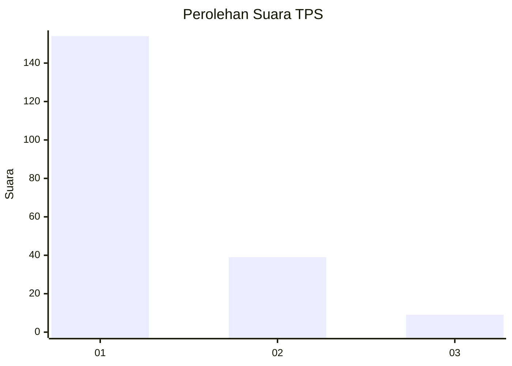
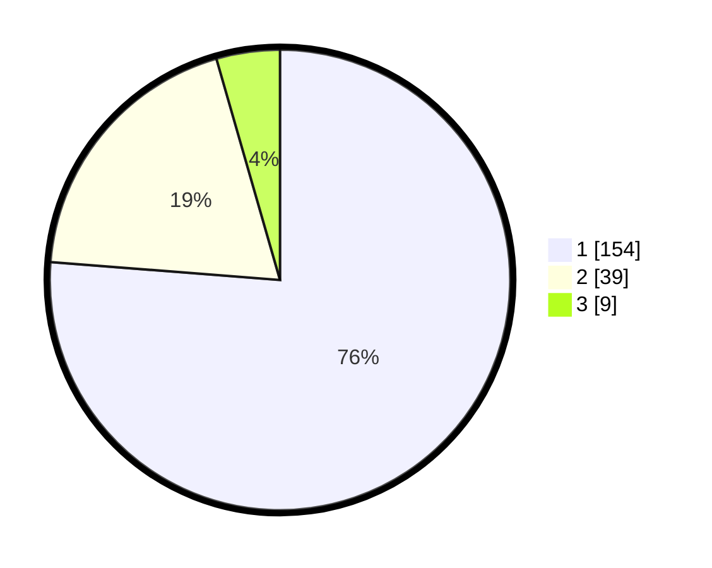

# Hasil

## Grafik

## Tabel

| No. | Nama Paslon    | Suara | Suara (raw) | Persentase |
|:--- |:-------------- | -----:| -----------:| ----------:|
| 1   | ANIES MUHAIMIN | 154   | [154][p-1]  | 76,24      |
| 2   | PRABOWO GIBRAN | 39    | [39][p-2]   | 19,31      |
| 3   | GANJAR MAHFUD  | 9     | [9][p-3]    | 4,46       |

[p-1]: https://github.com/gigit-pemilu/pemilu-2024-11-aceh/blob/main/pilpres/hitung-suara/sub/11-aceh/sub/11-bireuen/sub/13-kota-juang/sub/2001-bandar-bireuen/sub/002-tps/sub/paslon-1.txt
[p-2]: https://github.com/gigit-pemilu/pemilu-2024-11-aceh/blob/main/pilpres/hitung-suara/sub/11-aceh/sub/11-bireuen/sub/13-kota-juang/sub/2001-bandar-bireuen/sub/002-tps/sub/paslon-2.txt
[p-3]: https://github.com/gigit-pemilu/pemilu-2024-11-aceh/blob/main/pilpres/hitung-suara/sub/11-aceh/sub/11-bireuen/sub/13-kota-juang/sub/2001-bandar-bireuen/sub/002-tps/sub/paslon-3.txt

## Foto C Plano

https://sirekap-obj-formc.kpu.go.id/597c/pemilu/ppwp/11/11/13/20/01/1111132001002-20240216-133540--210940af-a9e3-4eb4-a89b-293913f425f3.jpg

https://sirekap-obj-formc.kpu.go.id/597c/pemilu/ppwp/11/11/13/20/01/1111132001002-20240216-133542--cb9e252a-758c-4d71-8e12-3ce871ac0260.jpg

https://sirekap-obj-formc.kpu.go.id/597c/pemilu/ppwp/11/11/13/20/01/1111132001002-20240216-133541--c156325a-ed25-48c8-ac56-c765e43bcf7e.jpg

## Metadata

| Key        | Value               |
| ---------- | ------------------- |
| Time Stamp | 2024-02-19 06:16:00 |

## DATA PEMILIH TETAP

Jumlah pemilih dalam DPT: **266**.
 * L: **130**.
 * P: **136**.

## DATA PENGGUNA HAK PILIH

Jumlah pengguna hak pilih dalam DPT: **202**.
 * L: **95**.
 * P: **107**.

Jumlah pengguna hak pilih dalam DPTb: **0**.
 * L: **0**.
 * P: **0**.

Jumlah pengguna hak pilih dalam DPK: **3**.
 * L: **1**.
 * P: **2**.

Jumlah pengguna hak pilih: **205**.
 * L: **96**.
 * P: **109**.

## JUMLAH SUARA SAH DAN TIDAK SAH

JUMLAH SELURUH SUARA SAH: **202**.

JUMLAH SUARA TIDAK SAH: **3**.

JUMLAH SELURUH SUARA SAH DAN SUARA TIDAK SAH: **205**.

