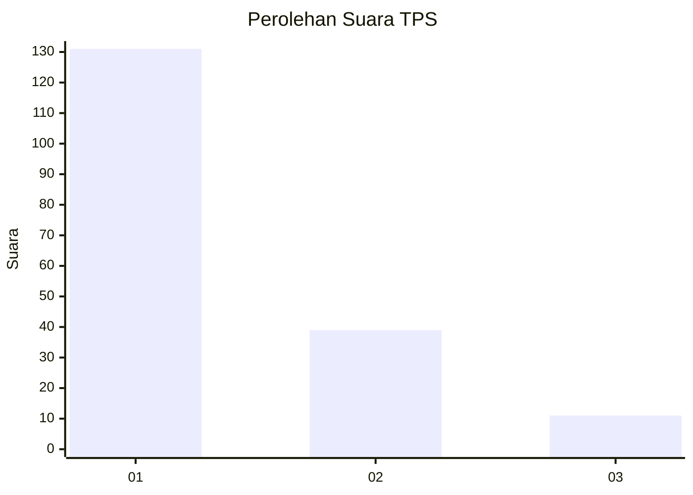
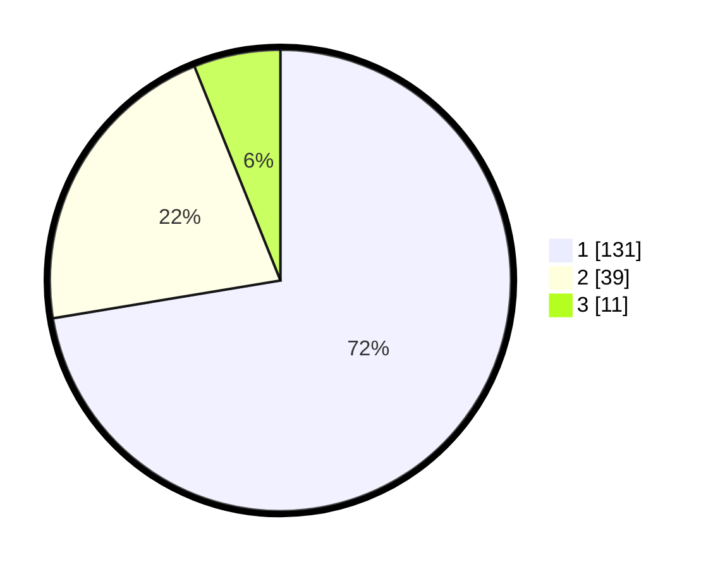

# Hasil

## Grafik

## Tabel

| No. | Nama Paslon    | Suara | Suara (raw) | Persentase |
|:--- |:-------------- | -----:| -----------:| ----------:|
| 1   | ANIES MUHAIMIN | 131   | [131][p-1]  | 72,38      |
| 2   | PRABOWO GIBRAN | 39    | [39][p-2]   | 21,55      |
| 3   | GANJAR MAHFUD  | 11    | [11][p-3]   | 6,08       |

[p-1]: https://github.com/gigit-pemilu/pemilu-2024-11-aceh/blob/main/pilpres/hitung-suara/sub/11-aceh/sub/11-bireuen/sub/13-kota-juang/sub/2001-bandar-bireuen/sub/003-tps/sub/paslon-1.txt
[p-2]: https://github.com/gigit-pemilu/pemilu-2024-11-aceh/blob/main/pilpres/hitung-suara/sub/11-aceh/sub/11-bireuen/sub/13-kota-juang/sub/2001-bandar-bireuen/sub/003-tps/sub/paslon-2.txt
[p-3]: https://github.com/gigit-pemilu/pemilu-2024-11-aceh/blob/main/pilpres/hitung-suara/sub/11-aceh/sub/11-bireuen/sub/13-kota-juang/sub/2001-bandar-bireuen/sub/003-tps/sub/paslon-3.txt

## Foto C Plano

https://sirekap-obj-formc.kpu.go.id/b8d1/pemilu/ppwp/11/11/13/20/01/1111132001003-20240216-134648--88a30a39-5419-45fd-b29a-4fe227c72ce2.jpg

https://sirekap-obj-formc.kpu.go.id/b8d1/pemilu/ppwp/11/11/13/20/01/1111132001003-20240216-134650--85d4bb41-6619-4d8e-9458-35a3344a5f16.jpg

https://sirekap-obj-formc.kpu.go.id/b8d1/pemilu/ppwp/11/11/13/20/01/1111132001003-20240216-134649--71cdf66f-af0f-4b21-94fc-3b7e408f5b58.jpg

## Metadata

| Key        | Value               |
| ---------- | ------------------- |
| Time Stamp | 2024-02-19 06:16:00 |

## DATA PEMILIH TETAP

Jumlah pemilih dalam DPT: **259**.
 * L: **117**.
 * P: **142**.

## DATA PENGGUNA HAK PILIH

Jumlah pengguna hak pilih dalam DPT: **180**.
 * L: **79**.
 * P: **101**.

Jumlah pengguna hak pilih dalam DPTb: **0**.
 * L: **0**.
 * P: **0**.

Jumlah pengguna hak pilih dalam DPK: **1**.
 * L: **1**.
 * P: **0**.

Jumlah pengguna hak pilih: **181**.
 * L: **80**.
 * P: **101**.

## JUMLAH SUARA SAH DAN TIDAK SAH

JUMLAH SELURUH SUARA SAH: **181**.

JUMLAH SUARA TIDAK SAH: **0**.

JUMLAH SELURUH SUARA SAH DAN SUARA TIDAK SAH: **181**.

