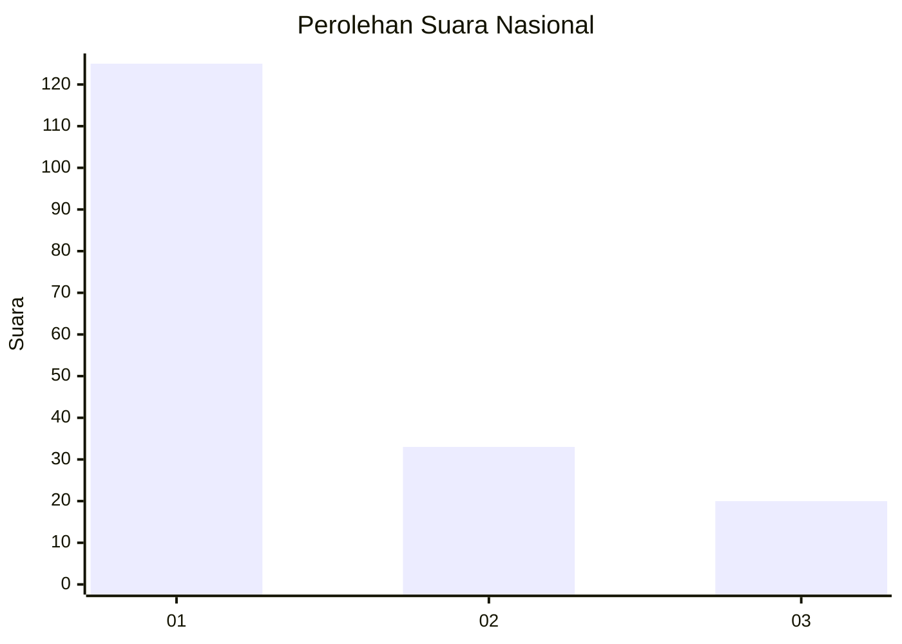
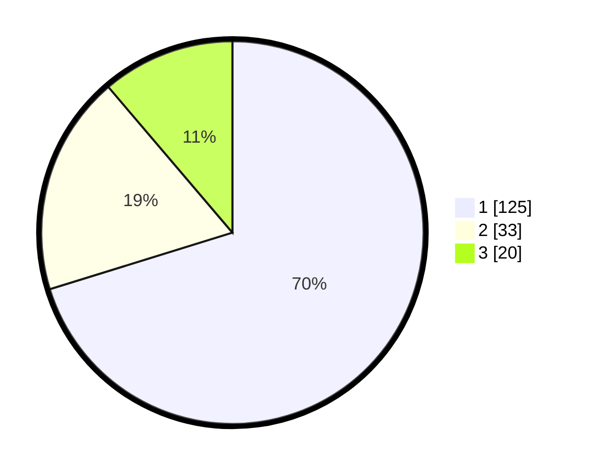

# Hasil

## Grafik

## Tabel

| No. | Nama Paslon    | Suara | Suara (raw) | Persentase |
|:--- |:-------------- | -----:| -----------:| ----------:|
| 1   | ANIES MUHAIMIN | 125   | [125][p-1]  | 70,22      |
| 2   | PRABOWO GIBRAN | 33    | [33][p-2]   | 18,54      |
| 3   | GANJAR MAHFUD  | 20    | [20][p-3]   | 11,24      |

[p-1]: https://github.com/gigit-pemilu/pemilu-2024/blob/main/pilpres/hitung-suara/sub/11-aceh/sub/11-bireuen/sub/13-kota-juang/sub/2001-bandar-bireuen/sub/004-tps/sub/paslon-1.txt
[p-2]: https://github.com/gigit-pemilu/pemilu-2024/blob/main/pilpres/hitung-suara/sub/11-aceh/sub/11-bireuen/sub/13-kota-juang/sub/2001-bandar-bireuen/sub/004-tps/sub/paslon-2.txt
[p-3]: https://github.com/gigit-pemilu/pemilu-2024/blob/main/pilpres/hitung-suara/sub/11-aceh/sub/11-bireuen/sub/13-kota-juang/sub/2001-bandar-bireuen/sub/004-tps/sub/paslon-3.txt

## Foto C Plano

https://sirekap-obj-formc.kpu.go.id/0c34/pemilu/ppwp/11/11/13/20/01/1111132001004-20240216-144031--62e9d7da-2045-46f7-ac2f-21fb8e4903ab.jpg

https://sirekap-obj-formc.kpu.go.id/0c34/pemilu/ppwp/11/11/13/20/01/1111132001004-20240216-144032--d118d491-31d4-4dee-a775-385f2535cd37.jpg

https://sirekap-obj-formc.kpu.go.id/0c34/pemilu/ppwp/11/11/13/20/01/1111132001004-20240216-144032--2d822ac1-a43d-4656-9c7e-30ed15514a14.jpg

## Metadata

| Key        | Value               |
| ---------- | ------------------- |
| Time Stamp | 2024-02-19 06:16:00 |

## DATA PEMILIH TETAP

Jumlah pemilih dalam DPT: **266**.
 * L: **126**.
 * P: **140**.

## DATA PENGGUNA HAK PILIH

Jumlah pengguna hak pilih dalam DPT: **176**.
 * L: **84**.
 * P: **92**.

Jumlah pengguna hak pilih dalam DPTb: **0**.
 * L: **0**.
 * P: **0**.

Jumlah pengguna hak pilih dalam DPK: **4**.
 * L: **3**.
 * P: **1**.

Jumlah pengguna hak pilih: **180**.
 * L: **87**.
 * P: **93**.

## JUMLAH SUARA SAH DAN TIDAK SAH

JUMLAH SELURUH SUARA SAH: **178**.

JUMLAH SUARA TIDAK SAH: **2**.

JUMLAH SELURUH SUARA SAH DAN SUARA TIDAK SAH: **180**.

