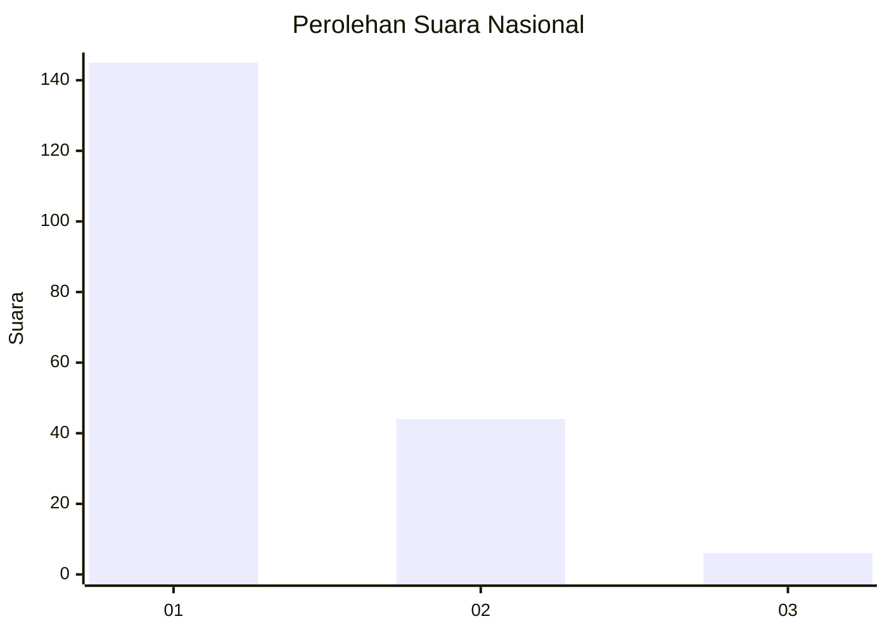
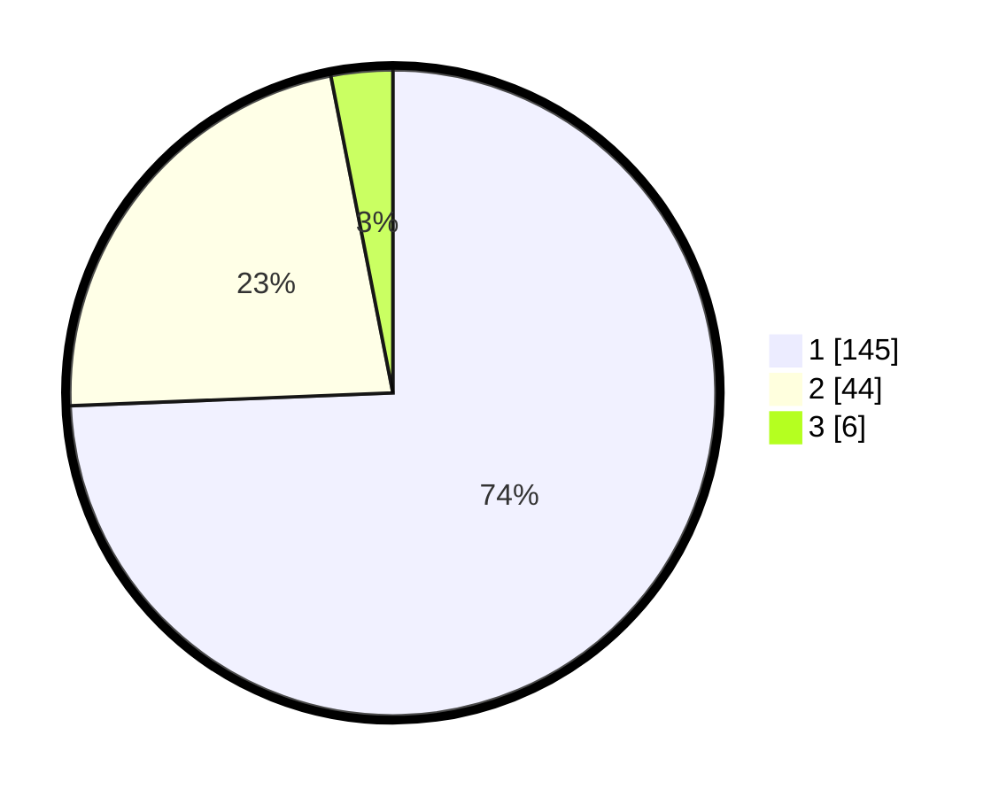

# Hasil

## Grafik

## Tabel

| No. | Nama Paslon    | Suara | Suara (raw) | Persentase |
|:--- |:-------------- | -----:| -----------:| ----------:|
| 1   | ANIES MUHAIMIN | 145   | [145][p-1]  | 74,36      |
| 2   | PRABOWO GIBRAN | 44    | [44][p-2]   | 22,56      |
| 3   | GANJAR MAHFUD  | 6     | [6][p-3]    | 3,08       |

[p-1]: https://github.com/gigit-pemilu/pemilu-2024/blob/main/pilpres/hitung-suara/sub/11-aceh/sub/11-bireuen/sub/13-kota-juang/sub/2001-bandar-bireuen/sub/901-tps/sub/paslon-1.txt
[p-2]: https://github.com/gigit-pemilu/pemilu-2024/blob/main/pilpres/hitung-suara/sub/11-aceh/sub/11-bireuen/sub/13-kota-juang/sub/2001-bandar-bireuen/sub/901-tps/sub/paslon-2.txt
[p-3]: https://github.com/gigit-pemilu/pemilu-2024/blob/main/pilpres/hitung-suara/sub/11-aceh/sub/11-bireuen/sub/13-kota-juang/sub/2001-bandar-bireuen/sub/901-tps/sub/paslon-3.txt

## Foto C Plano

https://sirekap-obj-formc.kpu.go.id/ed85/pemilu/ppwp/11/11/13/20/01/1111132001901-20240215-003158--27dd901d-ba70-47d8-b74a-1ed3f3f90b5e.jpg

https://sirekap-obj-formc.kpu.go.id/ed85/pemilu/ppwp/11/11/13/20/01/1111132001901-20240215-003254--af81bcab-ebf4-4501-917a-b4ce3c454e30.jpg

https://sirekap-obj-formc.kpu.go.id/ed85/pemilu/ppwp/11/11/13/20/01/1111132001901-20240215-003336--eb898474-80cf-4612-93c6-e90f9c189939.jpg

## Metadata

| Key        | Value               |
| ---------- | ------------------- |
| Time Stamp | 2024-02-15 20:30:46 |

## DATA PEMILIH TETAP

Jumlah pemilih dalam DPT: **199**.
 * L: **193**.
 * P: **6**.

## DATA PENGGUNA HAK PILIH

Jumlah pengguna hak pilih dalam DPT: **136**.
 * L: **134**.
 * P: **2**.

Jumlah pengguna hak pilih dalam DPTb: **65**.
 * L: **64**.
 * P: **1**.

Jumlah pengguna hak pilih dalam DPK: **0**.
 * L: **0**.
 * P: **0**.

Jumlah pengguna hak pilih: **201**.
 * L: **198**.
 * P: **3**.

## JUMLAH SUARA SAH DAN TIDAK SAH

JUMLAH SELURUH SUARA SAH: **195**.

JUMLAH SUARA TIDAK SAH: **4**.

JUMLAH SELURUH SUARA SAH DAN SUARA TIDAK SAH: **199**.

