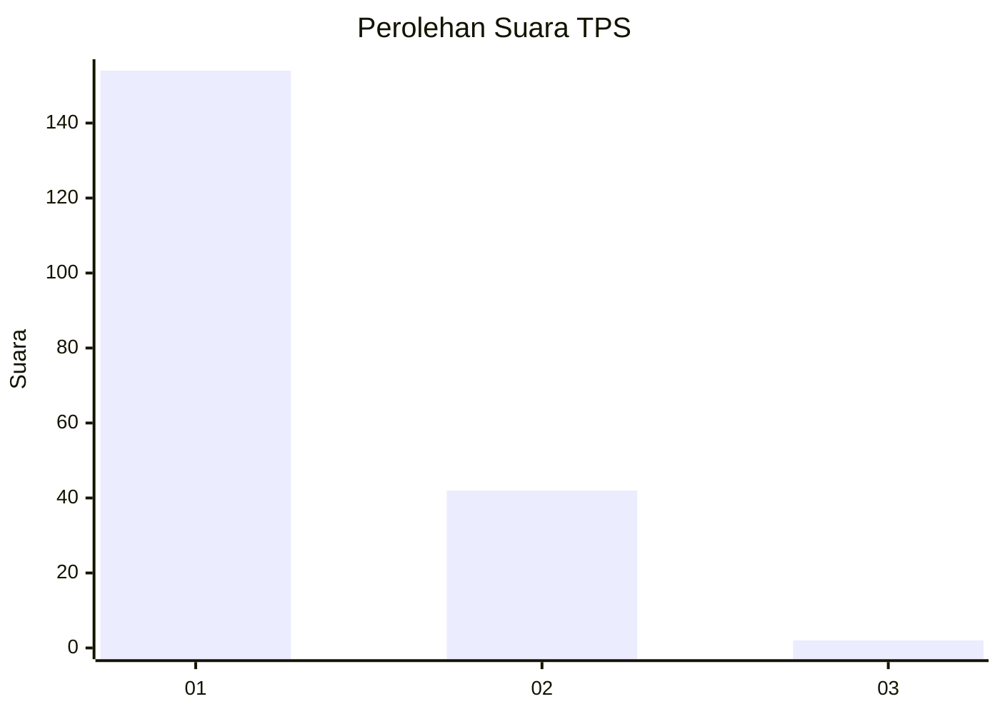
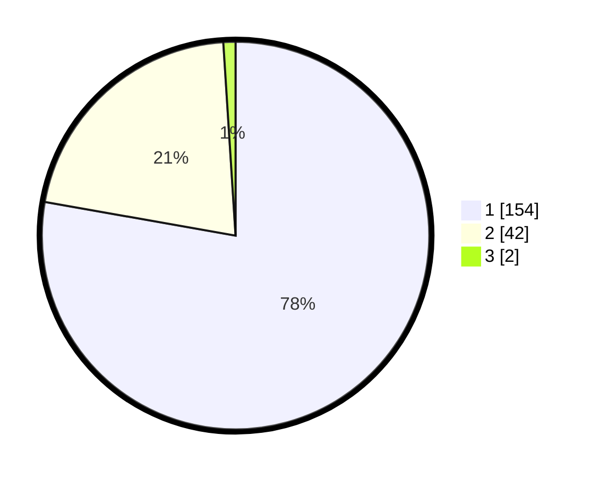

# Hasil

## Grafik

## Tabel

| No. | Nama Paslon    | Suara | Suara (raw) | Persentase |
|:--- |:-------------- | -----:| -----------:| ----------:|
| 1   | ANIES MUHAIMIN | 154   | [154][p-1]  | 77,78      |
| 2   | PRABOWO GIBRAN | 42    | [42][p-2]   | 21,21      |
| 3   | GANJAR MAHFUD  | 2     | [2][p-3]    | 1,01       |

[p-1]: https://github.com/gigit-pemilu/pemilu-2024-11-aceh/blob/main/pilpres/hitung-suara/sub/11-aceh/sub/11-bireuen/sub/13-kota-juang/sub/2007-geudong-geudong/sub/004-tps/sub/paslon-1.txt
[p-2]: https://github.com/gigit-pemilu/pemilu-2024-11-aceh/blob/main/pilpres/hitung-suara/sub/11-aceh/sub/11-bireuen/sub/13-kota-juang/sub/2007-geudong-geudong/sub/004-tps/sub/paslon-2.txt
[p-3]: https://github.com/gigit-pemilu/pemilu-2024-11-aceh/blob/main/pilpres/hitung-suara/sub/11-aceh/sub/11-bireuen/sub/13-kota-juang/sub/2007-geudong-geudong/sub/004-tps/sub/paslon-3.txt

## Foto C Plano

https://sirekap-obj-formc.kpu.go.id/866d/pemilu/ppwp/11/11/13/20/07/1111132007004-20240215-104240--86252427-2a26-475d-8079-6932395dba04.jpg

https://sirekap-obj-formc.kpu.go.id/866d/pemilu/ppwp/11/11/13/20/07/1111132007004-20240215-104232--790e15da-d0f6-40c1-a057-48e4ffcb9e64.jpg

https://sirekap-obj-formc.kpu.go.id/866d/pemilu/ppwp/11/11/13/20/07/1111132007004-20240215-104223--4b86f9a7-4ad5-40df-83e0-32b29001b50a.jpg

## Metadata

| Key        | Value               |
| ---------- | ------------------- |
| Time Stamp | 2024-02-16 17:30:00 |

