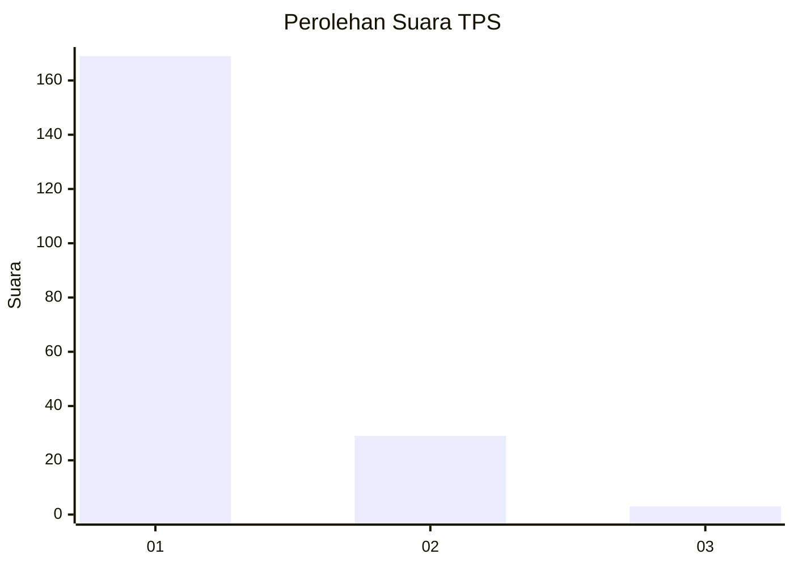
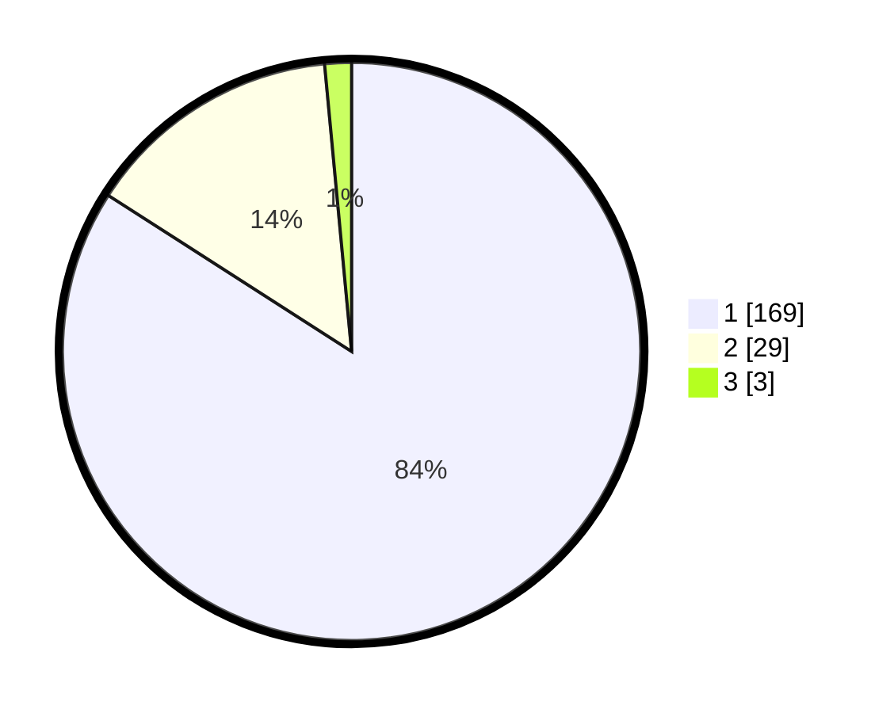

# Hasil

## Grafik

## Tabel

| No. | Nama Paslon    | Suara | Suara (raw) | Persentase |
|:--- |:-------------- | -----:| -----------:| ----------:|
| 1   | ANIES MUHAIMIN | 169   | [169][p-1]  | 84,08      |
| 2   | PRABOWO GIBRAN | 29    | [29][p-2]   | 14,43      |
| 3   | GANJAR MAHFUD  | 3     | [3][p-3]    | 1,49       |

[p-1]: https://github.com/gigit-pemilu/pemilu-2024-11-aceh/blob/main/pilpres/hitung-suara/sub/11-aceh/sub/11-bireuen/sub/13-kota-juang/sub/2007-geudong-geudong/sub/006-tps/sub/paslon-1.txt
[p-2]: https://github.com/gigit-pemilu/pemilu-2024-11-aceh/blob/main/pilpres/hitung-suara/sub/11-aceh/sub/11-bireuen/sub/13-kota-juang/sub/2007-geudong-geudong/sub/006-tps/sub/paslon-2.txt
[p-3]: https://github.com/gigit-pemilu/pemilu-2024-11-aceh/blob/main/pilpres/hitung-suara/sub/11-aceh/sub/11-bireuen/sub/13-kota-juang/sub/2007-geudong-geudong/sub/006-tps/sub/paslon-3.txt

## Foto C Plano

https://sirekap-obj-formc.kpu.go.id/12c3/pemilu/ppwp/11/11/13/20/07/1111132007006-20240215-093141--33c10da0-3a57-4cc6-ab5c-78961d347afe.jpg

https://sirekap-obj-formc.kpu.go.id/12c3/pemilu/ppwp/11/11/13/20/07/1111132007006-20240215-093257--2cfaa63c-b200-4b96-8bbe-0df66dfa388f.jpg

https://sirekap-obj-formc.kpu.go.id/12c3/pemilu/ppwp/11/11/13/20/07/1111132007006-20240215-093408--e52cea5a-8ef3-4a17-aeae-b1af6a1bad83.jpg

## Metadata

| Key        | Value               |
| ---------- | ------------------- |
| Time Stamp | 2024-02-19 06:16:00 |

