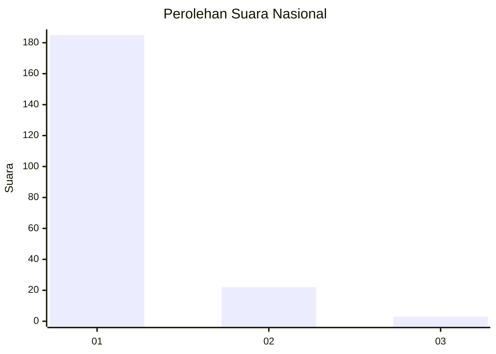
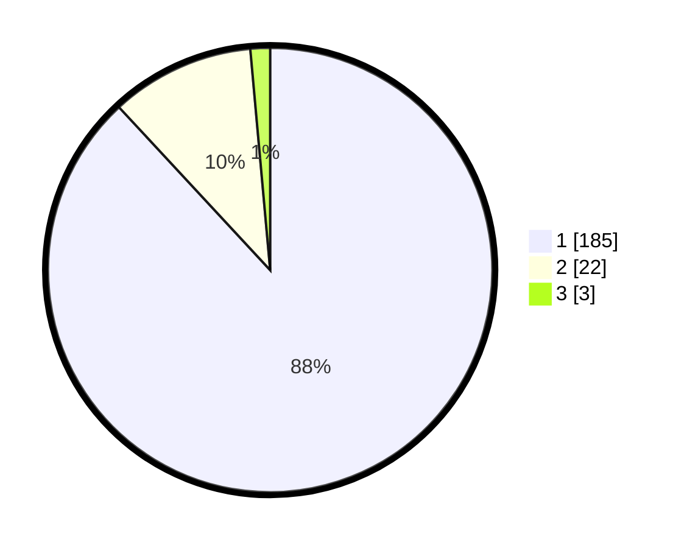

# Hasil

## Grafik

## Tabel

| No. | Nama Paslon    | Suara | Suara (raw) | Persentase |
|:--- |:-------------- | -----:| -----------:| ----------:|
| 1   | ANIES MUHAIMIN | 185   | [185][p-1]  | 88,10      |
| 2   | PRABOWO GIBRAN | 22    | [22][p-2]   | 10,48      |
| 3   | GANJAR MAHFUD  | 3     | [3][p-3]    | 1,43       |

[p-1]: https://github.com/gigit-pemilu/pemilu-2024/blob/main/pilpres/hitung-suara/sub/11-aceh/sub/11-bireuen/sub/13-kota-juang/sub/2007-geudong-geudong/sub/010-tps/sub/paslon-1.txt
[p-2]: https://github.com/gigit-pemilu/pemilu-2024/blob/main/pilpres/hitung-suara/sub/11-aceh/sub/11-bireuen/sub/13-kota-juang/sub/2007-geudong-geudong/sub/010-tps/sub/paslon-2.txt
[p-3]: https://github.com/gigit-pemilu/pemilu-2024/blob/main/pilpres/hitung-suara/sub/11-aceh/sub/11-bireuen/sub/13-kota-juang/sub/2007-geudong-geudong/sub/010-tps/sub/paslon-3.txt

## Foto C Plano

https://sirekap-obj-formc.kpu.go.id/b339/pemilu/ppwp/11/11/13/20/07/1111132007010-20240215-090300--7552d54f-1018-4c8c-9b08-ac76209d7fe2.jpg

https://sirekap-obj-formc.kpu.go.id/b339/pemilu/ppwp/11/11/13/20/07/1111132007010-20240215-090340--cdfb279a-33cc-4d28-999d-753d6874b41a.jpg

https://sirekap-obj-formc.kpu.go.id/b339/pemilu/ppwp/11/11/13/20/07/1111132007010-20240215-090416--b137de2d-e333-4b07-bdc9-7c1cd3908381.jpg

## Metadata

| Key        | Value               |
| ---------- | ------------------- |
| Time Stamp | 2024-02-15 20:30:46 |

