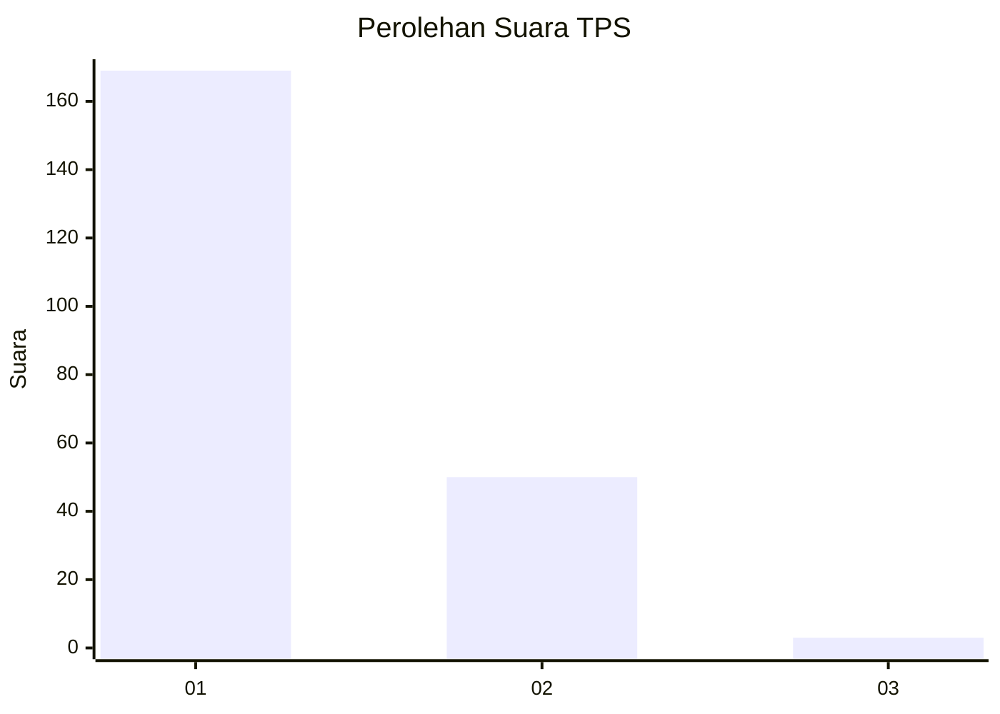
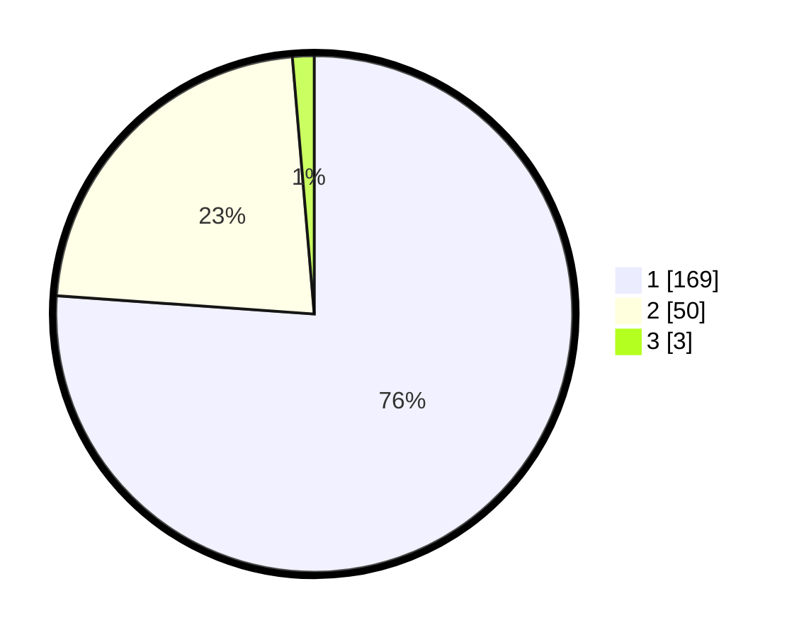

# Hasil

## Grafik

## Tabel

| No. | Nama Paslon    | Suara | Suara (raw) | Persentase |
|:--- |:-------------- | -----:| -----------:| ----------:|
| 1   | ANIES MUHAIMIN | 169   | [169][p-1]  | 76,13      |
| 2   | PRABOWO GIBRAN | 50    | [50][p-2]   | 22,52      |
| 3   | GANJAR MAHFUD  | 3     | [3][p-3]    | 1,35       |

[p-1]: https://github.com/gigit-pemilu/pemilu-2024-11-aceh/blob/main/pilpres/hitung-suara/sub/11-aceh/sub/11-bireuen/sub/13-kota-juang/sub/2010-pulo-kiton/sub/005-tps/sub/paslon-1.txt
[p-2]: https://github.com/gigit-pemilu/pemilu-2024-11-aceh/blob/main/pilpres/hitung-suara/sub/11-aceh/sub/11-bireuen/sub/13-kota-juang/sub/2010-pulo-kiton/sub/005-tps/sub/paslon-2.txt
[p-3]: https://github.com/gigit-pemilu/pemilu-2024-11-aceh/blob/main/pilpres/hitung-suara/sub/11-aceh/sub/11-bireuen/sub/13-kota-juang/sub/2010-pulo-kiton/sub/005-tps/sub/paslon-3.txt

## Foto C Plano

https://sirekap-obj-formc.kpu.go.id/ca40/pemilu/ppwp/11/11/13/20/10/1111132010005-20240218-122956--929c6110-f8e7-4bcd-8924-3c8277f4ca1d.jpg

https://sirekap-obj-formc.kpu.go.id/ca40/pemilu/ppwp/11/11/13/20/10/1111132010005-20240216-164322--c6d390b5-8559-4950-bce5-a7fe3e8fff97.jpg

https://sirekap-obj-formc.kpu.go.id/ca40/pemilu/ppwp/11/11/13/20/10/1111132010005-20240216-172732--001a1b08-3e13-48e9-80de-06523a6c1426.jpg

## Metadata

| Key        | Value               |
| ---------- | ------------------- |
| Time Stamp | 2024-02-19 06:16:00 |

