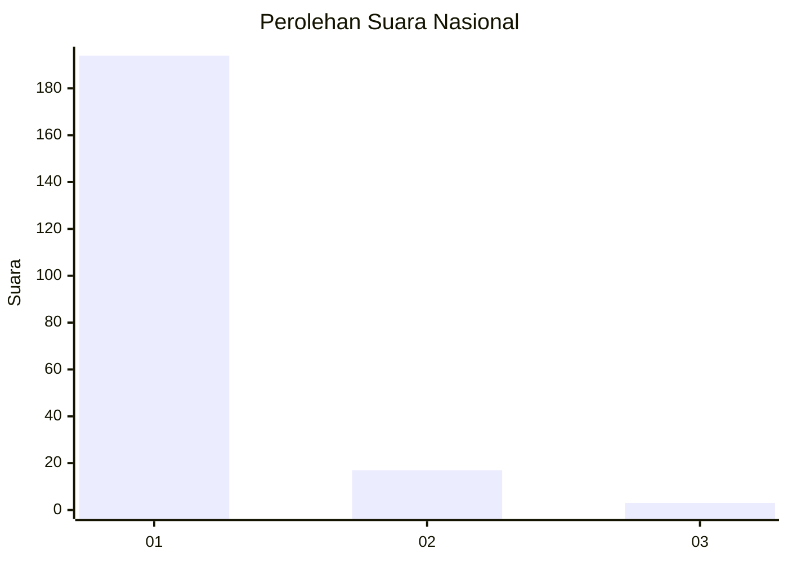
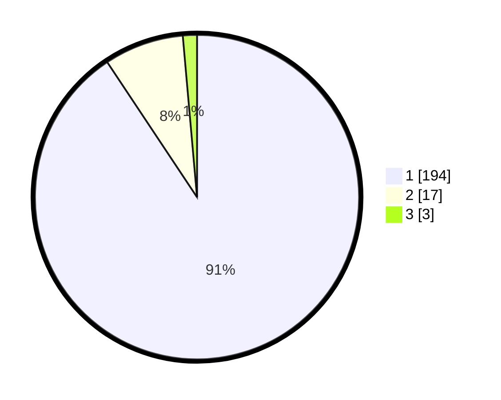

# Hasil

## Grafik

## Tabel

| No. | Nama Paslon    | Suara | Suara (raw) | Persentase |
|:--- |:-------------- | -----:| -----------:| ----------:|
| 1   | ANIES MUHAIMIN | 194   | [194][p-1]  | 90,65      |
| 2   | PRABOWO GIBRAN | 17    | [17][p-2]   | 7,94       |
| 3   | GANJAR MAHFUD  | 3     | [3][p-3]    | 1,40       |

[p-1]: https://github.com/gigit-pemilu/pemilu-2024/blob/main/pilpres/hitung-suara/sub/11-aceh/sub/11-bireuen/sub/13-kota-juang/sub/2017-buket-teukueh/sub/002-tps/sub/paslon-1.txt
[p-2]: https://github.com/gigit-pemilu/pemilu-2024/blob/main/pilpres/hitung-suara/sub/11-aceh/sub/11-bireuen/sub/13-kota-juang/sub/2017-buket-teukueh/sub/002-tps/sub/paslon-2.txt
[p-3]: https://github.com/gigit-pemilu/pemilu-2024/blob/main/pilpres/hitung-suara/sub/11-aceh/sub/11-bireuen/sub/13-kota-juang/sub/2017-buket-teukueh/sub/002-tps/sub/paslon-3.txt

## Foto C Plano

https://sirekap-obj-formc.kpu.go.id/e773/pemilu/ppwp/11/11/13/20/17/1111132017002-20240215-002531--5acffc9a-a9ce-4ce8-9501-ed49aa4318d5.jpg

https://sirekap-obj-formc.kpu.go.id/e773/pemilu/ppwp/11/11/13/20/17/1111132017002-20240215-001355--65d4ceb6-c2a0-42e0-8988-5e432ebca84b.jpg

https://sirekap-obj-formc.kpu.go.id/e773/pemilu/ppwp/11/11/13/20/17/1111132017002-20240215-001453--eedead2a-7c1d-41ab-ab6e-f510b22ad632.jpg

## Metadata

| Key        | Value               |
| ---------- | ------------------- |
| Time Stamp | 2024-02-16 00:00:26 |

