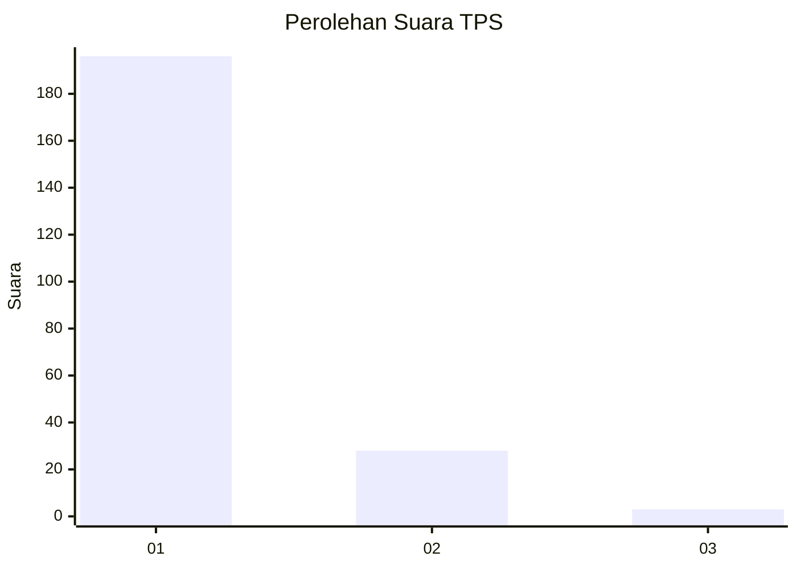
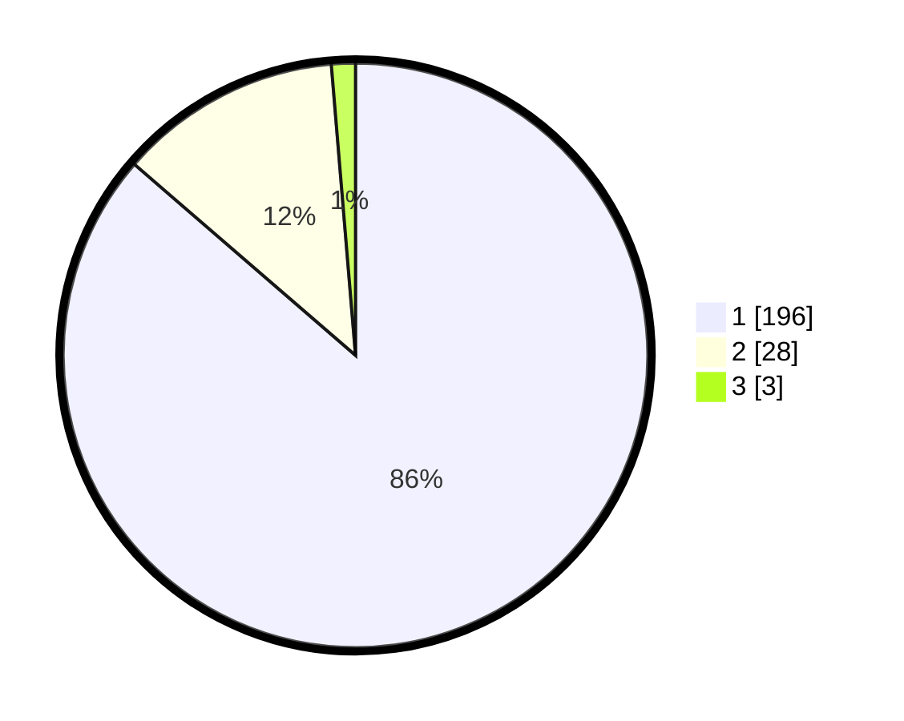

# Hasil

## Grafik

## Tabel

| No. | Nama Paslon    | Suara | Suara (raw) | Persentase |
|:--- |:-------------- | -----:| -----------:| ----------:|
| 1   | ANIES MUHAIMIN | 196   | [196][p-1]  | 86,34      |
| 2   | PRABOWO GIBRAN | 28    | [28][p-2]   | 12,33      |
| 3   | GANJAR MAHFUD  | 3     | [3][p-3]    | 1,32       |

[p-1]: https://github.com/gigit-pemilu/pemilu-2024-11-aceh/blob/main/pilpres/hitung-suara/sub/11-aceh/sub/11-bireuen/sub/14-kuala/sub/2005-cot-kuta/sub/001-tps/sub/paslon-1.txt
[p-2]: https://github.com/gigit-pemilu/pemilu-2024-11-aceh/blob/main/pilpres/hitung-suara/sub/11-aceh/sub/11-bireuen/sub/14-kuala/sub/2005-cot-kuta/sub/001-tps/sub/paslon-2.txt
[p-3]: https://github.com/gigit-pemilu/pemilu-2024-11-aceh/blob/main/pilpres/hitung-suara/sub/11-aceh/sub/11-bireuen/sub/14-kuala/sub/2005-cot-kuta/sub/001-tps/sub/paslon-3.txt

## Foto C Plano

https://sirekap-obj-formc.kpu.go.id/50bb/pemilu/ppwp/11/11/14/20/05/1111142005001-20240215-043255--408e2f54-6974-4e84-9cc2-0af0eeb9e663.jpg

https://sirekap-obj-formc.kpu.go.id/50bb/pemilu/ppwp/11/11/14/20/05/1111142005001-20240215-043548--8af10918-8269-4c61-ae07-19f8ae012fdc.jpg

https://sirekap-obj-formc.kpu.go.id/50bb/pemilu/ppwp/11/11/14/20/05/1111142005001-20240215-044003--874bcf1a-7d9e-4dfb-8eb3-66a9bc130c7f.jpg

## Metadata

| Key        | Value               |
| ---------- | ------------------- |
| Time Stamp | 2024-02-19 06:16:00 |

