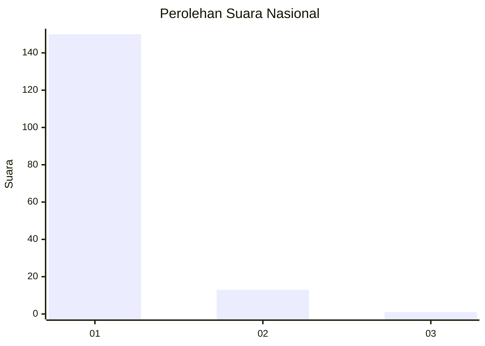
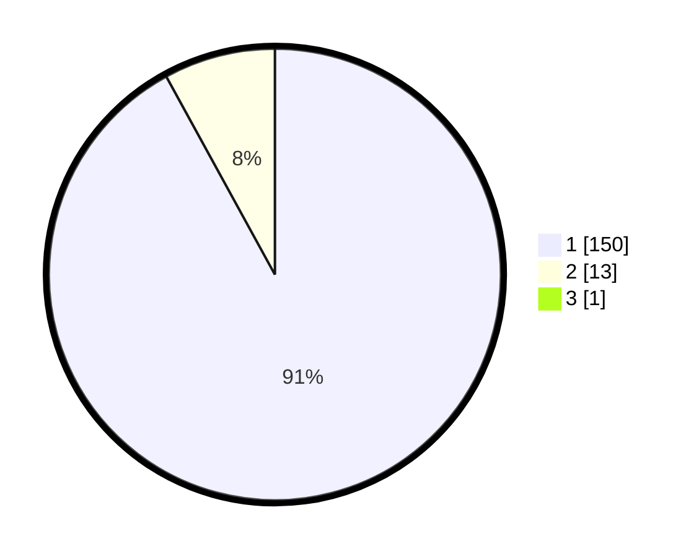

# Hasil

## Grafik

## Tabel

| No. | Nama Paslon    | Suara | Suara (raw) | Persentase |
|:--- |:-------------- | -----:| -----------:| ----------:|
| 1   | ANIES MUHAIMIN | 150   | [150][p-1]  | 91,46      |
| 2   | PRABOWO GIBRAN | 13    | [13][p-2]   | 7,93       |
| 3   | GANJAR MAHFUD  | 1     | [1][p-3]    | 0,61       |

[p-1]: https://github.com/gigit-pemilu/pemilu-2024/blob/main/pilpres/hitung-suara/sub/11-aceh/sub/11-bireuen/sub/14-kuala/sub/2012-cot-u-sibak/sub/002-tps/sub/paslon-1.txt
[p-2]: https://github.com/gigit-pemilu/pemilu-2024/blob/main/pilpres/hitung-suara/sub/11-aceh/sub/11-bireuen/sub/14-kuala/sub/2012-cot-u-sibak/sub/002-tps/sub/paslon-2.txt
[p-3]: https://github.com/gigit-pemilu/pemilu-2024/blob/main/pilpres/hitung-suara/sub/11-aceh/sub/11-bireuen/sub/14-kuala/sub/2012-cot-u-sibak/sub/002-tps/sub/paslon-3.txt

## Foto C Plano

https://sirekap-obj-formc.kpu.go.id/56f0/pemilu/ppwp/11/11/14/20/12/1111142012002-20240214-155043--bf25f467-c278-45f9-831d-e861b1e378fc.jpg

https://sirekap-obj-formc.kpu.go.id/56f0/pemilu/ppwp/11/11/14/20/12/1111142012002-20240215-025638--9ad1aaab-9002-4f26-b2ce-76de27434725.jpg

https://sirekap-obj-formc.kpu.go.id/56f0/pemilu/ppwp/11/11/14/20/12/1111142012002-20240215-025736--3dfc85cf-39f4-4331-9705-e977b1e9f6b8.jpg

## Metadata

| Key        | Value               |
| ---------- | ------------------- |
| Time Stamp | 2024-02-15 15:00:29 |

