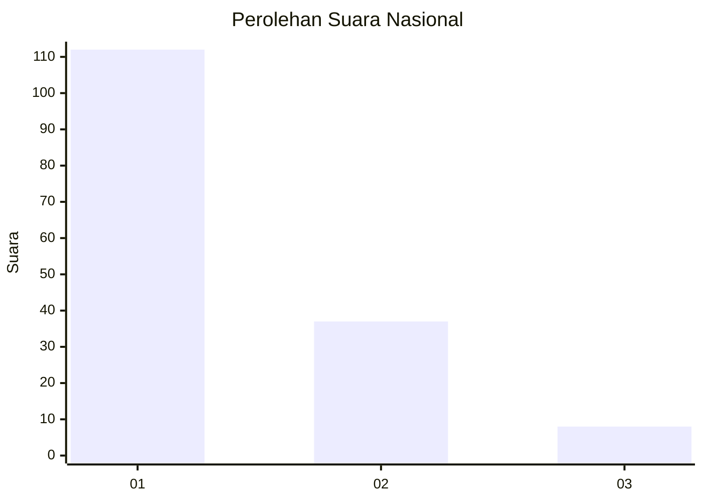
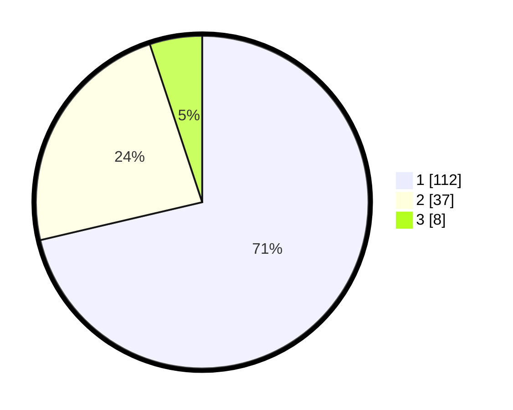

# Hasil

## Grafik

## Tabel

| No. | Nama Paslon    | Suara | Suara (raw) | Persentase |
|:--- |:-------------- | -----:| -----------:| ----------:|
| 1   | ANIES MUHAIMIN | 112   | [112][p-1]  | 71,34      |
| 2   | PRABOWO GIBRAN | 37    | [37][p-2]   | 23,57      |
| 3   | GANJAR MAHFUD  | 8     | [8][p-3]    | 5,10       |

[p-1]: https://github.com/gigit-pemilu/pemilu-2024/blob/main/pilpres/hitung-suara/sub/11-aceh/sub/11-bireuen/sub/15-peusangan-siblah-krueng/sub/2002-rambong-payong/sub/002-tps/sub/paslon-1.txt
[p-2]: https://github.com/gigit-pemilu/pemilu-2024/blob/main/pilpres/hitung-suara/sub/11-aceh/sub/11-bireuen/sub/15-peusangan-siblah-krueng/sub/2002-rambong-payong/sub/002-tps/sub/paslon-2.txt
[p-3]: https://github.com/gigit-pemilu/pemilu-2024/blob/main/pilpres/hitung-suara/sub/11-aceh/sub/11-bireuen/sub/15-peusangan-siblah-krueng/sub/2002-rambong-payong/sub/002-tps/sub/paslon-3.txt

## Foto C Plano

https://sirekap-obj-formc.kpu.go.id/9272/pemilu/ppwp/11/11/15/20/02/1111152002002-20240216-133239--e6a6bb5e-a46c-45eb-9127-2f61a6a43381.jpg

https://sirekap-obj-formc.kpu.go.id/9272/pemilu/ppwp/11/11/15/20/02/1111152002002-20240216-133240--2ff134c1-9ba0-4bcd-8b65-fef506fc6b62.jpg

https://sirekap-obj-formc.kpu.go.id/9272/pemilu/ppwp/11/11/15/20/02/1111152002002-20240216-133240--290794f9-5757-440d-85fa-61a2e78fe3d1.jpg

## Metadata

| Key        | Value               |
| ---------- | ------------------- |
| Time Stamp | 2024-02-19 06:16:00 |

## DATA PEMILIH TETAP

Jumlah pemilih dalam DPT: **172**.
 * L: **85**.
 * P: **87**.

## DATA PENGGUNA HAK PILIH

Jumlah pengguna hak pilih dalam DPT: **159**.
 * L: **75**.
 * P: **84**.

Jumlah pengguna hak pilih dalam DPTb: **0**.
 * L: **0**.
 * P: **0**.

Jumlah pengguna hak pilih dalam DPK: **0**.
 * L: **0**.
 * P: **0**.

Jumlah pengguna hak pilih: **159**.
 * L: **75**.
 * P: **84**.

## JUMLAH SUARA SAH DAN TIDAK SAH

JUMLAH SELURUH SUARA SAH: **157**.

JUMLAH SUARA TIDAK SAH: **2**.

JUMLAH SELURUH SUARA SAH DAN SUARA TIDAK SAH: **159**.

