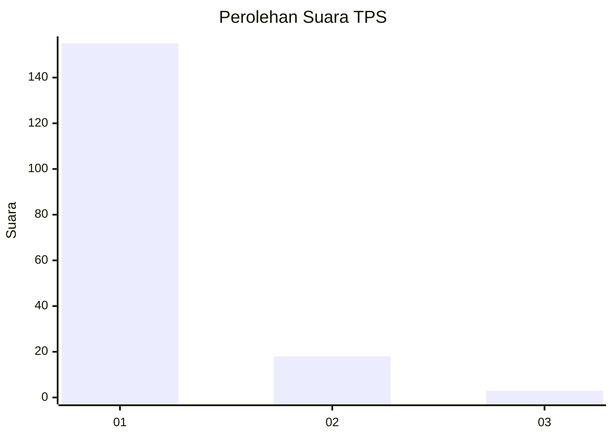
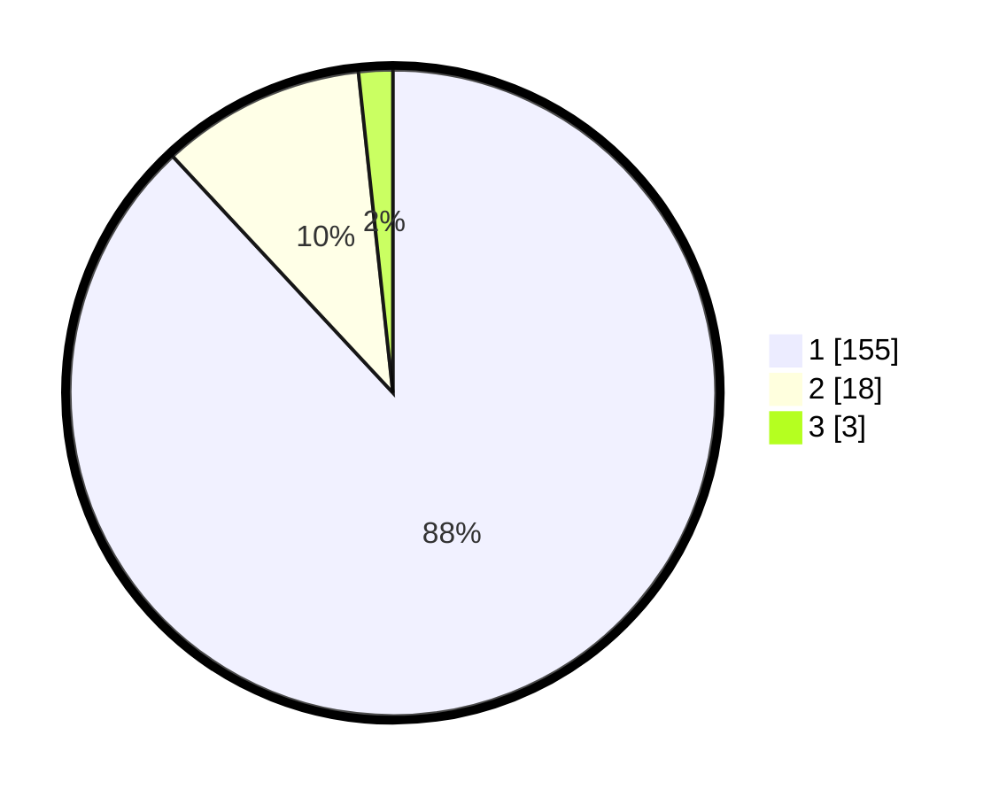

# Hasil

## Grafik

## Tabel

| No. | Nama Paslon    | Suara | Suara (raw) | Persentase |
|:--- |:-------------- | -----:| -----------:| ----------:|
| 1   | ANIES MUHAIMIN | 155   | [155][p-1]  | 88,07      |
| 2   | PRABOWO GIBRAN | 18    | [18][p-2]   | 10,23      |
| 3   | GANJAR MAHFUD  | 3     | [3][p-3]    | 1,70       |

[p-1]: https://github.com/gigit-pemilu/pemilu-2024-11-aceh/blob/main/pilpres/hitung-suara/sub/11-aceh/sub/11-bireuen/sub/15-peusangan-siblah-krueng/sub/2021-dayah-baro/sub/002-tps/sub/paslon-1.txt
[p-2]: https://github.com/gigit-pemilu/pemilu-2024-11-aceh/blob/main/pilpres/hitung-suara/sub/11-aceh/sub/11-bireuen/sub/15-peusangan-siblah-krueng/sub/2021-dayah-baro/sub/002-tps/sub/paslon-2.txt
[p-3]: https://github.com/gigit-pemilu/pemilu-2024-11-aceh/blob/main/pilpres/hitung-suara/sub/11-aceh/sub/11-bireuen/sub/15-peusangan-siblah-krueng/sub/2021-dayah-baro/sub/002-tps/sub/paslon-3.txt

## Foto C Plano

https://sirekap-obj-formc.kpu.go.id/5948/pemilu/ppwp/11/11/15/20/21/1111152021002-20240215-070717--08a354fb-6982-4aed-b563-fc89b326a836.jpg

https://sirekap-obj-formc.kpu.go.id/5948/pemilu/ppwp/11/11/15/20/21/1111152021002-20240215-090153--a85d8ea5-856c-420e-834d-aab5efa36852.jpg

https://sirekap-obj-formc.kpu.go.id/5948/pemilu/ppwp/11/11/15/20/21/1111152021002-20240215-090226--9d9a5e61-70ea-456c-aceb-c9d010a6ceaf.jpg

## Metadata

| Key        | Value               |
| ---------- | ------------------- |
| Time Stamp | 2024-02-16 16:25:10 |

