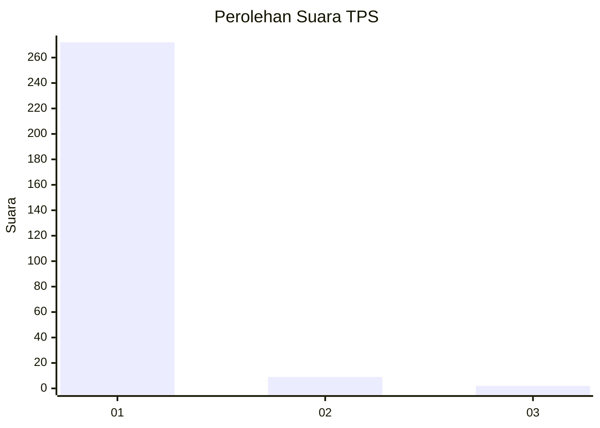
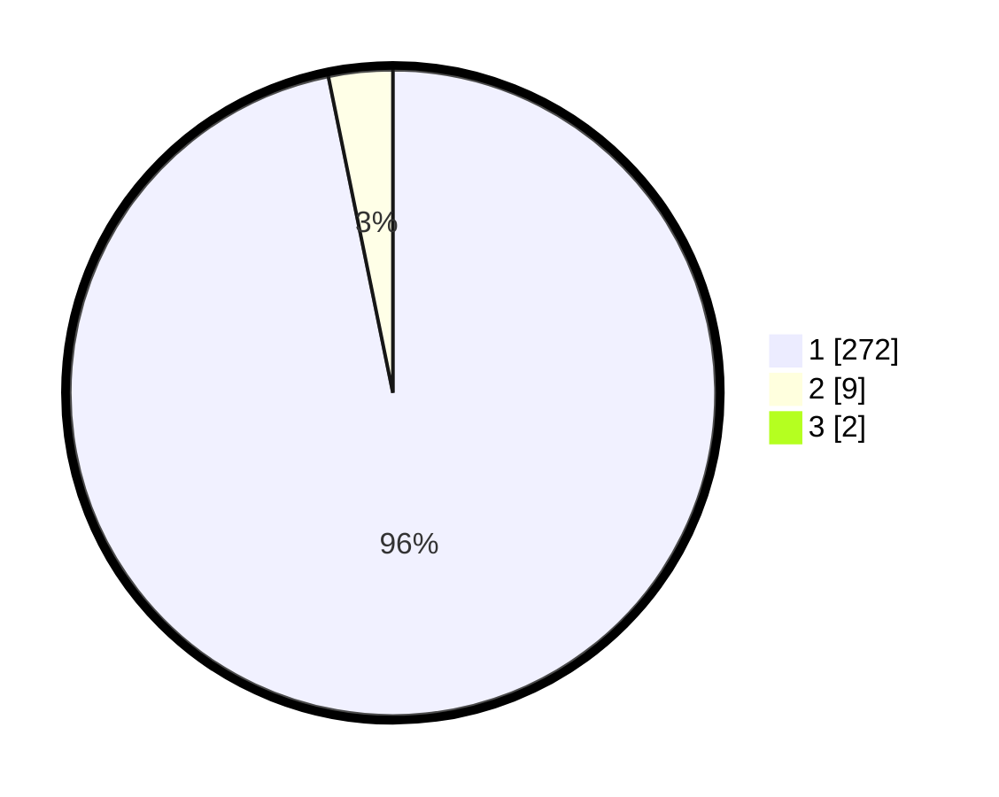

# Hasil

## Grafik

## Tabel

| No. | Nama Paslon    | Suara | Suara (raw) | Persentase |
|:--- |:-------------- | -----:| -----------:| ----------:|
| 1   | ANIES MUHAIMIN | 272   | [272][p-1]  | 96,11      |
| 2   | PRABOWO GIBRAN | 9     | [9][p-2]    | 3,18       |
| 3   | GANJAR MAHFUD  | 2     | [2][p-3]    | 0,71       |

[p-1]: https://github.com/gigit-pemilu/pemilu-2024-11-aceh/blob/main/pilpres/hitung-suara/sub/11-aceh/sub/11-bireuen/sub/16-peusangan-selatan/sub/2002-blang-mane/sub/002-tps/sub/paslon-1.txt
[p-2]: https://github.com/gigit-pemilu/pemilu-2024-11-aceh/blob/main/pilpres/hitung-suara/sub/11-aceh/sub/11-bireuen/sub/16-peusangan-selatan/sub/2002-blang-mane/sub/002-tps/sub/paslon-2.txt
[p-3]: https://github.com/gigit-pemilu/pemilu-2024-11-aceh/blob/main/pilpres/hitung-suara/sub/11-aceh/sub/11-bireuen/sub/16-peusangan-selatan/sub/2002-blang-mane/sub/002-tps/sub/paslon-3.txt

## Foto C Plano

https://sirekap-obj-formc.kpu.go.id/bd2b/pemilu/ppwp/11/11/16/20/02/1111162002002-20240216-225708--f8c71028-a439-40b1-9ec3-c6428a67ef24.jpg

https://sirekap-obj-formc.kpu.go.id/bd2b/pemilu/ppwp/11/11/16/20/02/1111162002002-20240216-225709--f1ed28da-9b25-428c-9035-c798a3c75da4.jpg

https://sirekap-obj-formc.kpu.go.id/bd2b/pemilu/ppwp/11/11/16/20/02/1111162002002-20240216-225708--fc1c9499-d5b2-415b-a96d-fd84d285ae74.jpg

## Metadata

| Key        | Value               |
| ---------- | ------------------- |
| Time Stamp | 2024-02-19 06:16:00 |

## DATA PEMILIH TETAP

Jumlah pemilih dalam DPT: **281**.
 * L: **132**.
 * P: **149**.

## DATA PENGGUNA HAK PILIH

Jumlah pengguna hak pilih dalam DPT: **281**.
 * L: **132**.
 * P: **149**.

Jumlah pengguna hak pilih dalam DPTb: **0**.
 * L: **0**.
 * P: **0**.

Jumlah pengguna hak pilih dalam DPK: **2**.
 * L: **1**.
 * P: **1**.

Jumlah pengguna hak pilih: **283**.
 * L: **133**.
 * P: **150**.

## JUMLAH SUARA SAH DAN TIDAK SAH

JUMLAH SELURUH SUARA SAH: **283**.

JUMLAH SUARA TIDAK SAH: **0**.

JUMLAH SELURUH SUARA SAH DAN SUARA TIDAK SAH: **283**.

