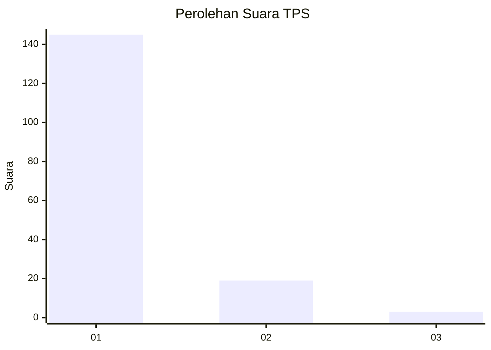
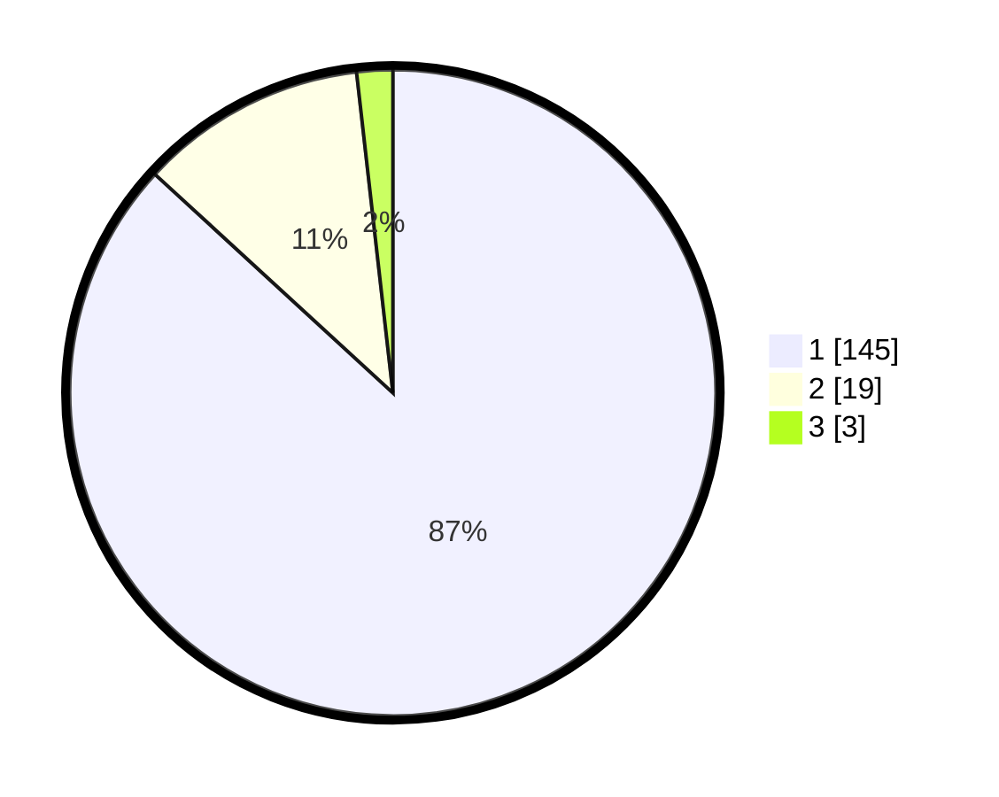

# Hasil

## Grafik

## Tabel

| No. | Nama Paslon    | Suara | Suara (raw) | Persentase |
|:--- |:-------------- | -----:| -----------:| ----------:|
| 1   | ANIES MUHAIMIN | 145   | [145][p-1]  | 86,83      |
| 2   | PRABOWO GIBRAN | 19    | [19][p-2]   | 11,38      |
| 3   | GANJAR MAHFUD  | 3     | [3][p-3]    | 1,80       |

[p-1]: https://github.com/gigit-pemilu/pemilu-2024-11-aceh/blob/main/pilpres/hitung-suara/sub/11-aceh/sub/11-bireuen/sub/16-peusangan-selatan/sub/2006-teupin-reudeup/sub/002-tps/sub/paslon-1.txt
[p-2]: https://github.com/gigit-pemilu/pemilu-2024-11-aceh/blob/main/pilpres/hitung-suara/sub/11-aceh/sub/11-bireuen/sub/16-peusangan-selatan/sub/2006-teupin-reudeup/sub/002-tps/sub/paslon-2.txt
[p-3]: https://github.com/gigit-pemilu/pemilu-2024-11-aceh/blob/main/pilpres/hitung-suara/sub/11-aceh/sub/11-bireuen/sub/16-peusangan-selatan/sub/2006-teupin-reudeup/sub/002-tps/sub/paslon-3.txt

## Foto C Plano

https://sirekap-obj-formc.kpu.go.id/4f07/pemilu/ppwp/11/11/16/20/06/1111162006002-20240215-041553--dd9d94aa-892c-4553-a6e9-f096e3344ba5.jpg

https://sirekap-obj-formc.kpu.go.id/4f07/pemilu/ppwp/11/11/16/20/06/1111162006002-20240215-041724--e8fa5ebb-1eda-4424-80aa-7be4bd47f84b.jpg

https://sirekap-obj-formc.kpu.go.id/4f07/pemilu/ppwp/11/11/16/20/06/1111162006002-20240215-041845--6915ceaf-9ca9-48fe-88a4-8e38347f15f2.jpg

## Metadata

| Key        | Value               |
| ---------- | ------------------- |
| Time Stamp | 2024-02-19 06:16:00 |

