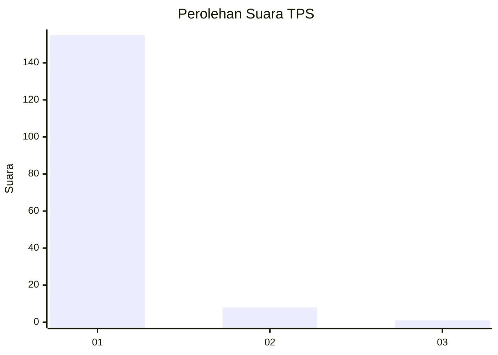
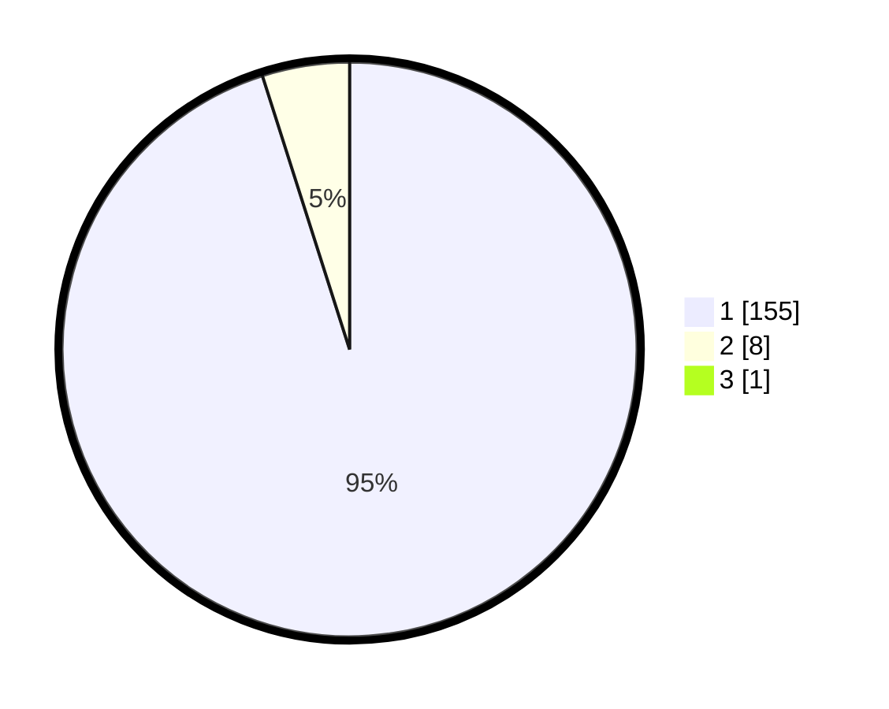

# Hasil

## Grafik

## Tabel

| No. | Nama Paslon    | Suara | Suara (raw) | Persentase |
|:--- |:-------------- | -----:| -----------:| ----------:|
| 1   | ANIES MUHAIMIN | 155   | [155][p-1]  | 94,51      |
| 2   | PRABOWO GIBRAN | 8     | [8][p-2]    | 4,88       |
| 3   | GANJAR MAHFUD  | 1     | [1][p-3]    | 0,61       |

[p-1]: https://github.com/gigit-pemilu/pemilu-2024-11-aceh/blob/main/pilpres/hitung-suara/sub/11-aceh/sub/11-bireuen/sub/17-kuta-blang/sub/2038-rancong/sub/001-tps/sub/paslon-1.txt
[p-2]: https://github.com/gigit-pemilu/pemilu-2024-11-aceh/blob/main/pilpres/hitung-suara/sub/11-aceh/sub/11-bireuen/sub/17-kuta-blang/sub/2038-rancong/sub/001-tps/sub/paslon-2.txt
[p-3]: https://github.com/gigit-pemilu/pemilu-2024-11-aceh/blob/main/pilpres/hitung-suara/sub/11-aceh/sub/11-bireuen/sub/17-kuta-blang/sub/2038-rancong/sub/001-tps/sub/paslon-3.txt

## Foto C Plano

https://sirekap-obj-formc.kpu.go.id/c646/pemilu/ppwp/11/11/17/20/38/1111172038001-20240214-234922--1ecabfe9-4c37-4c9d-b3d6-6f658d6b58f6.jpg

https://sirekap-obj-formc.kpu.go.id/c646/pemilu/ppwp/11/11/17/20/38/1111172038001-20240214-205756--44ea8d95-3924-4fe9-beba-8810f7c4a9cd.jpg

https://sirekap-obj-formc.kpu.go.id/c646/pemilu/ppwp/11/11/17/20/38/1111172038001-20240214-205838--3db60f21-9de3-47c7-9e17-4ef5b38d5179.jpg

## Metadata

| Key        | Value               |
| ---------- | ------------------- |
| Time Stamp | 2024-02-19 06:16:00 |

