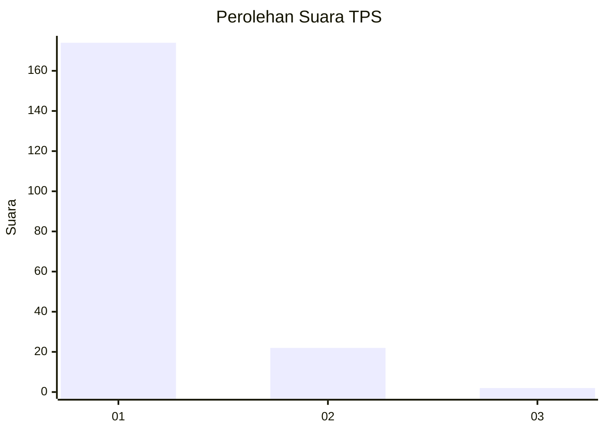
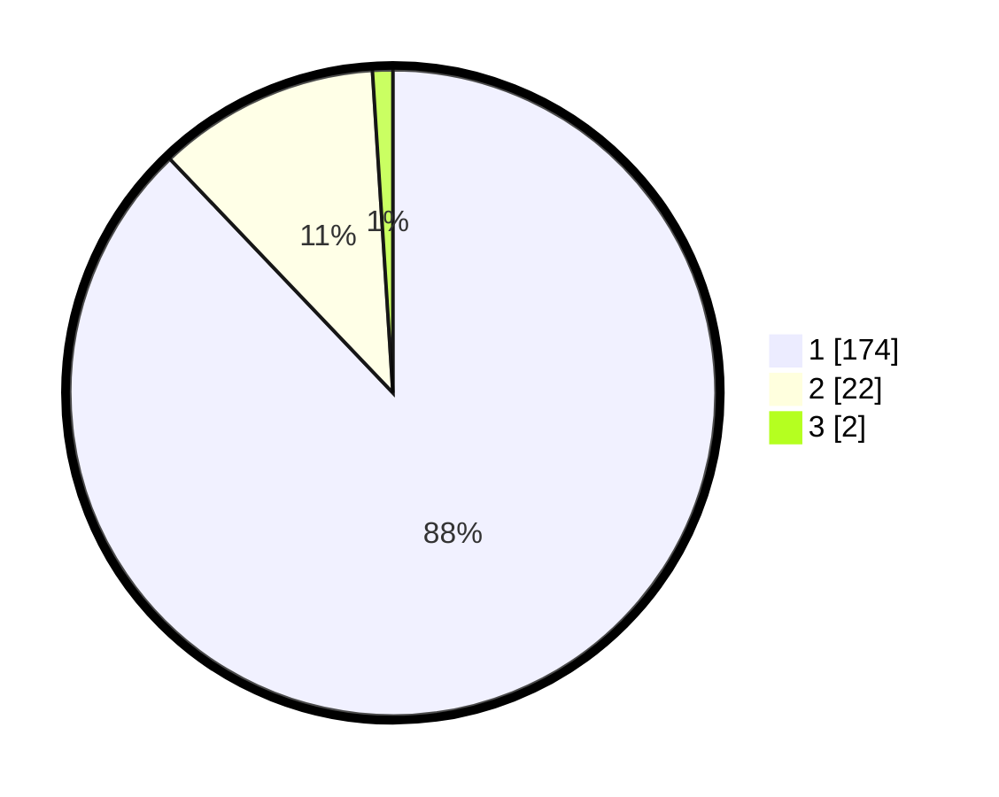

# Hasil

## Grafik

## Tabel

| No. | Nama Paslon    | Suara | Suara (raw) | Persentase |
|:--- |:-------------- | -----:| -----------:| ----------:|
| 1   | ANIES MUHAIMIN | 174   | [174][p-1]  | 87,88      |
| 2   | PRABOWO GIBRAN | 22    | [22][p-2]   | 11,11      |
| 3   | GANJAR MAHFUD  | 2     | [2][p-3]    | 1,01       |

[p-1]: https://github.com/gigit-pemilu/pemilu-2024-11-aceh/blob/main/pilpres/hitung-suara/sub/11-aceh/sub/12-aceh-barat-daya/sub/01-blangpidie/sub/2006-guhang/sub/001-tps/sub/paslon-1.txt
[p-2]: https://github.com/gigit-pemilu/pemilu-2024-11-aceh/blob/main/pilpres/hitung-suara/sub/11-aceh/sub/12-aceh-barat-daya/sub/01-blangpidie/sub/2006-guhang/sub/001-tps/sub/paslon-2.txt
[p-3]: https://github.com/gigit-pemilu/pemilu-2024-11-aceh/blob/main/pilpres/hitung-suara/sub/11-aceh/sub/12-aceh-barat-daya/sub/01-blangpidie/sub/2006-guhang/sub/001-tps/sub/paslon-3.txt

## Foto C Plano

https://sirekap-obj-formc.kpu.go.id/0cd9/pemilu/ppwp/11/12/01/20/06/1112012006001-20240215-105239--6688eac7-93ca-489c-a9c8-7b90678d2052.jpg

https://sirekap-obj-formc.kpu.go.id/0cd9/pemilu/ppwp/11/12/01/20/06/1112012006001-20240215-105346--21a052e4-3c55-4be9-b45f-c9fd7bbb96de.jpg

https://sirekap-obj-formc.kpu.go.id/0cd9/pemilu/ppwp/11/12/01/20/06/1112012006001-20240215-105628--8b493efa-b7ab-4bce-b4e2-de0b116abe06.jpg

## Metadata

| Key        | Value               |
| ---------- | ------------------- |
| Time Stamp | 2024-02-15 20:00:44 |

