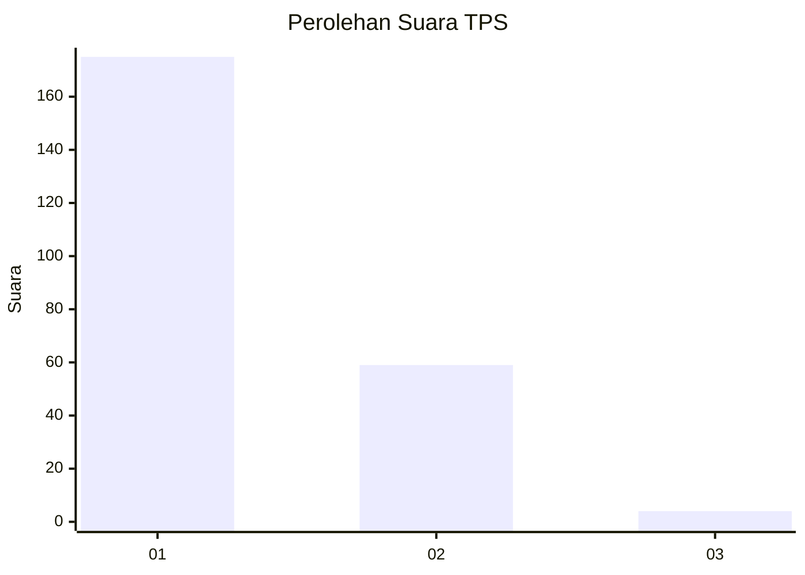
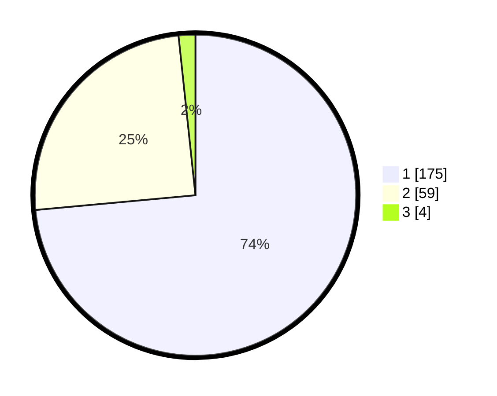

# Hasil

## Grafik

## Tabel

| No. | Nama Paslon    | Suara | Suara (raw) | Persentase |
|:--- |:-------------- | -----:| -----------:| ----------:|
| 1   | ANIES MUHAIMIN | 175   | [175][p-1]  | 73,53      |
| 2   | PRABOWO GIBRAN | 59    | [59][p-2]   | 24,79      |
| 3   | GANJAR MAHFUD  | 4     | [4][p-3]    | 1,68       |

[p-1]: https://github.com/gigit-pemilu/pemilu-2024-11-aceh/blob/main/pilpres/hitung-suara/sub/11-aceh/sub/12-aceh-barat-daya/sub/01-blangpidie/sub/2007-seunaloh/sub/001-tps/sub/paslon-1.txt
[p-2]: https://github.com/gigit-pemilu/pemilu-2024-11-aceh/blob/main/pilpres/hitung-suara/sub/11-aceh/sub/12-aceh-barat-daya/sub/01-blangpidie/sub/2007-seunaloh/sub/001-tps/sub/paslon-2.txt
[p-3]: https://github.com/gigit-pemilu/pemilu-2024-11-aceh/blob/main/pilpres/hitung-suara/sub/11-aceh/sub/12-aceh-barat-daya/sub/01-blangpidie/sub/2007-seunaloh/sub/001-tps/sub/paslon-3.txt

## Foto C Plano

https://sirekap-obj-formc.kpu.go.id/15e9/pemilu/ppwp/11/12/01/20/07/1112012007001-20240216-211701--ad080ca5-40ca-4839-864e-98b7033dc3f1.jpg

https://sirekap-obj-formc.kpu.go.id/15e9/pemilu/ppwp/11/12/01/20/07/1112012007001-20240216-211702--e79281b7-c42b-44b8-9276-f2721c3b68fd.jpg

https://sirekap-obj-formc.kpu.go.id/15e9/pemilu/ppwp/11/12/01/20/07/1112012007001-20240216-211701--fcab7580-3ded-430a-8f88-850aa329846e.jpg

## Metadata

| Key        | Value               |
| ---------- | ------------------- |
| Time Stamp | 2024-02-24 22:31:28 |

## DATA PEMILIH TETAP

Jumlah pemilih dalam DPT: **260**.
 * L: **136**.
 * P: **124**.

## DATA PENGGUNA HAK PILIH

Jumlah pengguna hak pilih dalam DPT: **232**.
 * L: **122**.
 * P: **110**.

Jumlah pengguna hak pilih dalam DPTb: **6**.
 * L: **4**.
 * P: **2**.

Jumlah pengguna hak pilih dalam DPK: **3**.
 * L: **2**.
 * P: **1**.

Jumlah pengguna hak pilih: **241**.
 * L: **128**.
 * P: **113**.

## JUMLAH SUARA SAH DAN TIDAK SAH

JUMLAH SELURUH SUARA SAH: **238**.

JUMLAH SUARA TIDAK SAH: **3**.

JUMLAH SELURUH SUARA SAH DAN SUARA TIDAK SAH: **241**.

