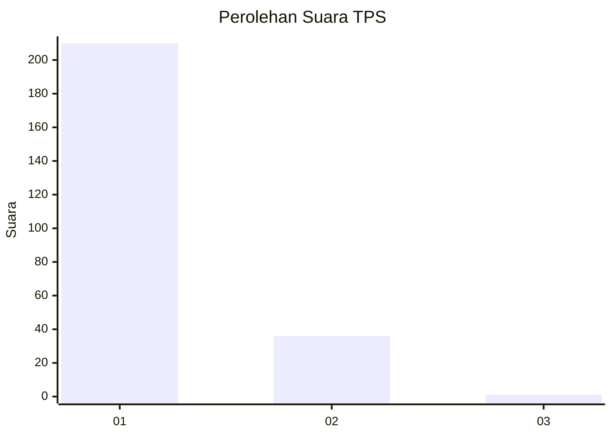
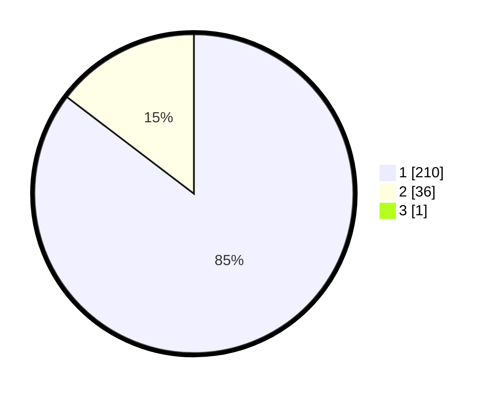

# Hasil

## Grafik

## Tabel

| No. | Nama Paslon    | Suara | Suara (raw) | Persentase |
|:--- |:-------------- | -----:| -----------:| ----------:|
| 1   | ANIES MUHAIMIN | 210   | [210][p-1]  | 85,02      |
| 2   | PRABOWO GIBRAN | 36    | [36][p-2]   | 14,57      |
| 3   | GANJAR MAHFUD  | 1     | [1][p-3]    | 0,40       |

[p-1]: https://github.com/gigit-pemilu/pemilu-2024-11-aceh/blob/main/pilpres/hitung-suara/sub/11-aceh/sub/12-aceh-barat-daya/sub/01-blangpidie/sub/2007-seunaloh/sub/002-tps/sub/paslon-1.txt
[p-2]: https://github.com/gigit-pemilu/pemilu-2024-11-aceh/blob/main/pilpres/hitung-suara/sub/11-aceh/sub/12-aceh-barat-daya/sub/01-blangpidie/sub/2007-seunaloh/sub/002-tps/sub/paslon-2.txt
[p-3]: https://github.com/gigit-pemilu/pemilu-2024-11-aceh/blob/main/pilpres/hitung-suara/sub/11-aceh/sub/12-aceh-barat-daya/sub/01-blangpidie/sub/2007-seunaloh/sub/002-tps/sub/paslon-3.txt

## Foto C Plano

https://sirekap-obj-formc.kpu.go.id/0354/pemilu/ppwp/11/12/01/20/07/1112012007002-20240215-104203--f4f13381-bf65-4955-abf7-aab018a9f926.jpg

https://sirekap-obj-formc.kpu.go.id/0354/pemilu/ppwp/11/12/01/20/07/1112012007002-20240215-104315--de9eff6f-4eea-4cfa-b30a-68e8edbb8d17.jpg

https://sirekap-obj-formc.kpu.go.id/0354/pemilu/ppwp/11/12/01/20/07/1112012007002-20240215-104459--92fb9659-b113-4c1d-bf37-5e4ba52f1ee6.jpg

## Metadata

| Key        | Value               |
| ---------- | ------------------- |
| Time Stamp | 2024-02-16 17:30:00 |

## DATA PEMILIH TETAP

Jumlah pemilih dalam DPT: **274**.
 * L: **131**.
 * P: **143**.

## DATA PENGGUNA HAK PILIH

Jumlah pengguna hak pilih dalam DPT: **245**.
 * L: **117**.
 * P: **128**.

Jumlah pengguna hak pilih dalam DPTb: **7**.
 * L: **5**.
 * P: **2**.

Jumlah pengguna hak pilih dalam DPK: **0**.
 * L: **0**.
 * P: **0**.

Jumlah pengguna hak pilih: **252**.
 * L: **122**.
 * P: **130**.

## JUMLAH SUARA SAH DAN TIDAK SAH

JUMLAH SELURUH SUARA SAH: **247**.

JUMLAH SUARA TIDAK SAH: **5**.

JUMLAH SELURUH SUARA SAH DAN SUARA TIDAK SAH: **252**.

