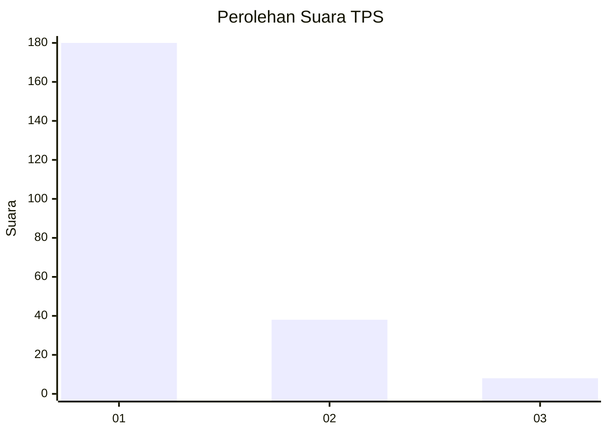
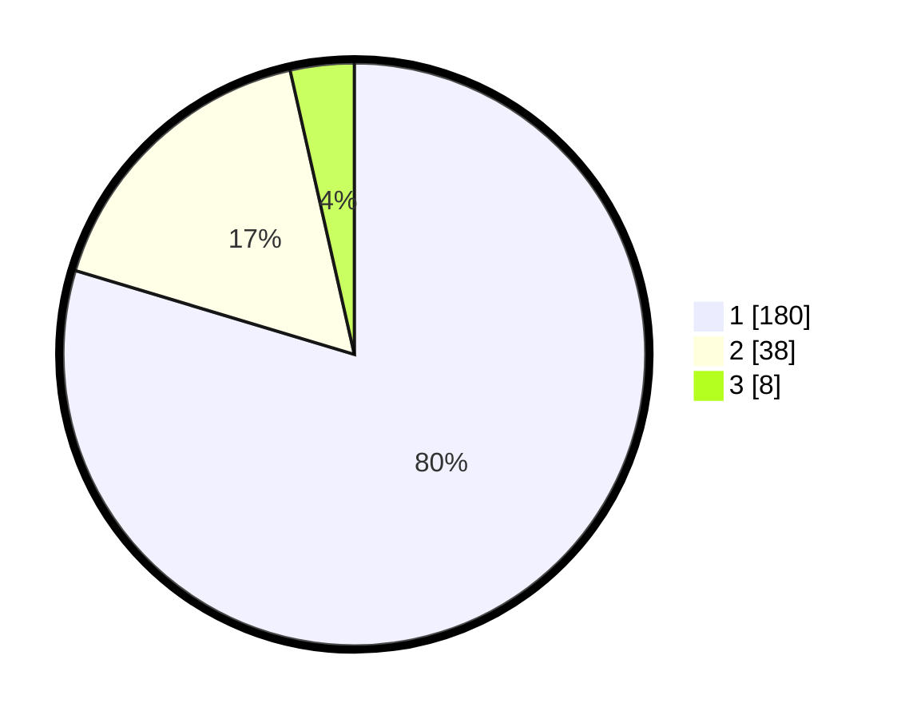

# Hasil

## Grafik

## Tabel

| No. | Nama Paslon    | Suara | Suara (raw) | Persentase |
|:--- |:-------------- | -----:| -----------:| ----------:|
| 1   | ANIES MUHAIMIN | 180   | [180][p-1]  | 79,65      |
| 2   | PRABOWO GIBRAN | 38    | [38][p-2]   | 16,81      |
| 3   | GANJAR MAHFUD  | 8     | [8][p-3]    | 3,54       |

[p-1]: https://github.com/gigit-pemilu/pemilu-2024-11-aceh/blob/main/pilpres/hitung-suara/sub/11-aceh/sub/12-aceh-barat-daya/sub/01-blangpidie/sub/2007-seunaloh/sub/003-tps/sub/paslon-1.txt
[p-2]: https://github.com/gigit-pemilu/pemilu-2024-11-aceh/blob/main/pilpres/hitung-suara/sub/11-aceh/sub/12-aceh-barat-daya/sub/01-blangpidie/sub/2007-seunaloh/sub/003-tps/sub/paslon-2.txt
[p-3]: https://github.com/gigit-pemilu/pemilu-2024-11-aceh/blob/main/pilpres/hitung-suara/sub/11-aceh/sub/12-aceh-barat-daya/sub/01-blangpidie/sub/2007-seunaloh/sub/003-tps/sub/paslon-3.txt

## Foto C Plano

https://sirekap-obj-formc.kpu.go.id/85f2/pemilu/ppwp/11/12/01/20/07/1112012007003-20240216-211109--99921102-b510-498e-affb-3f9b5bcffb9d.jpg

https://sirekap-obj-formc.kpu.go.id/85f2/pemilu/ppwp/11/12/01/20/07/1112012007003-20240216-211111--47c81ec4-4f11-48fd-a8ac-657f2bb298d6.jpg

https://sirekap-obj-formc.kpu.go.id/85f2/pemilu/ppwp/11/12/01/20/07/1112012007003-20240216-211110--aa1a7b83-5cff-4232-8403-8339618c2605.jpg

## Metadata

| Key        | Value               |
| ---------- | ------------------- |
| Time Stamp | 2024-02-21 21:00:04 |

## DATA PEMILIH TETAP

Jumlah pemilih dalam DPT: **263**.
 * L: **130**.
 * P: **133**.

## DATA PENGGUNA HAK PILIH

Jumlah pengguna hak pilih dalam DPT: **216**.
 * L: **104**.
 * P: **112**.

Jumlah pengguna hak pilih dalam DPTb: **7**.
 * L: **3**.
 * P: **4**.

Jumlah pengguna hak pilih dalam DPK: **3**.
 * L: **2**.
 * P: **1**.

Jumlah pengguna hak pilih: **226**.
 * L: **109**.
 * P: **117**.

## JUMLAH SUARA SAH DAN TIDAK SAH

JUMLAH SELURUH SUARA SAH: **226**.

JUMLAH SUARA TIDAK SAH: **0**.

JUMLAH SELURUH SUARA SAH DAN SUARA TIDAK SAH: **226**.

