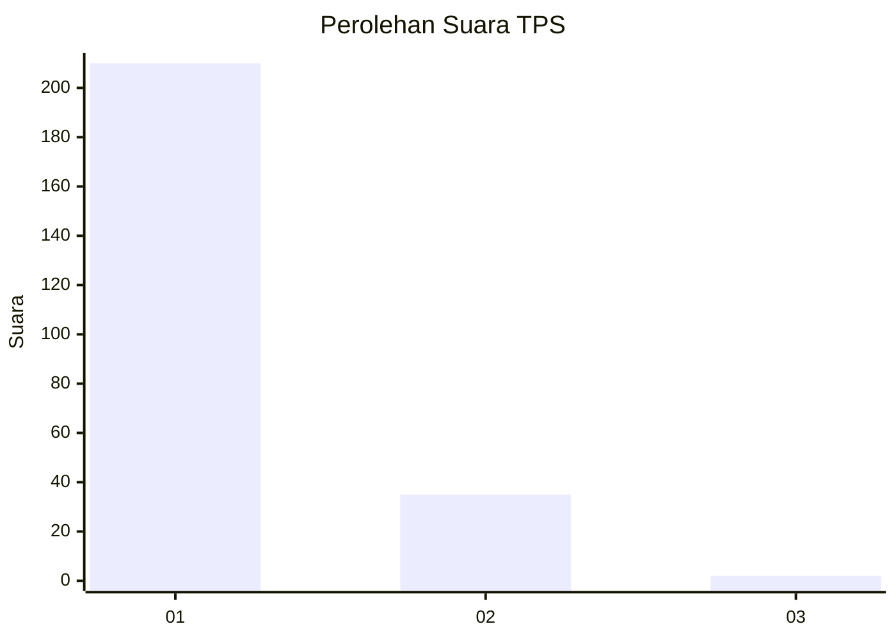
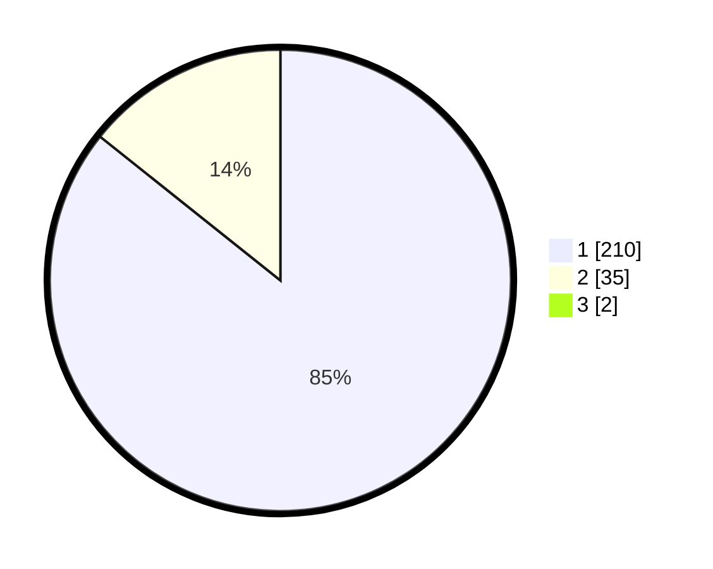

# Hasil

## Grafik

## Tabel

| No. | Nama Paslon    | Suara | Suara (raw) | Persentase |
|:--- |:-------------- | -----:| -----------:| ----------:|
| 1   | ANIES MUHAIMIN | 210   | [210][p-1]  | 85,02      |
| 2   | PRABOWO GIBRAN | 35    | [35][p-2]   | 14,17      |
| 3   | GANJAR MAHFUD  | 2     | [2][p-3]    | 0,81       |

[p-1]: https://github.com/gigit-pemilu/pemilu-2024-11-aceh/blob/main/pilpres/hitung-suara/sub/11-aceh/sub/12-aceh-barat-daya/sub/01-blangpidie/sub/2008-lhung-asan/sub/001-tps/sub/paslon-1.txt
[p-2]: https://github.com/gigit-pemilu/pemilu-2024-11-aceh/blob/main/pilpres/hitung-suara/sub/11-aceh/sub/12-aceh-barat-daya/sub/01-blangpidie/sub/2008-lhung-asan/sub/001-tps/sub/paslon-2.txt
[p-3]: https://github.com/gigit-pemilu/pemilu-2024-11-aceh/blob/main/pilpres/hitung-suara/sub/11-aceh/sub/12-aceh-barat-daya/sub/01-blangpidie/sub/2008-lhung-asan/sub/001-tps/sub/paslon-3.txt

## Foto C Plano

https://sirekap-obj-formc.kpu.go.id/c208/pemilu/ppwp/11/12/01/20/08/1112012008001-20240214-200931--8b1b2680-0e6e-41f6-b57b-87db517194c1.jpg

https://sirekap-obj-formc.kpu.go.id/c208/pemilu/ppwp/11/12/01/20/08/1112012008001-20240214-184754--92035641-5b32-4f5c-bc32-80aa3917e3dc.jpg

https://sirekap-obj-formc.kpu.go.id/c208/pemilu/ppwp/11/12/01/20/08/1112012008001-20240214-184855--6d725187-212d-4a21-9909-91d1826bab3e.jpg

## Metadata

| Key        | Value               |
| ---------- | ------------------- |
| Time Stamp | 2024-02-15 20:00:44 |

