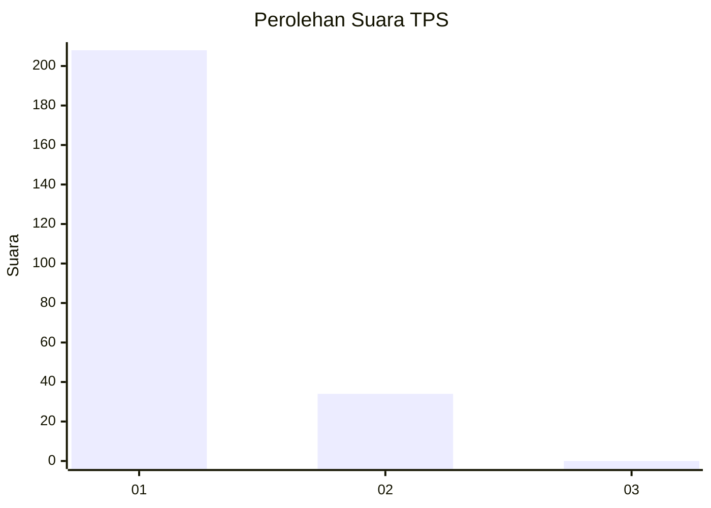
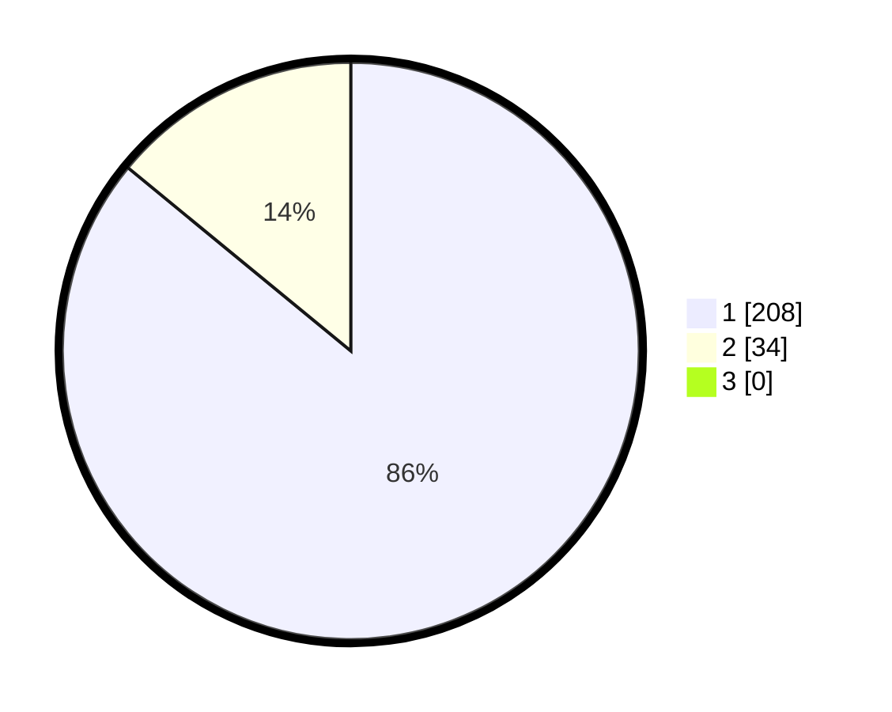

# Hasil

## Grafik

## Tabel

| No. | Nama Paslon    | Suara | Suara (raw) | Persentase |
|:--- |:-------------- | -----:| -----------:| ----------:|
| 1   | ANIES MUHAIMIN | 208   | [208][p-1]  | 85,95      |
| 2   | PRABOWO GIBRAN | 34    | [34][p-2]   | 14,05      |
| 3   | GANJAR MAHFUD  | 0     | [0][p-3]    | 0,00       |

[p-1]: https://github.com/gigit-pemilu/pemilu-2024-11-aceh/blob/main/pilpres/hitung-suara/sub/11-aceh/sub/12-aceh-barat-daya/sub/01-blangpidie/sub/2008-lhung-asan/sub/002-tps/sub/paslon-1.txt
[p-2]: https://github.com/gigit-pemilu/pemilu-2024-11-aceh/blob/main/pilpres/hitung-suara/sub/11-aceh/sub/12-aceh-barat-daya/sub/01-blangpidie/sub/2008-lhung-asan/sub/002-tps/sub/paslon-2.txt
[p-3]: https://github.com/gigit-pemilu/pemilu-2024-11-aceh/blob/main/pilpres/hitung-suara/sub/11-aceh/sub/12-aceh-barat-daya/sub/01-blangpidie/sub/2008-lhung-asan/sub/002-tps/sub/paslon-3.txt

## Foto C Plano

https://sirekap-obj-formc.kpu.go.id/d219/pemilu/ppwp/11/12/01/20/08/1112012008002-20240214-200504--623c07f6-bddd-482c-b44d-2edfe1d05144.jpg

https://sirekap-obj-formc.kpu.go.id/d219/pemilu/ppwp/11/12/01/20/08/1112012008002-20240214-200553--e1b95190-0016-45f7-9966-264c90619396.jpg

https://sirekap-obj-formc.kpu.go.id/d219/pemilu/ppwp/11/12/01/20/08/1112012008002-20240214-200643--39253405-a8a9-40c7-866f-99a989fd7ad0.jpg

## Metadata

| Key        | Value               |
| ---------- | ------------------- |
| Time Stamp | 2024-02-15 20:00:44 |

