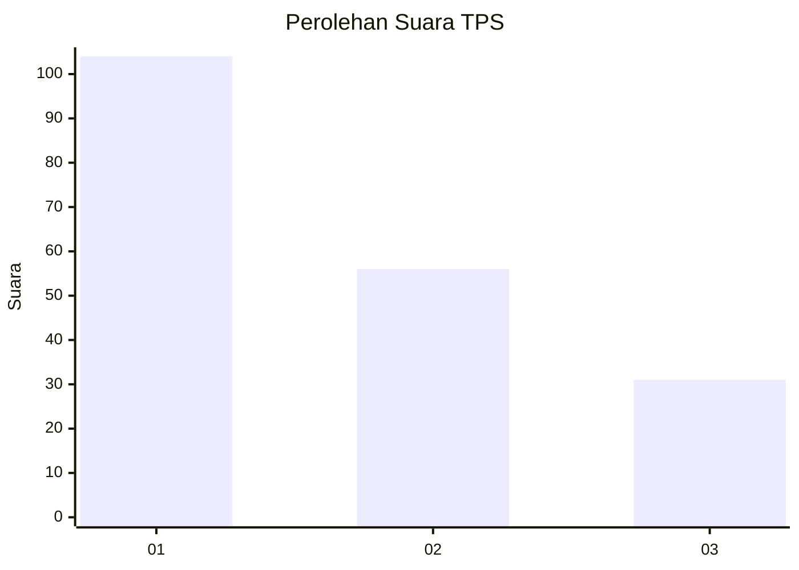
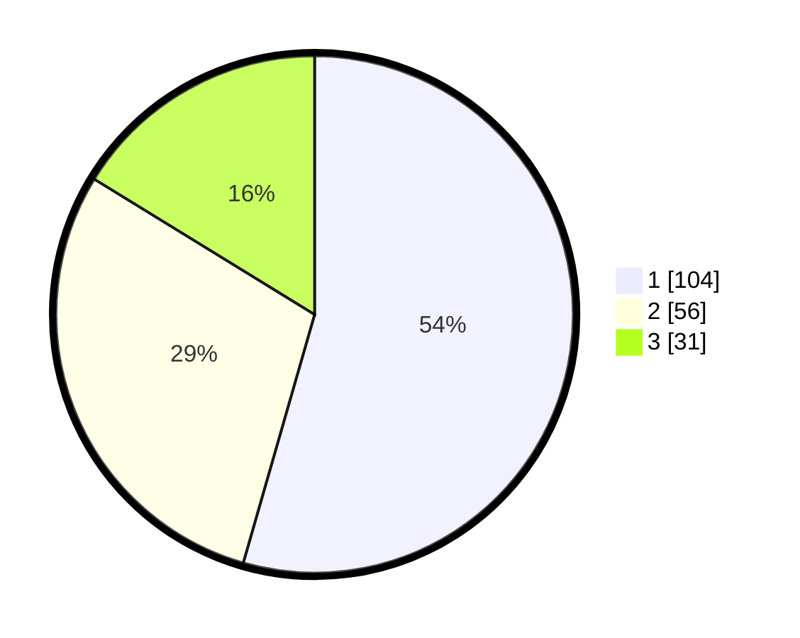

# Hasil

## Grafik

## Tabel

| No. | Nama Paslon    | Suara | Suara (raw) | Persentase |
|:--- |:-------------- | -----:| -----------:| ----------:|
| 1   | ANIES MUHAIMIN | 104   | [104][p-1]  | 54,45      |
| 2   | PRABOWO GIBRAN | 56    | [56][p-2]   | 29,32      |
| 3   | GANJAR MAHFUD  | 31    | [31][p-3]   | 16,23      |

[p-1]: https://github.com/gigit-pemilu/pemilu-2024-11-aceh/blob/main/pilpres/hitung-suara/sub/11-aceh/sub/12-aceh-barat-daya/sub/01-blangpidie/sub/2026-pasar-blangpidie/sub/002-tps/sub/paslon-1.txt
[p-2]: https://github.com/gigit-pemilu/pemilu-2024-11-aceh/blob/main/pilpres/hitung-suara/sub/11-aceh/sub/12-aceh-barat-daya/sub/01-blangpidie/sub/2026-pasar-blangpidie/sub/002-tps/sub/paslon-2.txt
[p-3]: https://github.com/gigit-pemilu/pemilu-2024-11-aceh/blob/main/pilpres/hitung-suara/sub/11-aceh/sub/12-aceh-barat-daya/sub/01-blangpidie/sub/2026-pasar-blangpidie/sub/002-tps/sub/paslon-3.txt

## Foto C Plano

https://sirekap-obj-formc.kpu.go.id/225f/pemilu/ppwp/11/12/01/20/26/1112012026002-20240214-200519--794f5f44-c6f9-468e-870a-8dd0dd9a6aea.jpg

https://sirekap-obj-formc.kpu.go.id/225f/pemilu/ppwp/11/12/01/20/26/1112012026002-20240214-202203--16527e38-7752-4785-9d59-f04092edc3a8.jpg

## Metadata

| Key        | Value               |
| ---------- | ------------------- |
| Time Stamp | 2024-02-24 22:31:28 |

