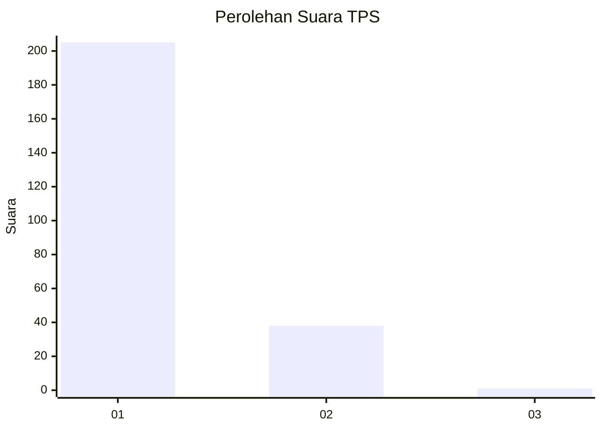
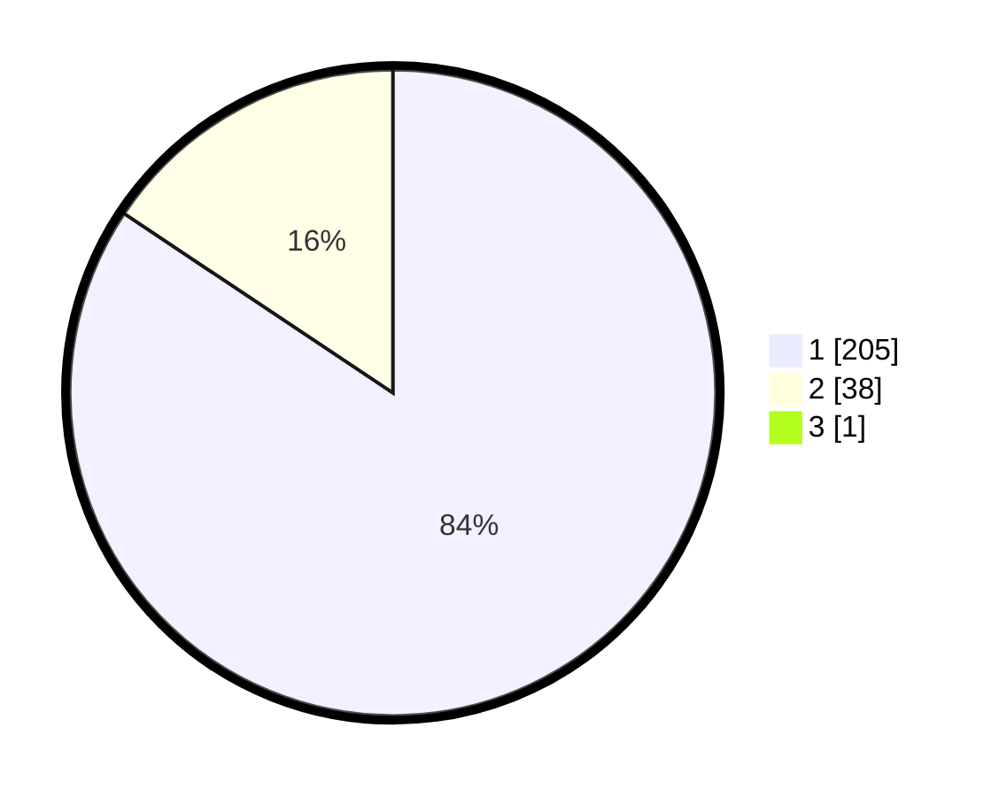

# Hasil

## Grafik

## Tabel

| No. | Nama Paslon    | Suara | Suara (raw) | Persentase |
|:--- |:-------------- | -----:| -----------:| ----------:|
| 1   | ANIES MUHAIMIN | 205   | [205][p-1]  | 84,02      |
| 2   | PRABOWO GIBRAN | 38    | [38][p-2]   | 15,57      |
| 3   | GANJAR MAHFUD  | 1     | [1][p-3]    | 0,41       |

[p-1]: https://github.com/gigit-pemilu/pemilu-2024-11-aceh/blob/main/pilpres/hitung-suara/sub/11-aceh/sub/12-aceh-barat-daya/sub/01-blangpidie/sub/2030-babah-lhung/sub/001-tps/sub/paslon-1.txt
[p-2]: https://github.com/gigit-pemilu/pemilu-2024-11-aceh/blob/main/pilpres/hitung-suara/sub/11-aceh/sub/12-aceh-barat-daya/sub/01-blangpidie/sub/2030-babah-lhung/sub/001-tps/sub/paslon-2.txt
[p-3]: https://github.com/gigit-pemilu/pemilu-2024-11-aceh/blob/main/pilpres/hitung-suara/sub/11-aceh/sub/12-aceh-barat-daya/sub/01-blangpidie/sub/2030-babah-lhung/sub/001-tps/sub/paslon-3.txt

## Foto C Plano

https://sirekap-obj-formc.kpu.go.id/b3b5/pemilu/ppwp/11/12/01/20/30/1112012030001-20240215-001333--557649bb-1172-4248-b156-dc270ad820c0.jpg

https://sirekap-obj-formc.kpu.go.id/b3b5/pemilu/ppwp/11/12/01/20/30/1112012030001-20240214-210210--5f6396d6-e283-4a81-b6e4-e6b9ad552953.jpg

https://sirekap-obj-formc.kpu.go.id/b3b5/pemilu/ppwp/11/12/01/20/30/1112012030001-20240215-001850--7736ca8f-5ba4-4227-9063-40250112c2bf.jpg

## Metadata

| Key        | Value               |
| ---------- | ------------------- |
| Time Stamp | 2024-02-15 18:30:25 |

