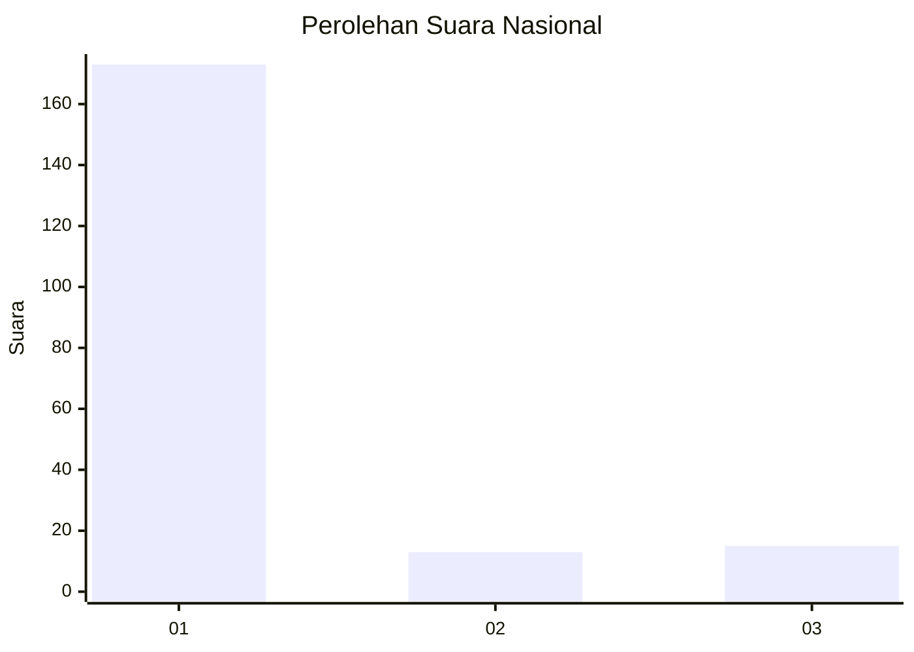
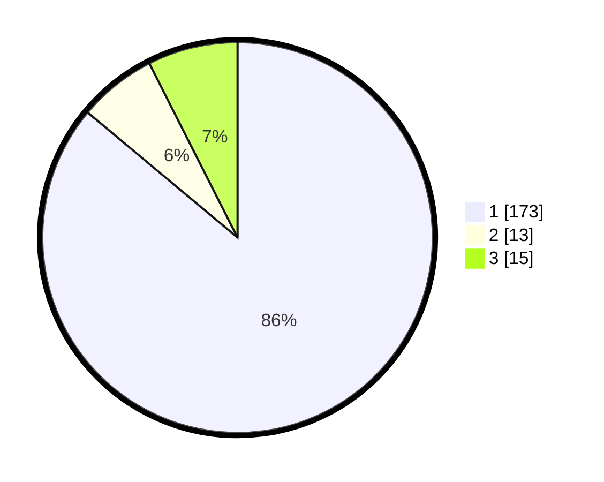

# Hasil

## Grafik

## Tabel

| No. | Nama Paslon    | Suara | Suara (raw) | Persentase |
|:--- |:-------------- | -----:| -----------:| ----------:|
| 1   | ANIES MUHAIMIN | 173   | [173][p-1]  | 86,07      |
| 2   | PRABOWO GIBRAN | 13    | [13][p-2]   | 6,47       |
| 3   | GANJAR MAHFUD  | 15    | [15][p-3]   | 7,46       |

[p-1]: https://github.com/gigit-pemilu/pemilu-2024/blob/main/pilpres/hitung-suara/sub/11-aceh/sub/12-aceh-barat-daya/sub/02-tangan-tangan/sub/2001-adan/sub/002-tps/sub/paslon-1.txt
[p-2]: https://github.com/gigit-pemilu/pemilu-2024/blob/main/pilpres/hitung-suara/sub/11-aceh/sub/12-aceh-barat-daya/sub/02-tangan-tangan/sub/2001-adan/sub/002-tps/sub/paslon-2.txt
[p-3]: https://github.com/gigit-pemilu/pemilu-2024/blob/main/pilpres/hitung-suara/sub/11-aceh/sub/12-aceh-barat-daya/sub/02-tangan-tangan/sub/2001-adan/sub/002-tps/sub/paslon-3.txt

## Foto C Plano

https://sirekap-obj-formc.kpu.go.id/3151/pemilu/ppwp/11/12/02/20/01/1112022001002-20240215-185017--e8b04d14-a9e5-469a-b01d-51fbf8ab1c49.jpg

https://sirekap-obj-formc.kpu.go.id/3151/pemilu/ppwp/11/12/02/20/01/1112022001002-20240215-222433--3c2b8784-a4aa-4eec-99b7-1e5fba55ab0e.jpg

https://sirekap-obj-formc.kpu.go.id/3151/pemilu/ppwp/11/12/02/20/01/1112022001002-20240215-222519--cf150228-909b-4432-b944-08d10192a5b9.jpg

## Metadata

| Key        | Value               |
| ---------- | ------------------- |
| Time Stamp | 2024-02-16 21:01:00 |

## DATA PEMILIH TETAP

Jumlah pemilih dalam DPT: **252**.
 * L: **139**.
 * P: **113**.

## DATA PENGGUNA HAK PILIH

Jumlah pengguna hak pilih dalam DPT: **213**.
 * L: **109**.
 * P: **104**.

Jumlah pengguna hak pilih dalam DPTb: **1**.
 * L: **1**.
 * P: **0**.

Jumlah pengguna hak pilih dalam DPK: **1**.
 * L: **1**.
 * P: **0**.

Jumlah pengguna hak pilih: **215**.
 * L: **111**.
 * P: **104**.

## JUMLAH SUARA SAH DAN TIDAK SAH

JUMLAH SELURUH SUARA SAH: **201**.

JUMLAH SUARA TIDAK SAH: **14**.

JUMLAH SELURUH SUARA SAH DAN SUARA TIDAK SAH: **215**.

