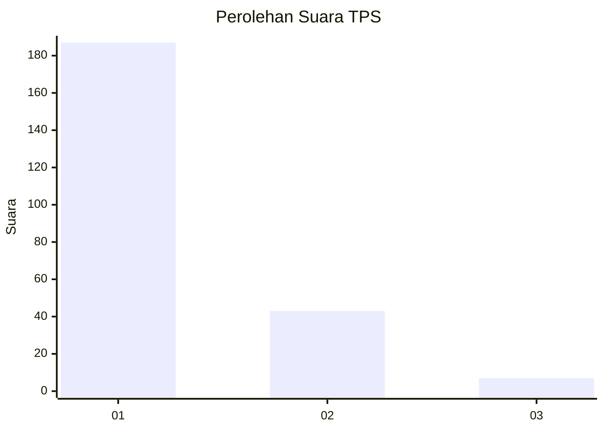
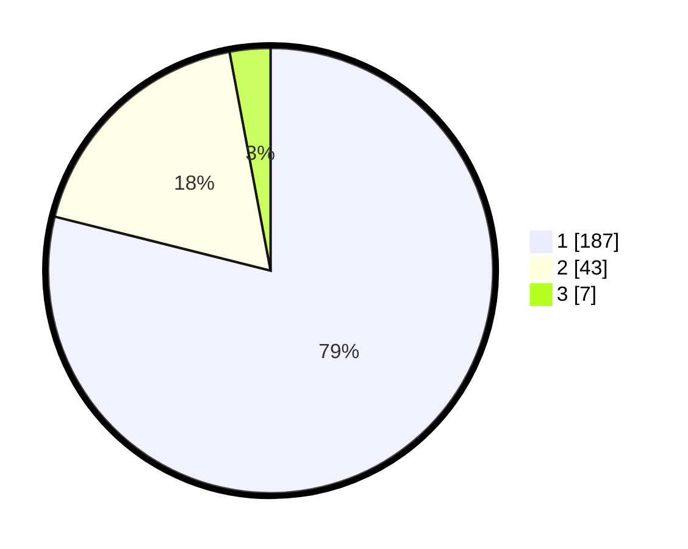

# Hasil

## Grafik

## Tabel

| No. | Nama Paslon    | Suara | Suara (raw) | Persentase |
|:--- |:-------------- | -----:| -----------:| ----------:|
| 1   | ANIES MUHAIMIN | 187   | [187][p-1]  | 78,90      |
| 2   | PRABOWO GIBRAN | 43    | [43][p-2]   | 18,14      |
| 3   | GANJAR MAHFUD  | 7     | [7][p-3]    | 2,95       |

[p-1]: https://github.com/gigit-pemilu/pemilu-2024-11-aceh/blob/main/pilpres/hitung-suara/sub/11-aceh/sub/12-aceh-barat-daya/sub/02-tangan-tangan/sub/2005-padang-kawa/sub/001-tps/sub/paslon-1.txt
[p-2]: https://github.com/gigit-pemilu/pemilu-2024-11-aceh/blob/main/pilpres/hitung-suara/sub/11-aceh/sub/12-aceh-barat-daya/sub/02-tangan-tangan/sub/2005-padang-kawa/sub/001-tps/sub/paslon-2.txt
[p-3]: https://github.com/gigit-pemilu/pemilu-2024-11-aceh/blob/main/pilpres/hitung-suara/sub/11-aceh/sub/12-aceh-barat-daya/sub/02-tangan-tangan/sub/2005-padang-kawa/sub/001-tps/sub/paslon-3.txt

## Foto C Plano

https://sirekap-obj-formc.kpu.go.id/6bd7/pemilu/ppwp/11/12/02/20/05/1112022005001-20240215-163937--592334d7-bd8c-4627-8a13-e3227c9f8b24.jpg

https://sirekap-obj-formc.kpu.go.id/6bd7/pemilu/ppwp/11/12/02/20/05/1112022005001-20240215-122528--4e071a8f-cc55-47f4-999a-55d8ff3800a6.jpg

https://sirekap-obj-formc.kpu.go.id/6bd7/pemilu/ppwp/11/12/02/20/05/1112022005001-20240215-164321--0ea588a8-0a42-4cb7-8430-8e1d0e16ab19.jpg

## Metadata

| Key        | Value               |
| ---------- | ------------------- |
| Time Stamp | 2024-02-15 20:00:44 |

