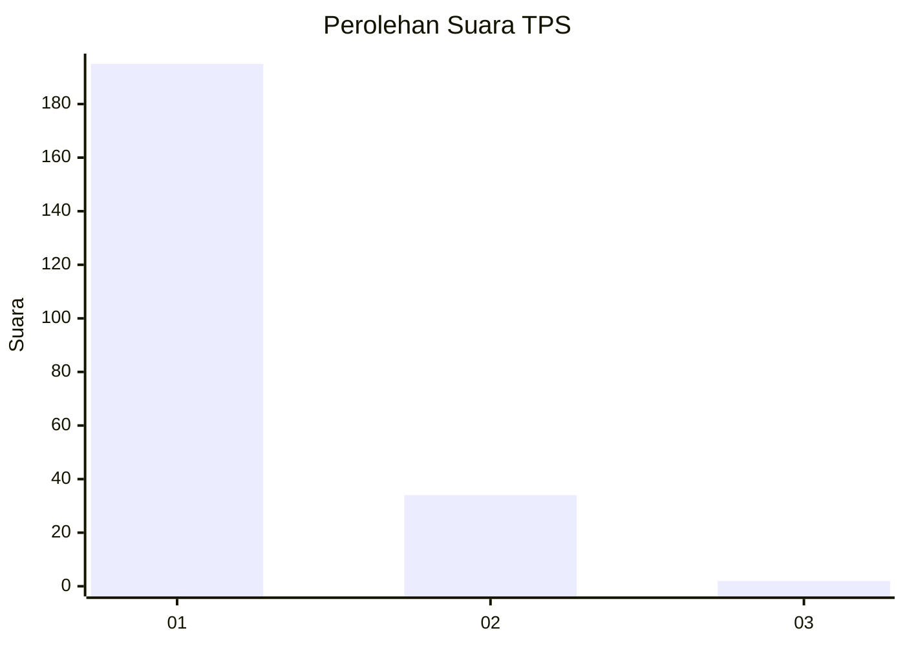
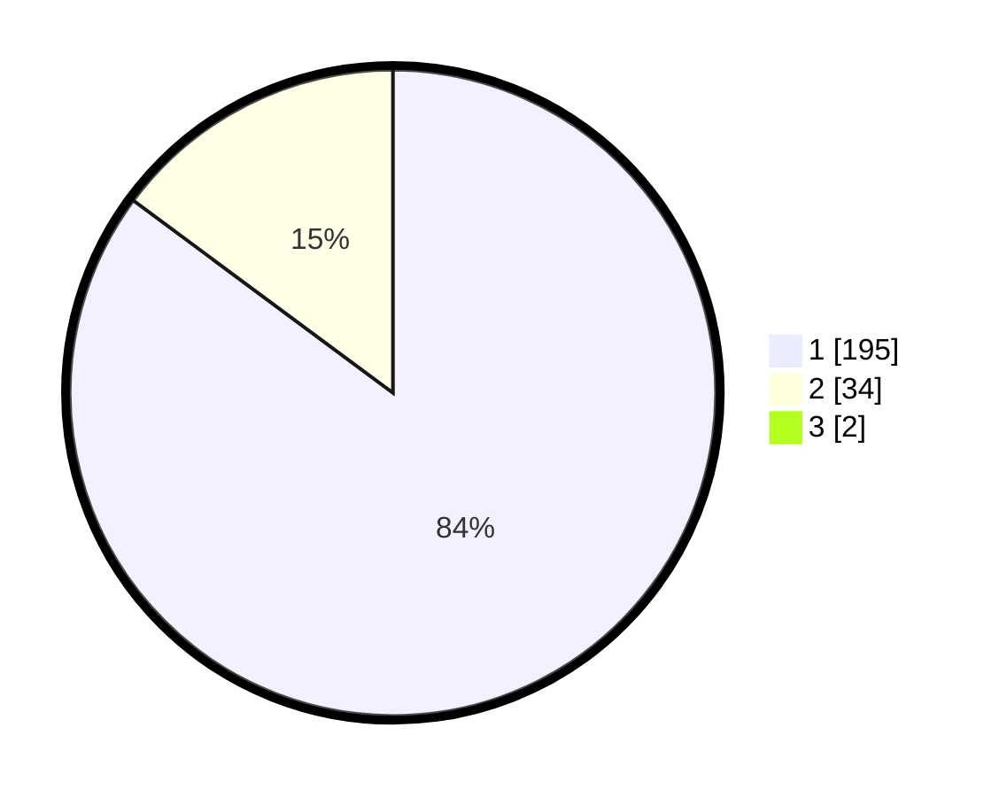

# Hasil

## Grafik

## Tabel

| No. | Nama Paslon    | Suara | Suara (raw) | Persentase |
|:--- |:-------------- | -----:| -----------:| ----------:|
| 1   | ANIES MUHAIMIN | 195   | [195][p-1]  | 84,42      |
| 2   | PRABOWO GIBRAN | 34    | [34][p-2]   | 14,72      |
| 3   | GANJAR MAHFUD  | 2     | [2][p-3]    | 0,87       |

[p-1]: https://github.com/gigit-pemilu/pemilu-2024-11-aceh/blob/main/pilpres/hitung-suara/sub/11-aceh/sub/12-aceh-barat-daya/sub/02-tangan-tangan/sub/2020-ie-lhob/sub/002-tps/sub/paslon-1.txt
[p-2]: https://github.com/gigit-pemilu/pemilu-2024-11-aceh/blob/main/pilpres/hitung-suara/sub/11-aceh/sub/12-aceh-barat-daya/sub/02-tangan-tangan/sub/2020-ie-lhob/sub/002-tps/sub/paslon-2.txt
[p-3]: https://github.com/gigit-pemilu/pemilu-2024-11-aceh/blob/main/pilpres/hitung-suara/sub/11-aceh/sub/12-aceh-barat-daya/sub/02-tangan-tangan/sub/2020-ie-lhob/sub/002-tps/sub/paslon-3.txt

## Foto C Plano

https://sirekap-obj-formc.kpu.go.id/45d7/pemilu/ppwp/11/12/02/20/20/1112022020002-20240214-204742--a55629e1-798c-49db-9436-149d9ce6a46d.jpg

https://sirekap-obj-formc.kpu.go.id/45d7/pemilu/ppwp/11/12/02/20/20/1112022020002-20240214-204913--5d765170-a40f-4454-914c-8e6a2ed5bc43.jpg

https://sirekap-obj-formc.kpu.go.id/45d7/pemilu/ppwp/11/12/02/20/20/1112022020002-20240214-205035--6e85ad2f-99b8-4464-b5eb-b869c1b068f4.jpg

## Metadata

| Key        | Value               |
| ---------- | ------------------- |
| Time Stamp | 2024-02-15 20:00:44 |

