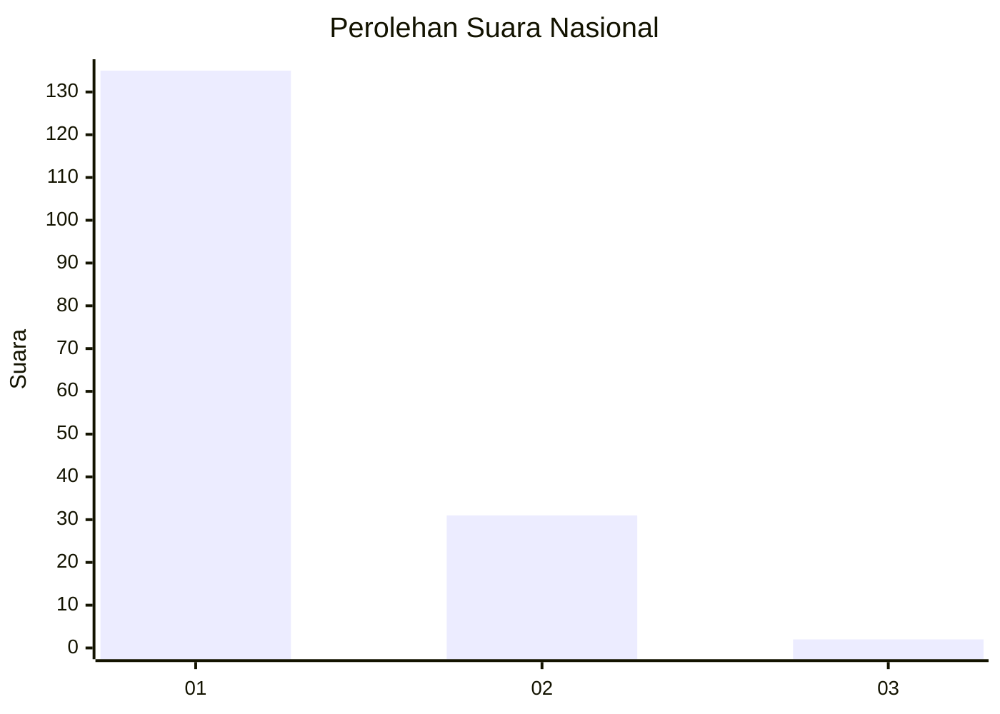
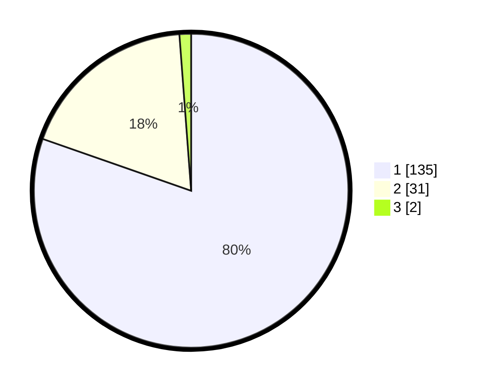

# Hasil

## Grafik

## Tabel

| No. | Nama Paslon    | Suara | Suara (raw) | Persentase |
|:--- |:-------------- | -----:| -----------:| ----------:|
| 1   | ANIES MUHAIMIN | 135   | [135][p-1]  | 80,36      |
| 2   | PRABOWO GIBRAN | 31    | [31][p-2]   | 18,45      |
| 3   | GANJAR MAHFUD  | 2     | [2][p-3]    | 1,19       |

[p-1]: https://github.com/gigit-pemilu/pemilu-2024/blob/main/pilpres/hitung-suara/sub/11-aceh/sub/12-aceh-barat-daya/sub/03-manggeng/sub/2001-kedai/sub/003-tps/sub/paslon-1.txt
[p-2]: https://github.com/gigit-pemilu/pemilu-2024/blob/main/pilpres/hitung-suara/sub/11-aceh/sub/12-aceh-barat-daya/sub/03-manggeng/sub/2001-kedai/sub/003-tps/sub/paslon-2.txt
[p-3]: https://github.com/gigit-pemilu/pemilu-2024/blob/main/pilpres/hitung-suara/sub/11-aceh/sub/12-aceh-barat-daya/sub/03-manggeng/sub/2001-kedai/sub/003-tps/sub/paslon-3.txt

## Foto C Plano

https://sirekap-obj-formc.kpu.go.id/9241/pemilu/ppwp/11/12/03/20/01/1112032001003-20240215-002927--88aeb816-314b-4455-a954-a517215693f2.jpg

https://sirekap-obj-formc.kpu.go.id/9241/pemilu/ppwp/11/12/03/20/01/1112032001003-20240215-003057--ac1a81c6-df92-477f-a37e-8370faf5d1c6.jpg

https://sirekap-obj-formc.kpu.go.id/9241/pemilu/ppwp/11/12/03/20/01/1112032001003-20240215-003319--63d942f0-e114-49e5-88f7-06e0d0e9c69a.jpg

## Metadata

| Key        | Value               |
| ---------- | ------------------- |
| Time Stamp | 2024-02-15 20:00:44 |

