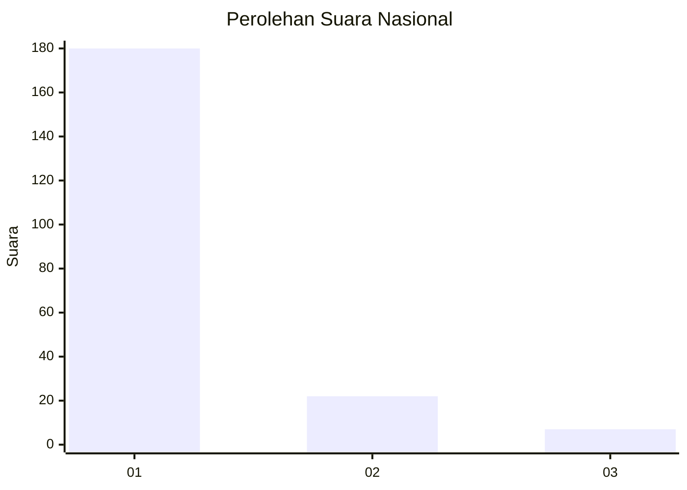
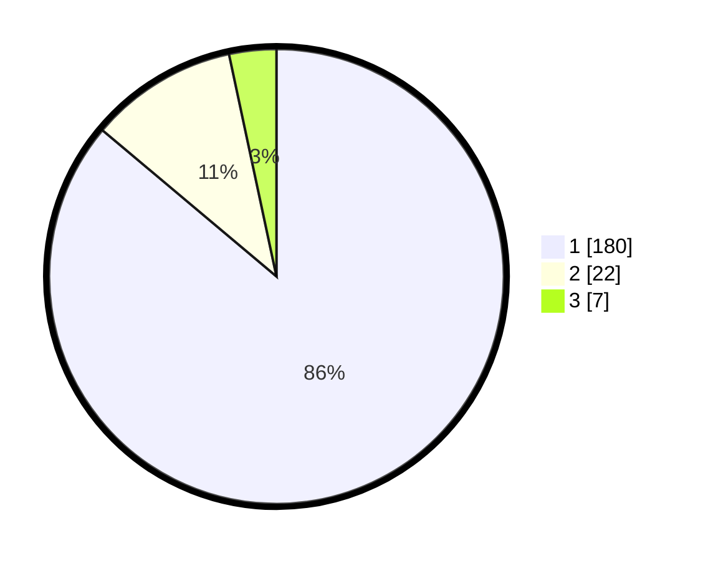

# Hasil

## Grafik

## Tabel

| No. | Nama Paslon    | Suara | Suara (raw) | Persentase |
|:--- |:-------------- | -----:| -----------:| ----------:|
| 1   | ANIES MUHAIMIN | 180   | [180][p-1]  | 86,12      |
| 2   | PRABOWO GIBRAN | 22    | [22][p-2]   | 10,53      |
| 3   | GANJAR MAHFUD  | 7     | [7][p-3]    | 3,35       |

[p-1]: https://github.com/gigit-pemilu/pemilu-2024/blob/main/pilpres/hitung-suara/sub/11-aceh/sub/12-aceh-barat-daya/sub/03-manggeng/sub/2006-seuneulop/sub/003-tps/sub/paslon-1.txt
[p-2]: https://github.com/gigit-pemilu/pemilu-2024/blob/main/pilpres/hitung-suara/sub/11-aceh/sub/12-aceh-barat-daya/sub/03-manggeng/sub/2006-seuneulop/sub/003-tps/sub/paslon-2.txt
[p-3]: https://github.com/gigit-pemilu/pemilu-2024/blob/main/pilpres/hitung-suara/sub/11-aceh/sub/12-aceh-barat-daya/sub/03-manggeng/sub/2006-seuneulop/sub/003-tps/sub/paslon-3.txt

## Foto C Plano

https://sirekap-obj-formc.kpu.go.id/3cd7/pemilu/ppwp/11/12/03/20/06/1112032006003-20240215-122659--2584dec7-e839-458b-95e9-6a0e229b8356.jpg

https://sirekap-obj-formc.kpu.go.id/3cd7/pemilu/ppwp/11/12/03/20/06/1112032006003-20240215-122959--bac792d0-8112-45f4-ae2f-3e9fffa2af7a.jpg

https://sirekap-obj-formc.kpu.go.id/3cd7/pemilu/ppwp/11/12/03/20/06/1112032006003-20240215-122852--f556ec56-c677-4ded-9a3e-92cf36b7e543.jpg

## Metadata

| Key        | Value               |
| ---------- | ------------------- |
| Time Stamp | 2024-02-15 20:00:44 |

