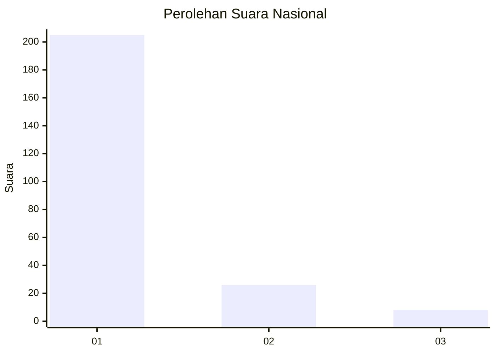
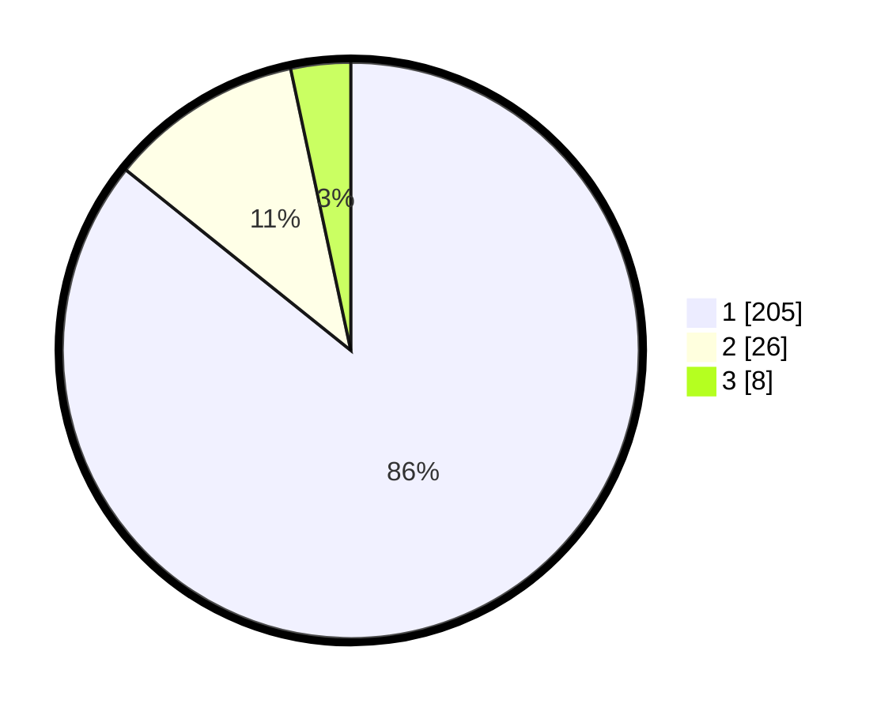

# Hasil

## Grafik

## Tabel

| No. | Nama Paslon    | Suara | Suara (raw) | Persentase |
|:--- |:-------------- | -----:| -----------:| ----------:|
| 1   | ANIES MUHAIMIN | 205   | [205][p-1]  | 85,77      |
| 2   | PRABOWO GIBRAN | 26    | [26][p-2]   | 10,88      |
| 3   | GANJAR MAHFUD  | 8     | [8][p-3]    | 3,35       |

[p-1]: https://github.com/gigit-pemilu/pemilu-2024/blob/main/pilpres/hitung-suara/sub/11-aceh/sub/12-aceh-barat-daya/sub/03-manggeng/sub/2025-pante-raja/sub/001-tps/sub/paslon-1.txt
[p-2]: https://github.com/gigit-pemilu/pemilu-2024/blob/main/pilpres/hitung-suara/sub/11-aceh/sub/12-aceh-barat-daya/sub/03-manggeng/sub/2025-pante-raja/sub/001-tps/sub/paslon-2.txt
[p-3]: https://github.com/gigit-pemilu/pemilu-2024/blob/main/pilpres/hitung-suara/sub/11-aceh/sub/12-aceh-barat-daya/sub/03-manggeng/sub/2025-pante-raja/sub/001-tps/sub/paslon-3.txt

## Foto C Plano

https://sirekap-obj-formc.kpu.go.id/7f19/pemilu/ppwp/11/12/03/20/25/1112032025001-20240215-140931--61d1fb8b-2b30-4b52-a935-e8edf8775c0d.jpg

https://sirekap-obj-formc.kpu.go.id/7f19/pemilu/ppwp/11/12/03/20/25/1112032025001-20240215-141106--9235dd5f-c5bd-4c92-8c32-4c6f7538edda.jpg

https://sirekap-obj-formc.kpu.go.id/7f19/pemilu/ppwp/11/12/03/20/25/1112032025001-20240215-141614--2e481a73-d6ef-4ba0-8e38-7e5fd15cdc5b.jpg

## Metadata

| Key        | Value               |
| ---------- | ------------------- |
| Time Stamp | 2024-02-15 20:30:46 |

