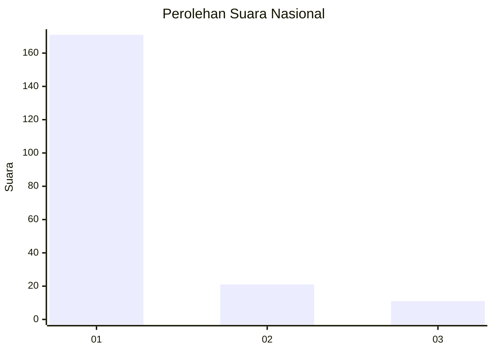
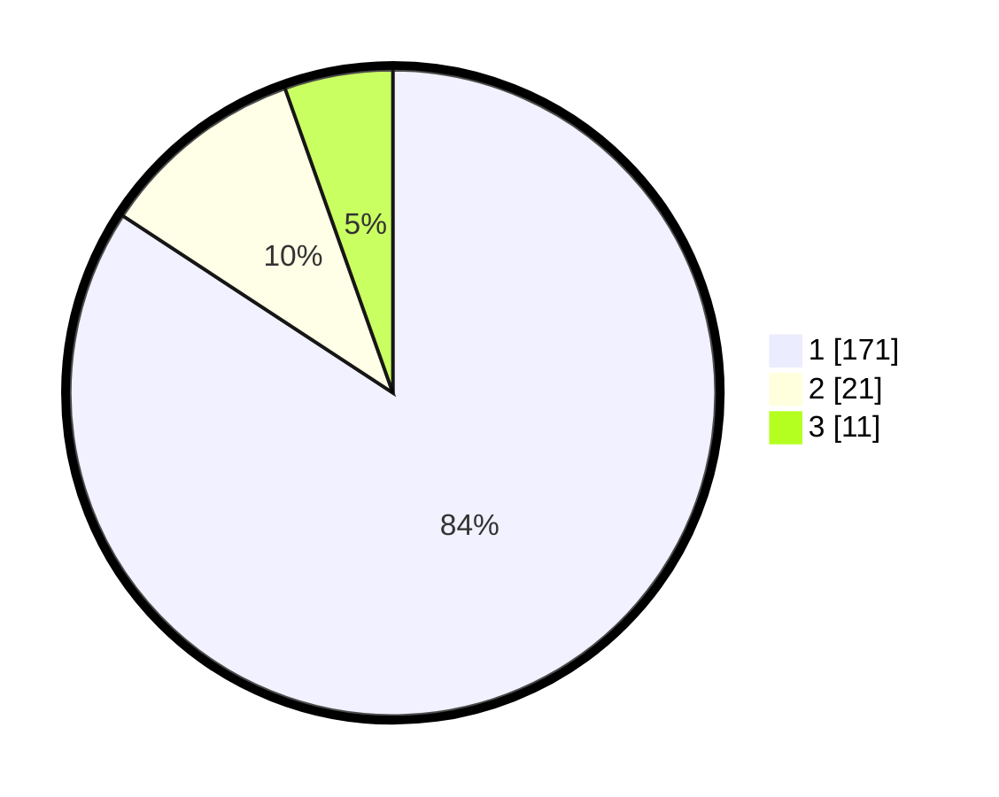

# Hasil

## Grafik

## Tabel

| No. | Nama Paslon    | Suara | Suara (raw) | Persentase |
|:--- |:-------------- | -----:| -----------:| ----------:|
| 1   | ANIES MUHAIMIN | 171   | [171][p-1]  | 84,24      |
| 2   | PRABOWO GIBRAN | 21    | [21][p-2]   | 10,34      |
| 3   | GANJAR MAHFUD  | 11    | [11][p-3]   | 5,42       |

[p-1]: https://github.com/gigit-pemilu/pemilu-2024/blob/main/pilpres/hitung-suara/sub/11-aceh/sub/12-aceh-barat-daya/sub/03-manggeng/sub/2026-sejahtera/sub/002-tps/sub/paslon-1.txt
[p-2]: https://github.com/gigit-pemilu/pemilu-2024/blob/main/pilpres/hitung-suara/sub/11-aceh/sub/12-aceh-barat-daya/sub/03-manggeng/sub/2026-sejahtera/sub/002-tps/sub/paslon-2.txt
[p-3]: https://github.com/gigit-pemilu/pemilu-2024/blob/main/pilpres/hitung-suara/sub/11-aceh/sub/12-aceh-barat-daya/sub/03-manggeng/sub/2026-sejahtera/sub/002-tps/sub/paslon-3.txt

## Foto C Plano

https://sirekap-obj-formc.kpu.go.id/211c/pemilu/ppwp/11/12/03/20/26/1112032026002-20240216-122505--0eedc338-328b-46e8-9064-5a188068b03e.jpg

https://sirekap-obj-formc.kpu.go.id/211c/pemilu/ppwp/11/12/03/20/26/1112032026002-20240216-122529--5877d9fe-e398-4a22-8ab3-e683be745f63.jpg

https://sirekap-obj-formc.kpu.go.id/211c/pemilu/ppwp/11/12/03/20/26/1112032026002-20240216-122617--eddae2af-55bc-44cf-ac5d-2c597c0a55a6.jpg

## Metadata

| Key        | Value               |
| ---------- | ------------------- |
| Time Stamp | 2024-02-16 22:01:00 |

