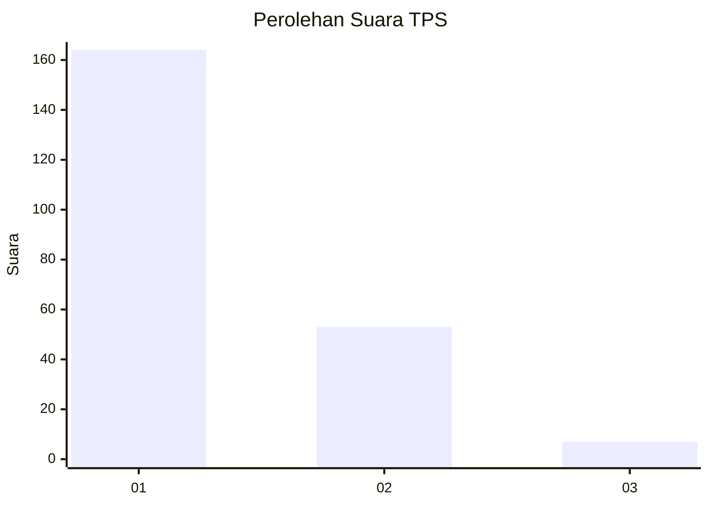
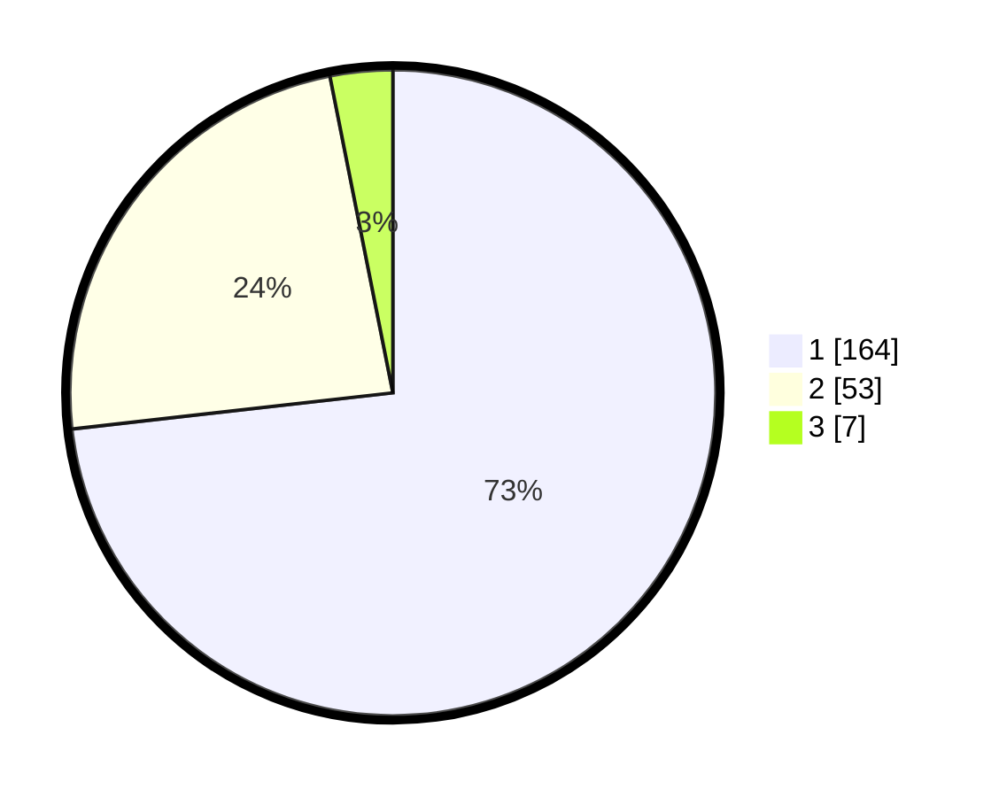

# Hasil

## Grafik

## Tabel

| No. | Nama Paslon    | Suara | Suara (raw) | Persentase |
|:--- |:-------------- | -----:| -----------:| ----------:|
| 1   | ANIES MUHAIMIN | 164   | [164][p-1]  | 73,21      |
| 2   | PRABOWO GIBRAN | 53    | [53][p-2]   | 23,66      |
| 3   | GANJAR MAHFUD  | 7     | [7][p-3]    | 3,13       |

[p-1]: https://github.com/gigit-pemilu/pemilu-2024-11-aceh/blob/main/pilpres/hitung-suara/sub/11-aceh/sub/12-aceh-barat-daya/sub/04-susoh/sub/2006-durian-jangek/sub/001-tps/sub/paslon-1.txt
[p-2]: https://github.com/gigit-pemilu/pemilu-2024-11-aceh/blob/main/pilpres/hitung-suara/sub/11-aceh/sub/12-aceh-barat-daya/sub/04-susoh/sub/2006-durian-jangek/sub/001-tps/sub/paslon-2.txt
[p-3]: https://github.com/gigit-pemilu/pemilu-2024-11-aceh/blob/main/pilpres/hitung-suara/sub/11-aceh/sub/12-aceh-barat-daya/sub/04-susoh/sub/2006-durian-jangek/sub/001-tps/sub/paslon-3.txt

## Foto C Plano

https://sirekap-obj-formc.kpu.go.id/4cbd/pemilu/ppwp/11/12/04/20/06/1112042006001-20240217-231627--bb517040-0aaf-4b37-9ac2-860111fac7d6.jpg

https://sirekap-obj-formc.kpu.go.id/4cbd/pemilu/ppwp/11/12/04/20/06/1112042006001-20240217-231628--2b8a8ccc-492f-407b-98cb-aa5a53dde8e7.jpg

https://sirekap-obj-formc.kpu.go.id/4cbd/pemilu/ppwp/11/12/04/20/06/1112042006001-20240217-231628--5686d4d3-a71e-42dc-b384-4c0be3c6f758.jpg

## Metadata

| Key        | Value               |
| ---------- | ------------------- |
| Time Stamp | 2024-02-21 17:00:00 |

## DATA PEMILIH TETAP

Jumlah pemilih dalam DPT: **258**.
 * L: **133**.
 * P: **125**.

## DATA PENGGUNA HAK PILIH

Jumlah pengguna hak pilih dalam DPT: **222**.
 * L: **115**.
 * P: **107**.

Jumlah pengguna hak pilih dalam DPTb: **1**.
 * L: **1**.
 * P: **0**.

Jumlah pengguna hak pilih dalam DPK: **5**.
 * L: **1**.
 * P: **4**.

Jumlah pengguna hak pilih: **228**.
 * L: **117**.
 * P: **111**.

## JUMLAH SUARA SAH DAN TIDAK SAH

JUMLAH SELURUH SUARA SAH: **224**.

JUMLAH SUARA TIDAK SAH: **4**.

JUMLAH SELURUH SUARA SAH DAN SUARA TIDAK SAH: **228**.

