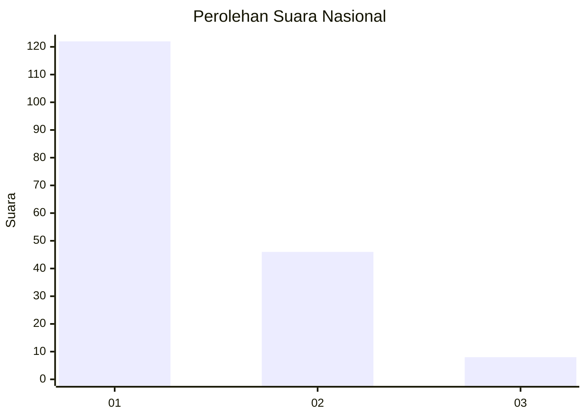
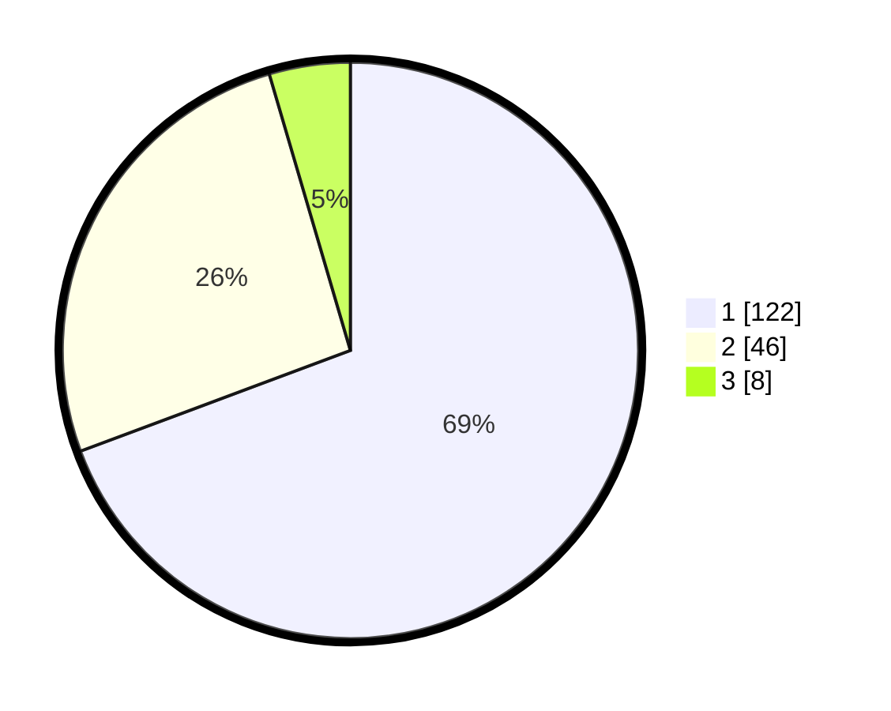

# Hasil

## Grafik

## Tabel

| No. | Nama Paslon    | Suara | Suara (raw) | Persentase |
|:--- |:-------------- | -----:| -----------:| ----------:|
| 1   | ANIES MUHAIMIN | 122   | [122][p-1]  | 69,32      |
| 2   | PRABOWO GIBRAN | 46    | [46][p-2]   | 26,14      |
| 3   | GANJAR MAHFUD  | 8     | [8][p-3]    | 4,55       |

[p-1]: https://github.com/gigit-pemilu/pemilu-2024/blob/main/pilpres/hitung-suara/sub/11-aceh/sub/12-aceh-barat-daya/sub/04-susoh/sub/2008-pinang/sub/002-tps/sub/paslon-1.txt
[p-2]: https://github.com/gigit-pemilu/pemilu-2024/blob/main/pilpres/hitung-suara/sub/11-aceh/sub/12-aceh-barat-daya/sub/04-susoh/sub/2008-pinang/sub/002-tps/sub/paslon-2.txt
[p-3]: https://github.com/gigit-pemilu/pemilu-2024/blob/main/pilpres/hitung-suara/sub/11-aceh/sub/12-aceh-barat-daya/sub/04-susoh/sub/2008-pinang/sub/002-tps/sub/paslon-3.txt

## Foto C Plano

https://sirekap-obj-formc.kpu.go.id/8da2/pemilu/ppwp/11/12/04/20/08/1112042008002-20240215-095458--6fff7fd4-76c6-4297-a1be-b99e950bade8.jpg

https://sirekap-obj-formc.kpu.go.id/8da2/pemilu/ppwp/11/12/04/20/08/1112042008002-20240215-033157--912d5276-4b96-42ee-8964-bf1925e8fa67.jpg

https://sirekap-obj-formc.kpu.go.id/8da2/pemilu/ppwp/11/12/04/20/08/1112042008002-20240215-095556--0d3f4fc3-bb77-4554-a870-f8813d67f513.jpg

## Metadata

| Key        | Value               |
| ---------- | ------------------- |
| Time Stamp | 2024-02-15 20:00:44 |

