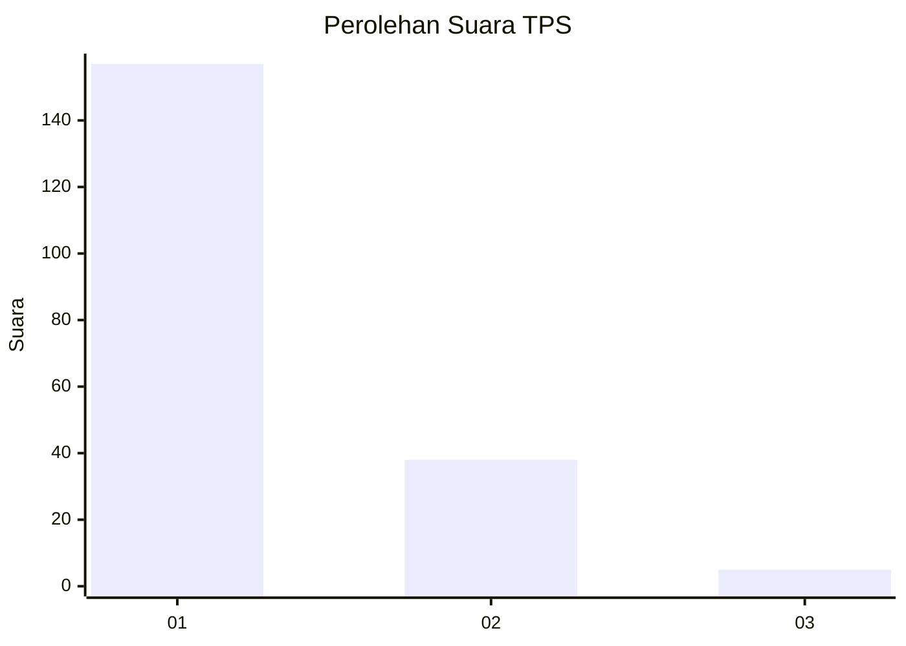
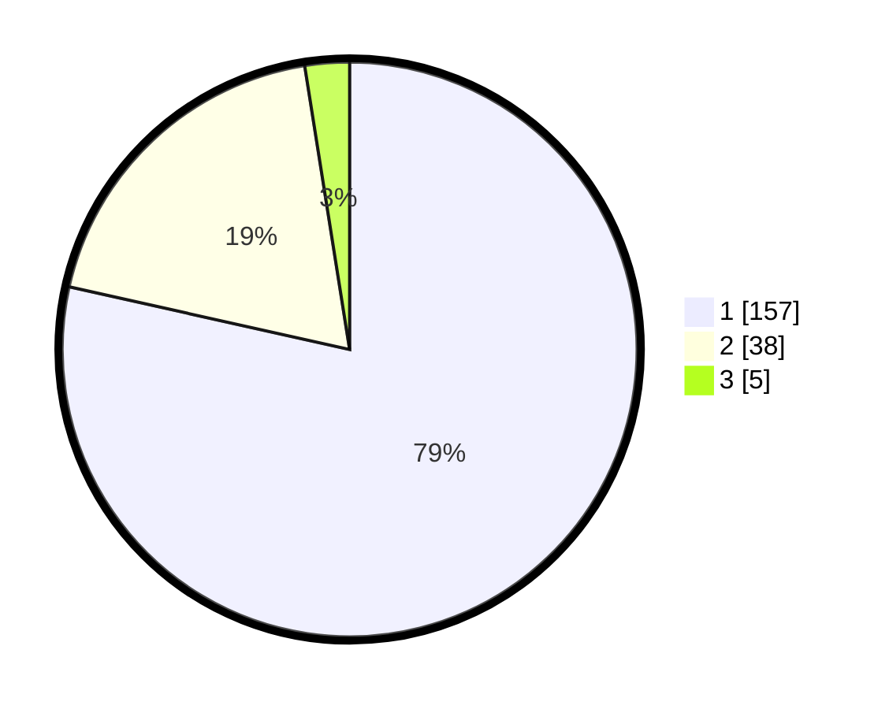

# Hasil

## Grafik

## Tabel

| No. | Nama Paslon    | Suara | Suara (raw) | Persentase |
|:--- |:-------------- | -----:| -----------:| ----------:|
| 1   | ANIES MUHAIMIN | 157   | [157][p-1]  | 78,50      |
| 2   | PRABOWO GIBRAN | 38    | [38][p-2]   | 19,00      |
| 3   | GANJAR MAHFUD  | 5     | [5][p-3]    | 2,50       |

[p-1]: https://github.com/gigit-pemilu/pemilu-2024-11-aceh/blob/main/pilpres/hitung-suara/sub/11-aceh/sub/12-aceh-barat-daya/sub/04-susoh/sub/2011-pawoh/sub/004-tps/sub/paslon-1.txt
[p-2]: https://github.com/gigit-pemilu/pemilu-2024-11-aceh/blob/main/pilpres/hitung-suara/sub/11-aceh/sub/12-aceh-barat-daya/sub/04-susoh/sub/2011-pawoh/sub/004-tps/sub/paslon-2.txt
[p-3]: https://github.com/gigit-pemilu/pemilu-2024-11-aceh/blob/main/pilpres/hitung-suara/sub/11-aceh/sub/12-aceh-barat-daya/sub/04-susoh/sub/2011-pawoh/sub/004-tps/sub/paslon-3.txt

## Foto C Plano

https://sirekap-obj-formc.kpu.go.id/f7ab/pemilu/ppwp/11/12/04/20/11/1112042011004-20240214-222105--1b7c1b30-02e8-4c4b-bbbe-ae446e83771d.jpg

https://sirekap-obj-formc.kpu.go.id/f7ab/pemilu/ppwp/11/12/04/20/11/1112042011004-20240214-222438--675f9574-b93d-4ffe-b7a7-4e854b59fef8.jpg

https://sirekap-obj-formc.kpu.go.id/f7ab/pemilu/ppwp/11/12/04/20/11/1112042011004-20240214-222604--f753d335-338b-490f-9854-ed36b4e90b31.jpg

## Metadata

| Key        | Value               |
| ---------- | ------------------- |
| Time Stamp | 2024-02-15 19:00:26 |

