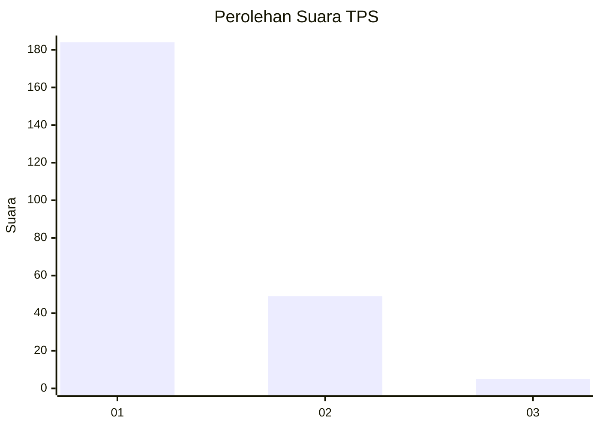
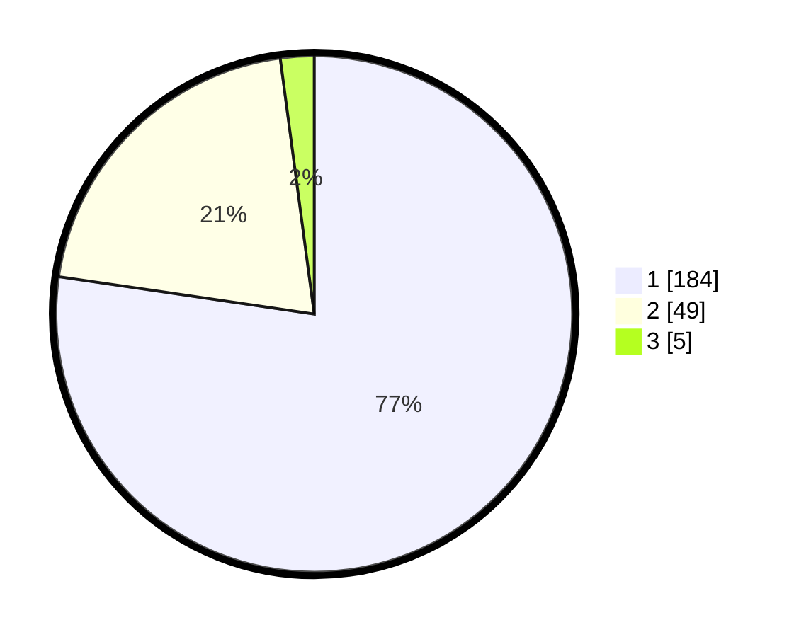

# Hasil

## Grafik

## Tabel

| No. | Nama Paslon    | Suara | Suara (raw) | Persentase |
|:--- |:-------------- | -----:| -----------:| ----------:|
| 1   | ANIES MUHAIMIN | 184   | [184][p-1]  | 77,31      |
| 2   | PRABOWO GIBRAN | 49    | [49][p-2]   | 20,59      |
| 3   | GANJAR MAHFUD  | 5     | [5][p-3]    | 2,10       |

[p-1]: https://github.com/gigit-pemilu/pemilu-2024-11-aceh/blob/main/pilpres/hitung-suara/sub/11-aceh/sub/12-aceh-barat-daya/sub/04-susoh/sub/2012-padang-baru/sub/006-tps/sub/paslon-1.txt
[p-2]: https://github.com/gigit-pemilu/pemilu-2024-11-aceh/blob/main/pilpres/hitung-suara/sub/11-aceh/sub/12-aceh-barat-daya/sub/04-susoh/sub/2012-padang-baru/sub/006-tps/sub/paslon-2.txt
[p-3]: https://github.com/gigit-pemilu/pemilu-2024-11-aceh/blob/main/pilpres/hitung-suara/sub/11-aceh/sub/12-aceh-barat-daya/sub/04-susoh/sub/2012-padang-baru/sub/006-tps/sub/paslon-3.txt

## Foto C Plano

https://sirekap-obj-formc.kpu.go.id/396c/pemilu/ppwp/11/12/04/20/12/1112042012006-20240215-012717--f34c2b17-2cc3-459c-a077-368d1f14982c.jpg

https://sirekap-obj-formc.kpu.go.id/396c/pemilu/ppwp/11/12/04/20/12/1112042012006-20240214-203727--8bf8a75c-c7b2-4420-997f-ed3621b3aa35.jpg

https://sirekap-obj-formc.kpu.go.id/396c/pemilu/ppwp/11/12/04/20/12/1112042012006-20240214-200816--e7ee4a44-56ba-487c-b5b5-381d5ac46fdc.jpg

## Metadata

| Key        | Value               |
| ---------- | ------------------- |
| Time Stamp | 2024-02-15 15:00:29 |

