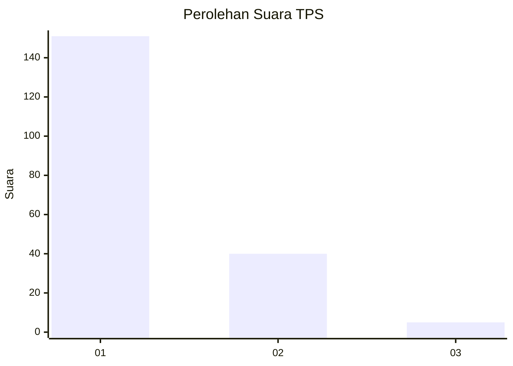
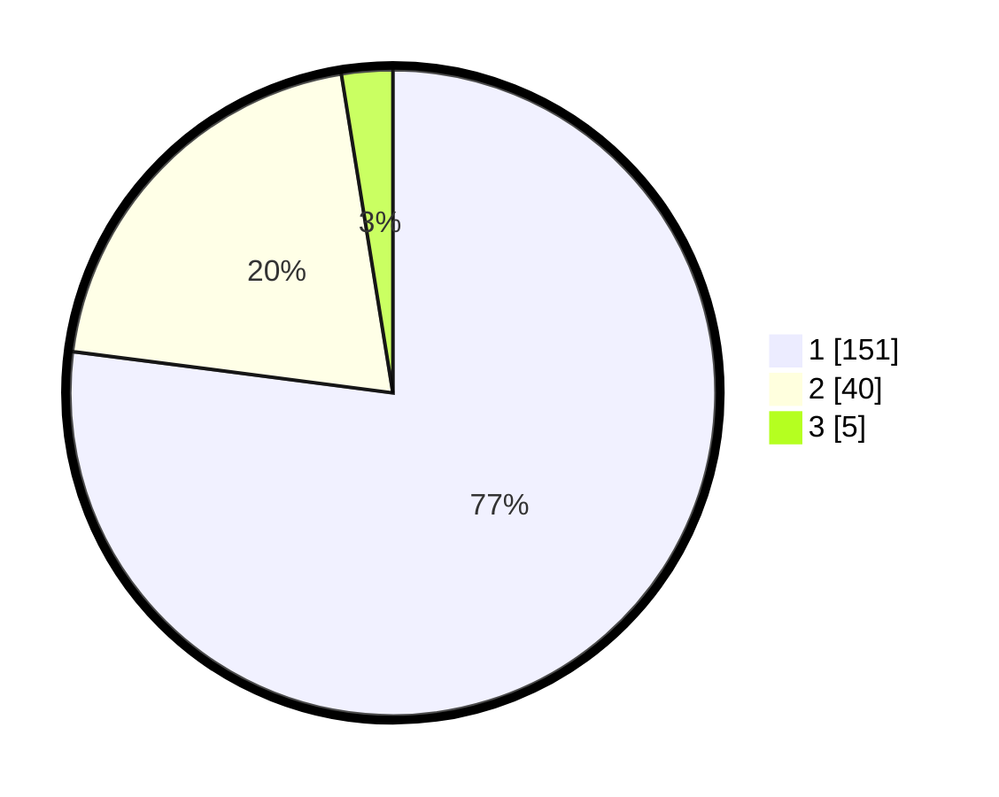

# Hasil

## Grafik

## Tabel

| No. | Nama Paslon    | Suara | Suara (raw) | Persentase |
|:--- |:-------------- | -----:| -----------:| ----------:|
| 1   | ANIES MUHAIMIN | 151   | [151][p-1]  | 77,04      |
| 2   | PRABOWO GIBRAN | 40    | [40][p-2]   | 20,41      |
| 3   | GANJAR MAHFUD  | 5     | [5][p-3]    | 2,55       |

[p-1]: https://github.com/gigit-pemilu/pemilu-2024-11-aceh/blob/main/pilpres/hitung-suara/sub/11-aceh/sub/12-aceh-barat-daya/sub/04-susoh/sub/2022-padang-hilir/sub/001-tps/sub/paslon-1.txt
[p-2]: https://github.com/gigit-pemilu/pemilu-2024-11-aceh/blob/main/pilpres/hitung-suara/sub/11-aceh/sub/12-aceh-barat-daya/sub/04-susoh/sub/2022-padang-hilir/sub/001-tps/sub/paslon-2.txt
[p-3]: https://github.com/gigit-pemilu/pemilu-2024-11-aceh/blob/main/pilpres/hitung-suara/sub/11-aceh/sub/12-aceh-barat-daya/sub/04-susoh/sub/2022-padang-hilir/sub/001-tps/sub/paslon-3.txt

## Foto C Plano

https://sirekap-obj-formc.kpu.go.id/e0e7/pemilu/ppwp/11/12/04/20/22/1112042022001-20240215-100512--c0d953b3-b816-4a66-8914-9a2bbdb105bb.jpg

https://sirekap-obj-formc.kpu.go.id/e0e7/pemilu/ppwp/11/12/04/20/22/1112042022001-20240215-101412--20ff6e47-02dc-47ed-98d3-0e301f918e63.jpg

## Metadata

| Key        | Value               |
| ---------- | ------------------- |
| Time Stamp | 2024-02-15 22:00:27 |

