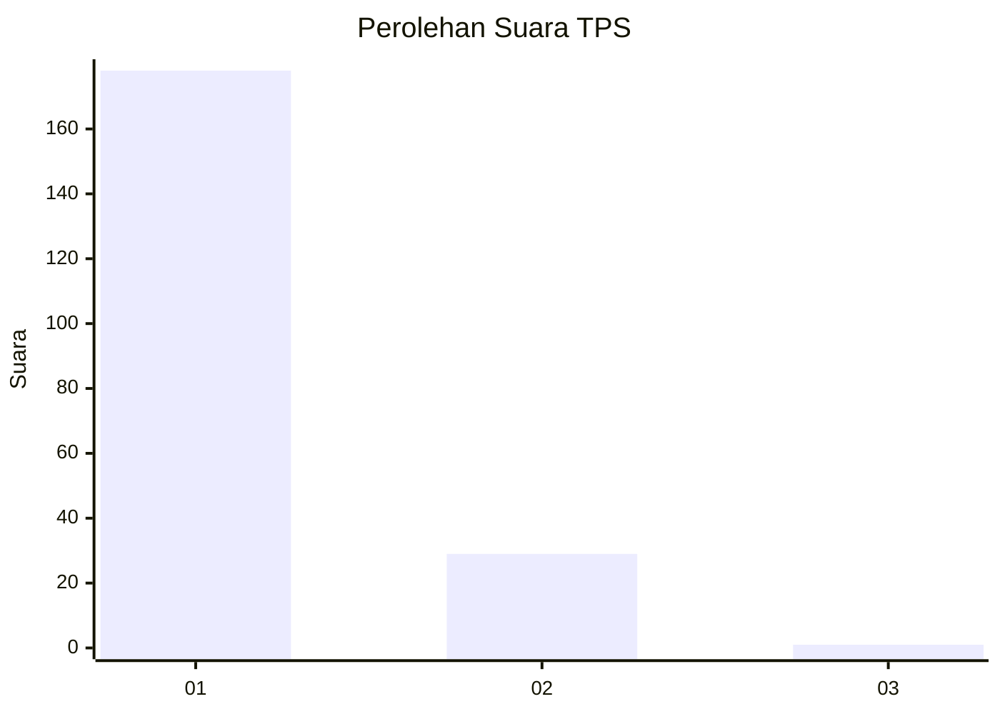
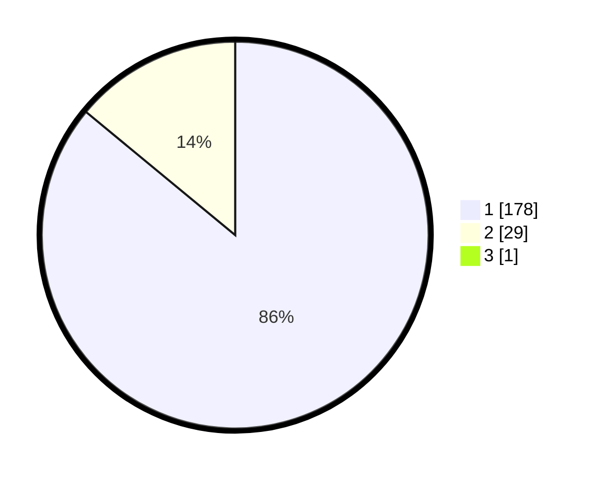

# Hasil

## Grafik

## Tabel

| No. | Nama Paslon    | Suara | Suara (raw) | Persentase |
|:--- |:-------------- | -----:| -----------:| ----------:|
| 1   | ANIES MUHAIMIN | 178   | [178][p-1]  | 85,58      |
| 2   | PRABOWO GIBRAN | 29    | [29][p-2]   | 13,94      |
| 3   | GANJAR MAHFUD  | 1     | [1][p-3]    | 0,48       |

[p-1]: https://github.com/gigit-pemilu/pemilu-2024-11-aceh/blob/main/pilpres/hitung-suara/sub/11-aceh/sub/12-aceh-barat-daya/sub/04-susoh/sub/2027-rubek-meupayong/sub/003-tps/sub/paslon-1.txt
[p-2]: https://github.com/gigit-pemilu/pemilu-2024-11-aceh/blob/main/pilpres/hitung-suara/sub/11-aceh/sub/12-aceh-barat-daya/sub/04-susoh/sub/2027-rubek-meupayong/sub/003-tps/sub/paslon-2.txt
[p-3]: https://github.com/gigit-pemilu/pemilu-2024-11-aceh/blob/main/pilpres/hitung-suara/sub/11-aceh/sub/12-aceh-barat-daya/sub/04-susoh/sub/2027-rubek-meupayong/sub/003-tps/sub/paslon-3.txt

## Foto C Plano

https://sirekap-obj-formc.kpu.go.id/13bb/pemilu/ppwp/11/12/04/20/27/1112042027003-20240214-223810--5b0e0bad-08cd-41a1-ad77-1c55ba46b013.jpg

https://sirekap-obj-formc.kpu.go.id/13bb/pemilu/ppwp/11/12/04/20/27/1112042027003-20240214-224352--200c9431-6982-4fa1-9f49-f18fadfaeae8.jpg

https://sirekap-obj-formc.kpu.go.id/13bb/pemilu/ppwp/11/12/04/20/27/1112042027003-20240214-224508--f07bdb9d-a05e-4c11-895d-aaee61b87f27.jpg

## Metadata

| Key        | Value               |
| ---------- | ------------------- |
| Time Stamp | 2024-02-15 22:00:27 |

