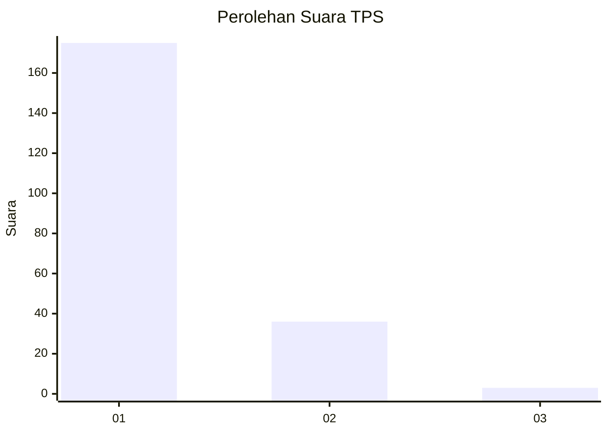
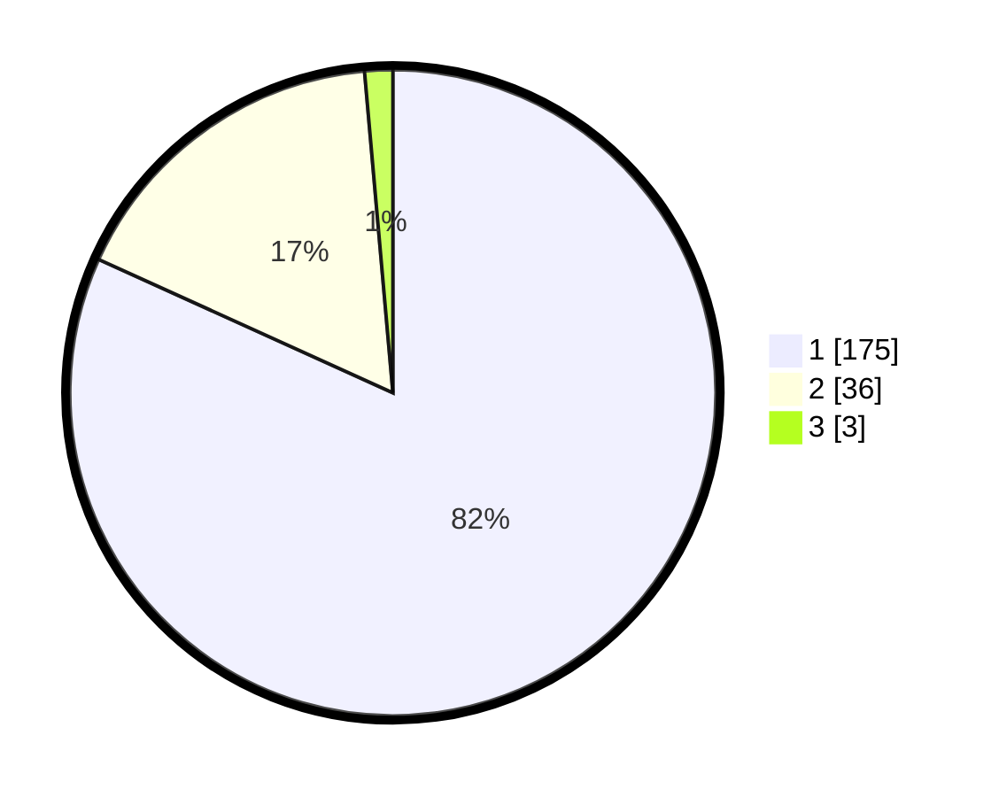

# Hasil

## Grafik

## Tabel

| No. | Nama Paslon    | Suara | Suara (raw) | Persentase |
|:--- |:-------------- | -----:| -----------:| ----------:|
| 1   | ANIES MUHAIMIN | 175   | [175][p-1]  | 81,78      |
| 2   | PRABOWO GIBRAN | 36    | [36][p-2]   | 16,82      |
| 3   | GANJAR MAHFUD  | 3     | [3][p-3]    | 1,40       |

[p-1]: https://github.com/gigit-pemilu/pemilu-2024-11-aceh/blob/main/pilpres/hitung-suara/sub/11-aceh/sub/12-aceh-barat-daya/sub/04-susoh/sub/2029-geulima-jaya/sub/001-tps/sub/paslon-1.txt
[p-2]: https://github.com/gigit-pemilu/pemilu-2024-11-aceh/blob/main/pilpres/hitung-suara/sub/11-aceh/sub/12-aceh-barat-daya/sub/04-susoh/sub/2029-geulima-jaya/sub/001-tps/sub/paslon-2.txt
[p-3]: https://github.com/gigit-pemilu/pemilu-2024-11-aceh/blob/main/pilpres/hitung-suara/sub/11-aceh/sub/12-aceh-barat-daya/sub/04-susoh/sub/2029-geulima-jaya/sub/001-tps/sub/paslon-3.txt

## Foto C Plano

https://sirekap-obj-formc.kpu.go.id/15a1/pemilu/ppwp/11/12/04/20/29/1112042029001-20240215-100155--695dbea1-5603-4438-9fc7-708b5386f274.jpg

https://sirekap-obj-formc.kpu.go.id/15a1/pemilu/ppwp/11/12/04/20/29/1112042029001-20240215-101013--cfc392a0-cfc0-4b1c-8a17-aec8e83a3aaf.jpg

https://sirekap-obj-formc.kpu.go.id/15a1/pemilu/ppwp/11/12/04/20/29/1112042029001-20240215-100506--23e2ab7b-6f88-4131-b868-ba4d45e76d3a.jpg

## Metadata

| Key        | Value               |
| ---------- | ------------------- |
| Time Stamp | 2024-02-16 17:00:00 |

