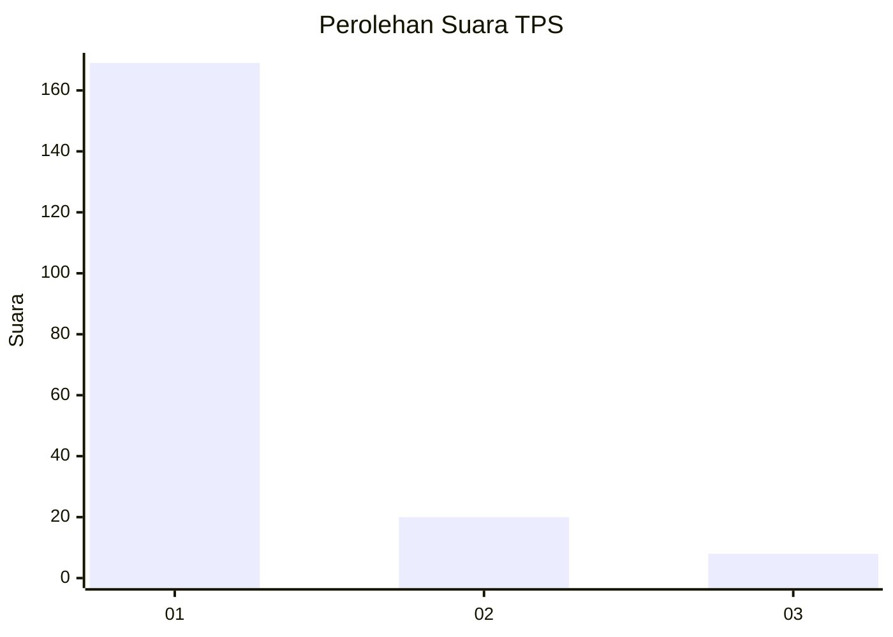
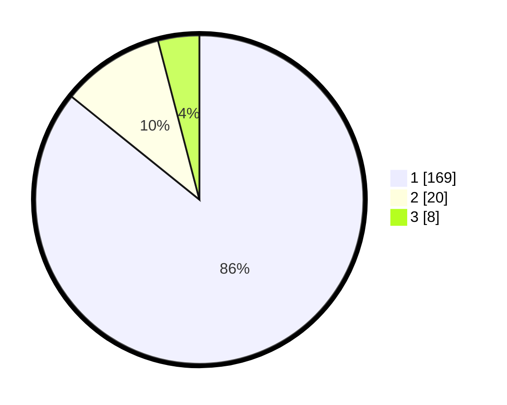

# Hasil

## Grafik

## Tabel

| No. | Nama Paslon    | Suara | Suara (raw) | Persentase |
|:--- |:-------------- | -----:| -----------:| ----------:|
| 1   | ANIES MUHAIMIN | 169   | [169][p-1]  | 85,79      |
| 2   | PRABOWO GIBRAN | 20    | [20][p-2]   | 10,15      |
| 3   | GANJAR MAHFUD  | 8     | [8][p-3]    | 4,06       |

[p-1]: https://github.com/gigit-pemilu/pemilu-2024-11-aceh/blob/main/pilpres/hitung-suara/sub/11-aceh/sub/12-aceh-barat-daya/sub/05-kuala-batee/sub/2001-kota-bahagia/sub/003-tps/sub/paslon-1.txt
[p-2]: https://github.com/gigit-pemilu/pemilu-2024-11-aceh/blob/main/pilpres/hitung-suara/sub/11-aceh/sub/12-aceh-barat-daya/sub/05-kuala-batee/sub/2001-kota-bahagia/sub/003-tps/sub/paslon-2.txt
[p-3]: https://github.com/gigit-pemilu/pemilu-2024-11-aceh/blob/main/pilpres/hitung-suara/sub/11-aceh/sub/12-aceh-barat-daya/sub/05-kuala-batee/sub/2001-kota-bahagia/sub/003-tps/sub/paslon-3.txt

## Foto C Plano

https://sirekap-obj-formc.kpu.go.id/e209/pemilu/ppwp/11/12/05/20/01/1112052001003-20240214-201253--1dbbae27-6116-4246-84a7-5f4d10904afb.jpg

https://sirekap-obj-formc.kpu.go.id/e209/pemilu/ppwp/11/12/05/20/01/1112052001003-20240214-201318--8f0dd561-1b44-4f1c-947f-ff284a1f08ff.jpg

https://sirekap-obj-formc.kpu.go.id/e209/pemilu/ppwp/11/12/05/20/01/1112052001003-20240214-201334--f353b58d-213a-4e6b-9562-11fcfc6c6c2e.jpg

## Metadata

| Key        | Value               |
| ---------- | ------------------- |
| Time Stamp | 2024-02-15 00:41:44 |

## DATA PEMILIH TETAP

Jumlah pemilih dalam DPT: **223**.
 * L: **105**.
 * P: **118**.

## DATA PENGGUNA HAK PILIH

Jumlah pengguna hak pilih dalam DPT: **201**.
 * L: **89**.
 * P: **112**.

Jumlah pengguna hak pilih dalam DPTb: **4**.
 * L: **3**.
 * P: **1**.

Jumlah pengguna hak pilih dalam DPK: **0**.
 * L: **0**.
 * P: **0**.

Jumlah pengguna hak pilih: **205**.
 * L: **92**.
 * P: **113**.

## JUMLAH SUARA SAH DAN TIDAK SAH

JUMLAH SELURUH SUARA SAH: **197**.

JUMLAH SUARA TIDAK SAH: **8**.

JUMLAH SELURUH SUARA SAH DAN SUARA TIDAK SAH: **205**.

