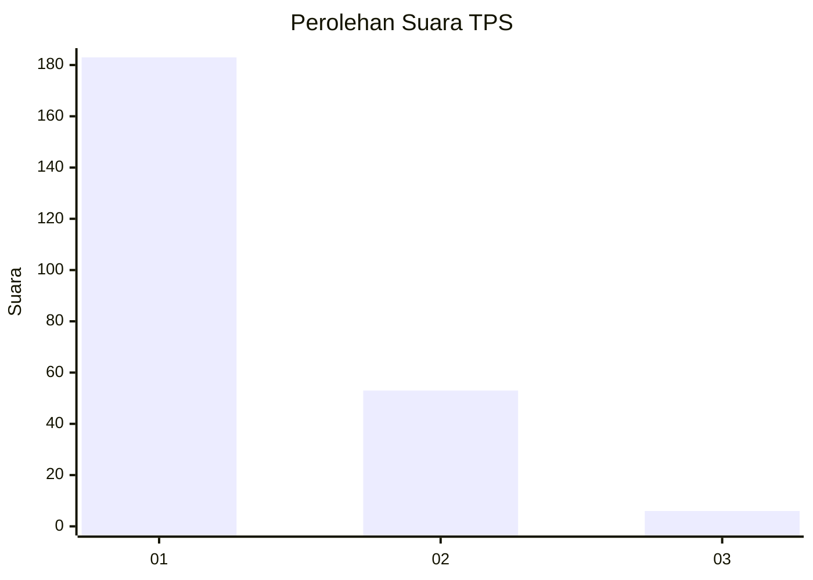
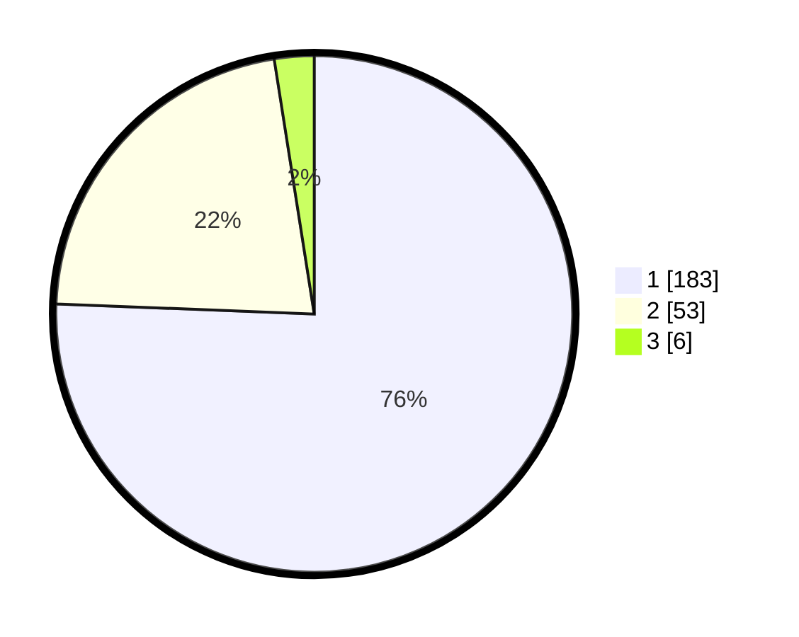

# Hasil

## Grafik

## Tabel

| No. | Nama Paslon    | Suara | Suara (raw) | Persentase |
|:--- |:-------------- | -----:| -----------:| ----------:|
| 1   | ANIES MUHAIMIN | 183   | [183][p-1]  | 75,62      |
| 2   | PRABOWO GIBRAN | 53    | [53][p-2]   | 21,90      |
| 3   | GANJAR MAHFUD  | 6     | [6][p-3]    | 2,48       |

[p-1]: https://github.com/gigit-pemilu/pemilu-2024-11-aceh/blob/main/pilpres/hitung-suara/sub/11-aceh/sub/12-aceh-barat-daya/sub/05-kuala-batee/sub/2002-pasar-kota-bahagia/sub/002-tps/sub/paslon-1.txt
[p-2]: https://github.com/gigit-pemilu/pemilu-2024-11-aceh/blob/main/pilpres/hitung-suara/sub/11-aceh/sub/12-aceh-barat-daya/sub/05-kuala-batee/sub/2002-pasar-kota-bahagia/sub/002-tps/sub/paslon-2.txt
[p-3]: https://github.com/gigit-pemilu/pemilu-2024-11-aceh/blob/main/pilpres/hitung-suara/sub/11-aceh/sub/12-aceh-barat-daya/sub/05-kuala-batee/sub/2002-pasar-kota-bahagia/sub/002-tps/sub/paslon-3.txt

## Foto C Plano

https://sirekap-obj-formc.kpu.go.id/f309/pemilu/ppwp/11/12/05/20/02/1112052002002-20240215-213222--e02174be-e0a2-41c7-8617-3383eef59f30.jpg

https://sirekap-obj-formc.kpu.go.id/f309/pemilu/ppwp/11/12/05/20/02/1112052002002-20240215-213225--3feb554c-66d5-428d-bad7-b88209346e44.jpg

https://sirekap-obj-formc.kpu.go.id/f309/pemilu/ppwp/11/12/05/20/02/1112052002002-20240215-213223--8cbbed5b-9c42-4392-ab5a-33829310b2f0.jpg

## Metadata

| Key        | Value               |
| ---------- | ------------------- |
| Time Stamp | 2024-02-15 22:30:27 |

## DATA PEMILIH TETAP

Jumlah pemilih dalam DPT: **282**.
 * L: **141**.
 * P: **141**.

## DATA PENGGUNA HAK PILIH

Jumlah pengguna hak pilih dalam DPT: **241**.
 * L: **130**.
 * P: **111**.

Jumlah pengguna hak pilih dalam DPTb: **4**.
 * L: **2**.
 * P: **2**.

Jumlah pengguna hak pilih dalam DPK: **0**.
 * L: **0**.
 * P: **0**.

Jumlah pengguna hak pilih: **245**.
 * L: **132**.
 * P: **113**.

## JUMLAH SUARA SAH DAN TIDAK SAH

JUMLAH SELURUH SUARA SAH: **242**.

JUMLAH SUARA TIDAK SAH: **3**.

JUMLAH SELURUH SUARA SAH DAN SUARA TIDAK SAH: **245**.

