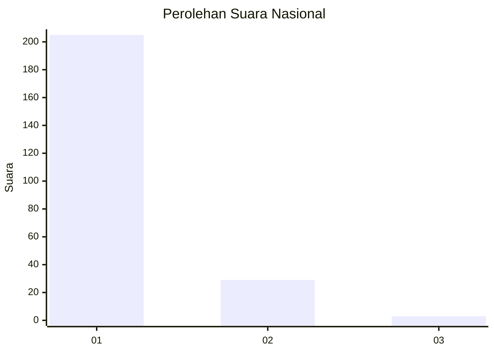
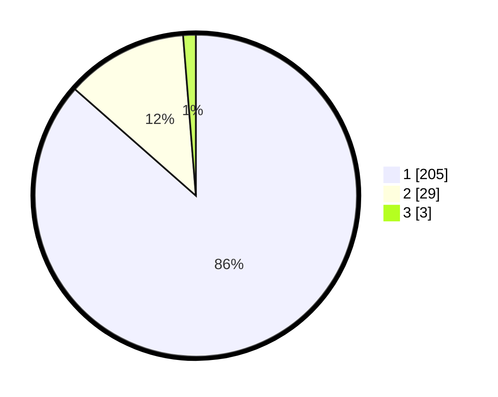

# Hasil

## Grafik

## Tabel

| No. | Nama Paslon    | Suara | Suara (raw) | Persentase |
|:--- |:-------------- | -----:| -----------:| ----------:|
| 1   | ANIES MUHAIMIN | 205   | [205][p-1]  | 86,50      |
| 2   | PRABOWO GIBRAN | 29    | [29][p-2]   | 12,24      |
| 3   | GANJAR MAHFUD  | 3     | [3][p-3]    | 1,27       |

[p-1]: https://github.com/gigit-pemilu/pemilu-2024/blob/main/pilpres/hitung-suara/sub/11-aceh/sub/12-aceh-barat-daya/sub/05-kuala-batee/sub/2005-blang-makmur/sub/001-tps/sub/paslon-1.txt
[p-2]: https://github.com/gigit-pemilu/pemilu-2024/blob/main/pilpres/hitung-suara/sub/11-aceh/sub/12-aceh-barat-daya/sub/05-kuala-batee/sub/2005-blang-makmur/sub/001-tps/sub/paslon-2.txt
[p-3]: https://github.com/gigit-pemilu/pemilu-2024/blob/main/pilpres/hitung-suara/sub/11-aceh/sub/12-aceh-barat-daya/sub/05-kuala-batee/sub/2005-blang-makmur/sub/001-tps/sub/paslon-3.txt

## Foto C Plano

https://sirekap-obj-formc.kpu.go.id/b8fa/pemilu/ppwp/11/12/05/20/05/1112052005001-20240215-001306--08f25711-4bdd-4a28-91d4-38d497b02d70.jpg

https://sirekap-obj-formc.kpu.go.id/b8fa/pemilu/ppwp/11/12/05/20/05/1112052005001-20240215-001459--034cf2db-fa0d-47c1-ba4c-2e3ec412b110.jpg

https://sirekap-obj-formc.kpu.go.id/b8fa/pemilu/ppwp/11/12/05/20/05/1112052005001-20240215-001754--d76ba07b-1028-44a6-9622-1d9a9589a0fe.jpg

## Metadata

| Key        | Value               |
| ---------- | ------------------- |
| Time Stamp | 2024-02-24 22:31:28 |

