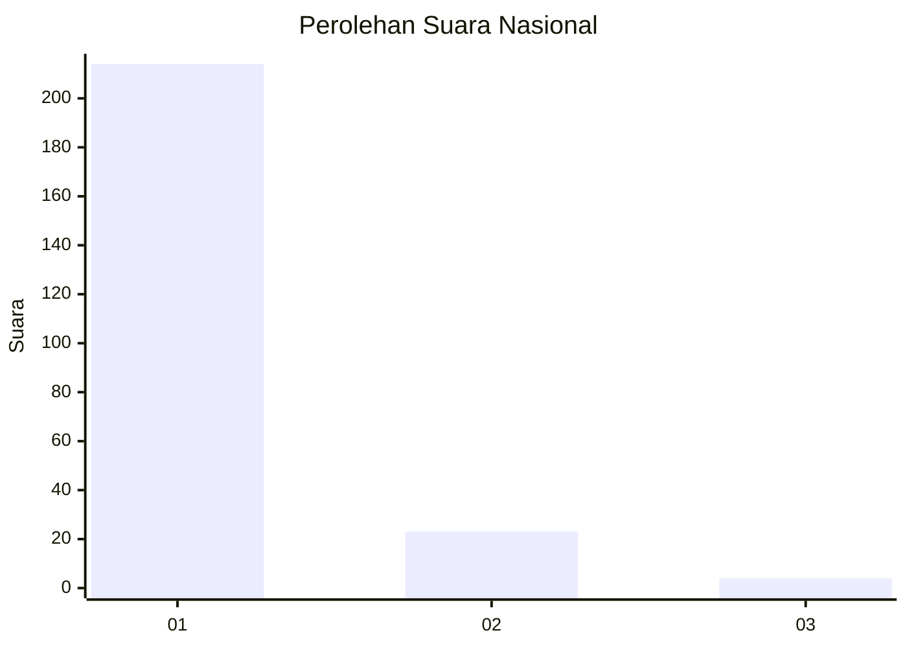
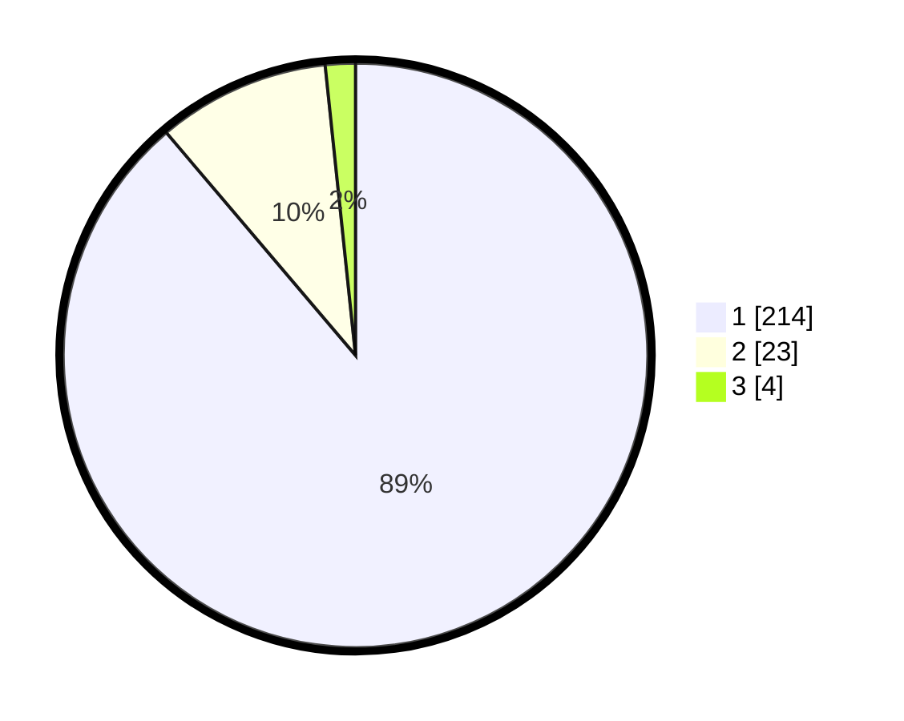

# Hasil

## Grafik

## Tabel

| No. | Nama Paslon    | Suara | Suara (raw) | Persentase |
|:--- |:-------------- | -----:| -----------:| ----------:|
| 1   | ANIES MUHAIMIN | 214   | [214][p-1]  | 88,80      |
| 2   | PRABOWO GIBRAN | 23    | [23][p-2]   | 9,54       |
| 3   | GANJAR MAHFUD  | 4     | [4][p-3]    | 1,66       |

[p-1]: https://github.com/gigit-pemilu/pemilu-2024/blob/main/pilpres/hitung-suara/sub/11-aceh/sub/12-aceh-barat-daya/sub/05-kuala-batee/sub/2005-blang-makmur/sub/002-tps/sub/paslon-1.txt
[p-2]: https://github.com/gigit-pemilu/pemilu-2024/blob/main/pilpres/hitung-suara/sub/11-aceh/sub/12-aceh-barat-daya/sub/05-kuala-batee/sub/2005-blang-makmur/sub/002-tps/sub/paslon-2.txt
[p-3]: https://github.com/gigit-pemilu/pemilu-2024/blob/main/pilpres/hitung-suara/sub/11-aceh/sub/12-aceh-barat-daya/sub/05-kuala-batee/sub/2005-blang-makmur/sub/002-tps/sub/paslon-3.txt

## Foto C Plano

https://sirekap-obj-formc.kpu.go.id/ef3a/pemilu/ppwp/11/12/05/20/05/1112052005002-20240214-231426--70fd0b02-d20c-425b-a604-5449d762badc.jpg

https://sirekap-obj-formc.kpu.go.id/ef3a/pemilu/ppwp/11/12/05/20/05/1112052005002-20240214-232328--470a117d-91fd-4ec5-a9b3-11edb3cd4fe8.jpg

https://sirekap-obj-formc.kpu.go.id/ef3a/pemilu/ppwp/11/12/05/20/05/1112052005002-20240214-232032--fca685aa-d5c8-4c41-88a3-6a85404a14b7.jpg

## Metadata

| Key        | Value               |
| ---------- | ------------------- |
| Time Stamp | 2024-02-24 22:31:28 |

