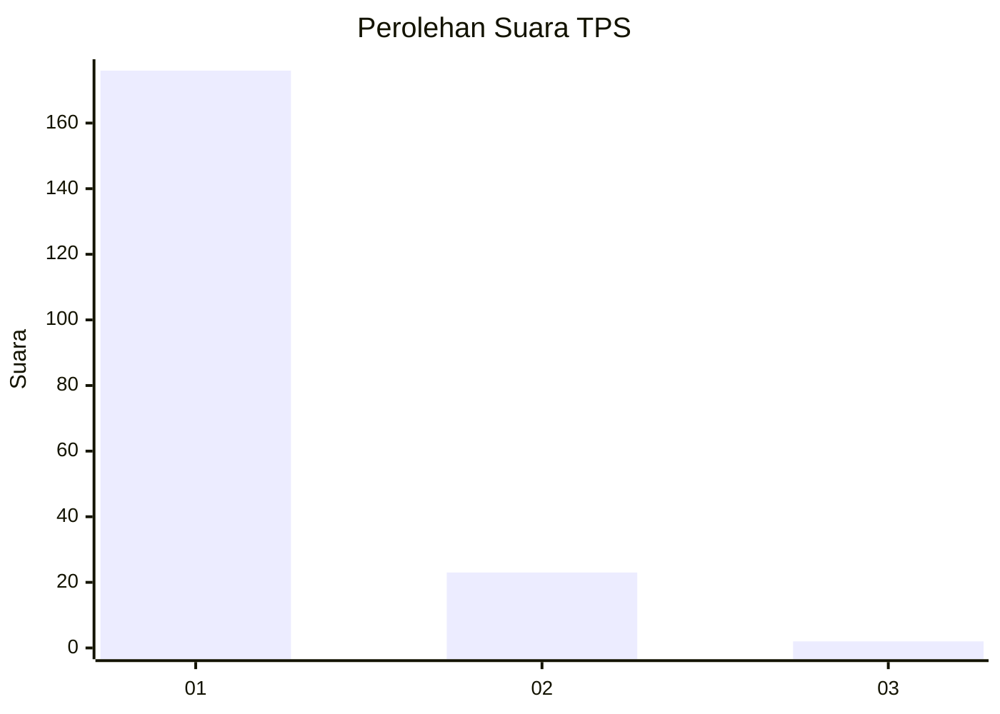
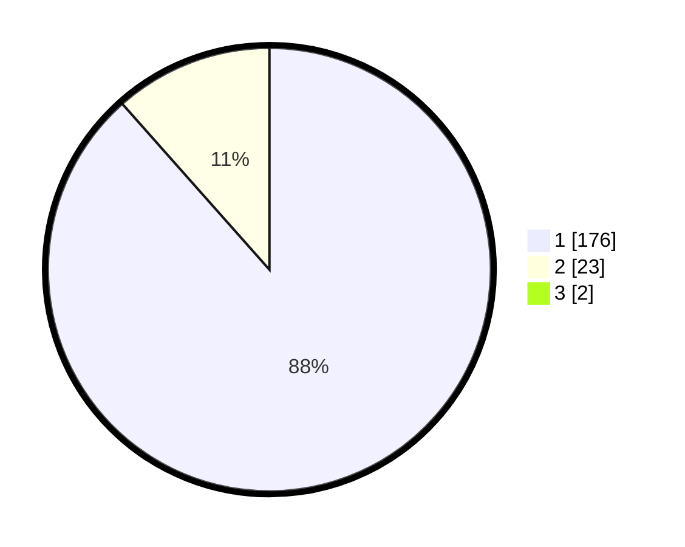

# Hasil

## Grafik

## Tabel

| No. | Nama Paslon    | Suara | Suara (raw) | Persentase |
|:--- |:-------------- | -----:| -----------:| ----------:|
| 1   | ANIES MUHAIMIN | 176   | [176][p-1]  | 87,56      |
| 2   | PRABOWO GIBRAN | 23    | [23][p-2]   | 11,44      |
| 3   | GANJAR MAHFUD  | 2     | [2][p-3]    | 1,00       |

[p-1]: https://github.com/gigit-pemilu/pemilu-2024-11-aceh/blob/main/pilpres/hitung-suara/sub/11-aceh/sub/12-aceh-barat-daya/sub/05-kuala-batee/sub/2011-kampung-tengah/sub/003-tps/sub/paslon-1.txt
[p-2]: https://github.com/gigit-pemilu/pemilu-2024-11-aceh/blob/main/pilpres/hitung-suara/sub/11-aceh/sub/12-aceh-barat-daya/sub/05-kuala-batee/sub/2011-kampung-tengah/sub/003-tps/sub/paslon-2.txt
[p-3]: https://github.com/gigit-pemilu/pemilu-2024-11-aceh/blob/main/pilpres/hitung-suara/sub/11-aceh/sub/12-aceh-barat-daya/sub/05-kuala-batee/sub/2011-kampung-tengah/sub/003-tps/sub/paslon-3.txt

## Foto C Plano

https://sirekap-obj-formc.kpu.go.id/13fd/pemilu/ppwp/11/12/05/20/11/1112052011003-20240215-165355--70206236-5b8a-403e-a5b3-01b75c1ec418.jpg

https://sirekap-obj-formc.kpu.go.id/13fd/pemilu/ppwp/11/12/05/20/11/1112052011003-20240215-172953--ab28b821-02ff-43fe-b3ae-8ff2c742d12f.jpg

https://sirekap-obj-formc.kpu.go.id/13fd/pemilu/ppwp/11/12/05/20/11/1112052011003-20240215-173134--1460e5e3-590e-4b44-bf63-27715dfe22c1.jpg

## Metadata

| Key        | Value               |
| ---------- | ------------------- |
| Time Stamp | 2024-02-24 22:31:28 |

